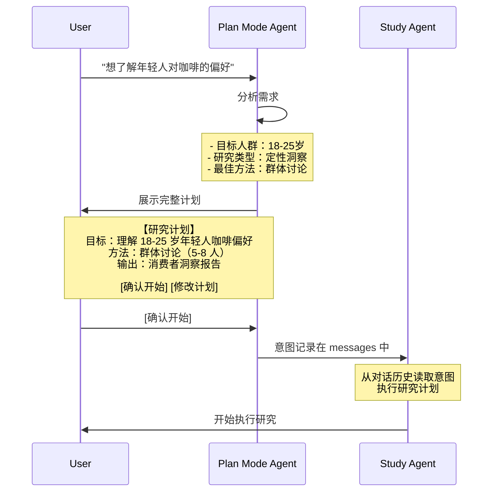

# Messages as Source of Truth

## 构建可扩展 AI Agent 系统的三次演进

---

## I. 2025年12月的某天

我们要添加一个新功能：群体讨论（`discussionChat`）。

这应该很简单。我们已经有 `interviewChat` 了——一对一访谈，用户和 AI 模拟的 persona 深度对话。群体讨论只是从 1对1 变成 1对多：3-8个 persona 同时参与，观察他们的观点碰撞。

理论上，只需要：
1. 复用 interview 的逻辑
2. 改改提示词，让 AI 模拟群体对话
3. 改改 UI，显示多个发言者

**但现实是**：我们需要改动 12 个文件。

```
prisma/schema.prisma          # 新建 Discussion 表
src/ai/tools/discussionChat.ts  # 新工具
src/ai/tools/saveDiscussion.ts   # 保存工具
src/app/(study)/agents/studyAgent.ts     # 添加工具到 Agent
src/app/(study)/agents/fastInsightAgent.ts  # 再添加一次
src/app/(study)/agents/productRnDAgent.ts   # 再添加一次
... 还有 6 个文件
```

更糟的是，我们发现了这个：

```typescript
// studyAgentRequest.ts (493 行)
export async function studyAgentRequest(context) {
  const result = await streamText({
    model: llm("claude-sonnet-4"),
    system: studySystem(),
    messages,
    tools: {
      webSearch,
      interview,
      scoutTask,
      saveAnalyst,
      generateReport
      // ... 15 个工具
    },
    onStepFinish: async (step) => {
      // 保存消息
      // 跟踪 token
      // 发送通知
      // ... 120 行逻辑
    }
  });
}

// fastInsightAgentRequest.ts (416 行)
// 95% 相同的代码

// productRnDAgentRequest.ts (302 行)
// 95% 相同的代码
```

三个几乎完全相同的 Agent wrapper。
每添加一个功能，都要在三个地方复制粘贴。
每修一个 bug，都要改三次。

那一刻我们意识到：**有些东西从根本上错了。**

不是代码不够优雅。
不是没有抽象。
而是我们在用**传统软件工程的思维**构建 **AI Agent 系统**。

这篇文章记录我们如何走出这个困境——通过三次架构演进，重新思考 AI Agent 应该如何构建。

---

## II. 重新思考：什么是 AI Agent？

在动手重构前，我们停下来问了一个根本问题：

**AI Agent 和传统软件有什么本质区别？**

### 传统软件的世界

传统软件基于**状态机**：

```typescript
class ResearchSession {
  state: 'IDLE' | 'PLANNING' | 'RESEARCHING' | 'REPORTING';
  data: {
    interviews: Interview[];
    findings: Finding[];
    reports: Report[];
  };

  transition(event: Event) {
    switch (this.state) {
      case 'IDLE':
        if (event.type === 'START') this.state = 'PLANNING';
        break;
      case 'PLANNING':
        if (event.type === 'PLAN_COMPLETE') this.state = 'RESEARCHING';
        break;
      // ... 更多状态转换
    }
  }
}
```

这个模型的核心假设：
- **状态是显式的**：我知道当前在哪个状态
- **转换是确定的**：给定状态和事件，下一个状态唯一
- **控制是精确的**：if-else 覆盖所有路径

这在传统软件中很好。但在 AI Agent 中？

### AI Agent 的世界

LLM 不是这样工作的：

```typescript
const messages = [
  { role: 'user', content: '想了解年轻人对咖啡的偏好' },
  { role: 'assistant', content: '我可以帮你做一个用户研究...' },
  { role: 'assistant', toolCalls: [{ name: 'scoutTask', args: {...} }] },
  { role: 'tool', content: '观察到了 5 个用户群体...' },
  { role: 'assistant', content: '基于观察，我建议访谈 18-25 岁咖啡爱好者...' },
  { role: 'assistant', toolCalls: [{ name: 'interviewChat', args: {...} }] },
  // ...
];
```

这里的"状态"在哪里？
- 不在一个 `state` 字段
- 而在整个**对话历史**中

AI 从对话历史推断：
- 用户想做什么研究？
- 目前进展到哪里？
- 下一步应该做什么？

这是完全不同的范式。

### 三个核心洞察

从这个观察出发，我们得出了三个洞察，它们塑造了我们的架构演进。

#### 洞察 1：对话即状态

传统做法：维护显式状态
```typescript
// ❌ 传统：显式状态管理
interface ResearchState {
  stage: 'planning' | 'researching' | 'reporting';
  completedInterviews: number;
  pendingTasks: Task[];
}

// 需要同步：状态和对话历史可能不一致
```

AI-native 做法：从对话推断状态
```typescript
// ✅ AI-native：对话即状态
const messages = [...conversationHistory];

// AI 自己从历史推断状态，无需显式同步
const result = await streamText({
  messages,
  // AI 知道该做什么
});
```

为什么对话优于状态机？

1. **天然对齐**：LLM 的工作方式就是基于消息历史
2. **容错性强**：状态机出错时难恢复；对话可以"倒带"、重播
3. **易扩展**：添加新能力不需要修改状态图

#### 洞察 2：推理与执行分离

人类做决策：
1. **理解意图**："我要做什么？" → 明确目标
2. **选择方法**："我怎么做？" → 执行步骤

AI Agent 也应该如此：

```typescript
// Plan Mode：理解意图
"用户说：想了解年轻人对咖啡的偏好"
  → 分析：需要定性研究
  → 决策：用群体讨论方法
  → 输出：完整的研究计划

// Study Agent：执行计划
"收到研究计划"
  → 调用 discussionChat
  → 分析讨论结果
  → 生成洞察报告
```

为什么分离？
- 推理需要深度思考（用 Claude Sonnet 4）
- 执行需要快速响应（可用更小模型）
- **关注点分离**，单一职责

#### 洞察 3：简单胜过精确

面对"AI 健忘"问题，我们可以：

**方案 A：Vector DB + Semantic Search**
```typescript
// 精确匹配相关记忆
const query_embedding = await embed(user_message);
const relevant_memories = await vectorDB.search(query_embedding, top_k=5);
```
- ✅ 精确检索
- ❌ 需要 embedding、索引、复杂查询
- ❌ 维护成本高

**方案 B：Markdown 文件 + 全文加载**
```typescript
// 简单透明
const memory = await readFile(`memories/${userId}.md`);
const messages = [
  { role: 'user', content: `<UserMemory>\n${memory}\n</UserMemory>` },
  ...conversationMessages
];
```
- ✅ 简单透明，用户可编辑
- ✅ 依赖大 context window（Claude 200K tokens）
- ✅ 更易调试、理解

我们选择了方案 B。

为什么？
1. **Context window 改变了游戏规则**：用户记忆通常 < 10K，全文加载完全可行
2. **简单方案更可靠**：没有 embedding 不一致、没有检索失败
3. **用户可控**：记忆透明，用户可查看、编辑

### 四个设计原则

从这三个洞察，我们提炼出架构的核心原则：

**1. Messages as Source of Truth**
- 所有重要信息都在消息中
- 数据库只存派生状态（如 report、studyLog）
- 类似 Event Sourcing：消息是 event log

**2. Configuration over Code**
- 用配置表达差异
- 用代码表达共性
- 避免过度抽象

**3. AI as State Manager**
- 让 AI 管理状态转换
- 不手写复杂状态机
- 适应 LLM 的能力边界

**4. Simple, Transparent, Controllable**
- 简单胜过复杂
- 透明胜过黑盒
- 用户控制胜过 AI 自动

---

## III. 第一步：消息驱动架构

_v2.2.0 - 2025-12-27_

### 问题：双 Source of Truth

最初，研究数据散落在三个地方：

```typescript
// 地方 1：analyst 表
const analyst = await prisma.analyst.findUnique({
  where: { id }
});
console.log(analyst.studySummary);  // "研究总结..."

// 地方 2：interviews 表
const interviews = await prisma.interview.findMany({
  where: { analystId: id }
});
console.log(interviews.map(i => i.conclusion));  // ["访谈1结论", "访谈2结论"]

// 地方 3：messages 表
const messages = await prisma.chatMessage.findMany({
  where: { userChatId }
});
// webSearch 结果在这里
```

生成报告时，需要从三个地方拼接：

```typescript
async function generateReport(analystId) {
  const analyst = await prisma.analyst.findUnique({
    where: { id: analystId },
    include: { interviews: true }  // JOIN！
  });

  const messages = await prisma.chatMessage.findMany({
    where: { userChatId: analyst.studyUserChatId }
  });

  // 拼接数据
  const reportData = {
    summary: analyst.studySummary,              // 来自 analyst 表
    interviewInsights: analyst.interviews.map(...),  // 来自 interviews 表
    webResearch: extractFromMessages(messages)    // 来自 messages 表
  };
}
```

**问题**：

1. **数据不一致**：`interviews.conclusion` 和消息中的访谈内容可能不同步
2. **工具调用失败时**：数据保存了一半，难以追溯完整上下文
3. **扩展困难**：添加 `discussionChat` 需要新表、新工具、新查询

更麻烦的是工具输出不一致：

```typescript
// interviewChat：内容在 DB，返回引用
{
  toolName: 'interviewChat',
  output: { interviewId: 123 }  // 需要再查询 DB
}

// scoutTaskChat：内容在返回值
{
  toolName: 'scoutTaskChat',
  output: {
    plainText: "观察结果...",  // 直接返回内容
    insights: [...]
  }
}
```

Agent 无法统一处理，导致代码复杂。

### 方案：Messages as Single Source

**核心思路**：所有研究内容都输出到消息流，数据库只存派生状态。

```typescript
// ✅ 新架构：统一输出格式
interface ResearchToolResult {
  plainText: string;  // 人类可读的总结，必需
  [key: string]: any; // 可选的结构化数据
}

// interviewChat 也返回 plainText
{
  toolName: 'interviewChat',
  output: {
    plainText: "访谈总结：用户张三表示...",  // ← 完整内容在这里
    interviewId: 123  // 可选：DB 引用
  }
}
```

**关键变化**：

1. **删除 5 个专用保存工具**
   - 删除：`saveInterview`, `saveDiscussion`, `saveScoutTask`, ...
   - 原因：Agent 直接输出到消息，不需要显式保存

2. **统一工具输出格式**
   - 所有研究工具返回 `plainText`
   - Agent 可以统一处理所有工具结果

3. **按需生成 studyLog**
   ```typescript
   // 不预先保存，用时再生成
   if (!analyst.studyLog) {
     const messages = await loadMessages(studyUserChatId);
     const studyLog = await generateStudyLog(messages);  // ← 从消息生成
     await prisma.analyst.update({
       where: { id },
       data: { studyLog }
     });
   }
   ```

### 为什么这么设计？

**从第一性原理推导**：

1. **对话即上下文**
   - LLM 需要完整上下文来生成报告
   - 消息历史本身就是最完整、最自然的上下文
   - 避免了"从 DB 重建上下文"的复杂性

2. **LLM 擅长提取**
   - 从对话生成结构化内容（studyLog）是 LLM 的强项
   - 比手写解析逻辑更灵活、更可靠

3. **Event Sourcing 的影子**
   - 消息序列 = event log
   - studyLog、report = 派生状态
   - 可以随时重放、重新生成

**与其他方案对比**：

| 方案 | 优点 | 缺点 | 为何未选 |
|------|------|------|----------|
| **Messages as source** | 数据一致、易扩展 | 需要额外 LLM 调用生成 studyLog | ✅ 我们的选择 |
| 传统状态管理 | 精确控制 | 状态同步复杂、难追溯 | 不适合 LLM 的非确定性 |
| 完全移除 DB | 极简 | 前端查询困难、历史数据难管理 | 需要结构化展示 |
| Event Sourcing | 完整历史、可重放 | 工程复杂度高 | 对当前规模过度设计 |

### 影响

**代码简化**：
```diff
删除文件：
- src/ai/tools/saveInterview.ts
- src/ai/tools/saveDiscussion.ts
- src/ai/tools/saveScoutTask.ts
- src/ai/tools/savePersona.ts
- src/ai/tools/saveWebSearch.ts

简化文件（28 个）：
- Agent 配置不再需要保存工具
- generateReport 不需要多表 JOIN
```

**开发效率**：

Before:
```
添加 discussionChat：
1. 创建 Discussion 表
2. 写 discussionChat 工具
3. 写 saveDiscussion 工具
4. 在 3 个 Agent 中添加这两个工具
5. 写 discussion 查询逻辑
6. 修改 generateReport 查询

总计：12 个文件，2-3 天
```

After:
```
添加 discussionChat：
1. 写 discussionChat 工具（返回 plainText）
2. 在 Agent 配置中添加工具
3. generateReport 自动支持（从消息读取）

总计：3 个文件，2-3 小时
```

**成本权衡**：

✅ **收益**：
- 架构简化：删除 5 个工具，简化 28 个文件
- 数据一致：失败时仍可追溯完整上下文
- 易扩展：添加新研究方式从 12 步 → 3 步

❌ **代价**：
- studyLog 生成需要额外 LLM 调用（~2K tokens, ~$0.002）
- 长对话 token 消耗略高

✅ **缓解**：
- Prompt cache 将重复 token 成本降低 90%
- 架构收益远大于成本

---

## III. 第二步：意图澄清 + 统一执行

_v2.3.0 - 2026-01-06_

### 问题 1：模糊需求 → 低效对话

完成消息驱动架构后，添加新功能变简单了。但用户体验还不够好。

用户创建研究时常说：
> "想了解年轻人对咖啡的偏好"

这不够具体：
- **哪个年龄段的年轻人**？18-22 的大学生？还是 23-28 的职场新人？
- **用什么方法**？深度访谈？群体讨论？还是社交媒体观察？
- **产出什么**？用户画像？市场洞察？还是产品建议？

传统做法：AI 多轮追问
```
AI: "你想研究哪个年龄段？"
User: "18-25岁吧"
AI: "你想用什么方法？访谈还是问卷？"
User: "访谈"
AI: "需要多少人？"
User: "10个左右"
```

**问题**：
- 需要 3-5 轮对话
- 用户体验差（像在填表）
- AI 无法主动建议最佳方案

### 问题 2：95% 重复代码

添加功能虽然简化了，但我们发现了更大的技术债：

```bash
$ wc -l src/app/(study)/agents/*AgentRequest.ts
493 studyAgentRequest.ts
416 fastInsightAgentRequest.ts
302 productRnDAgentRequest.ts
```

三个几乎完全相同的 Agent wrapper，总计 **1,211 行**。

代码重复主要在：
- 消息加载和处理（每个 ~80 行）
- 文件附件处理（每个 ~60 行）
- MCP 集成（每个 ~40 行）
- Token 追踪（每个 ~50 行）
- 通知发送（每个 ~30 行）

每次添加新功能（如 webhook 集成），都要改三个地方。

### 方案：Plan Mode + baseAgentRequest

我们的解决方案包含两个部分：

#### Part 1: Plan Mode（意图澄清层）

一个独立的 Agent，专门负责意图澄清：

```typescript
// src/app/(study)/agents/configs/planModeAgentConfig.ts

export async function createPlanModeAgentConfig() {
  return {
    model: "claude-sonnet-4-5",
    systemPrompt: planModeSystem({ locale }),
    tools: {
      requestInteraction,  // 和用户交互
      makeStudyPlan,       // 展示完整计划，一键确认
    },
    maxSteps: 5,  // 最多 5 步完成意图澄清
  };
}
```

**工作流程**：



**关键设计**：
- Plan Mode 的决策记录在消息中
- Study Agent 从消息推断意图，无需显式传递
- 避免了 context passing 的复杂性

#### Part 2: baseAgentRequest（统一执行器）

将三个重复的 Agent wrapper 合并成一个通用执行器：

```typescript
// src/app/(study)/agents/baseAgentRequest.ts (577 行)

interface AgentRequestConfig<TOOLS extends ToolSet> {
  model: LLMModelName;
  systemPrompt: string;
  tools: TOOLS;
  maxSteps?: number;

  specialHandlers?: {
    // 动态控制哪些工具可用
    customPrepareStep?: (options) => {
      messages,
      activeTools?: (keyof TOOLS)[]
    };

    // 自定义后处理逻辑
    customOnStepFinish?: (step, context) => Promise<void>;
  };
}

async function executeBaseAgentRequest<TOOLS>(
  baseContext: BaseAgentContext,
  config: AgentRequestConfig<TOOLS>,
  streamWriter: UIMessageStreamWriter
) {
  // Phase 1: Initialization
  // Phase 2: Prepare Messages
  // Phase 3: Universal Attachment Processing
  // Phase 4: Universal MCP and Team System Prompt
  // Phase 5: Load Memory and Inject into Context
  // Phase 6: Main Streaming Loop
  // Phase 7: Universal Notifications
}
```

**Agent 路由**：

```typescript
// src/app/(study)/api/chat/route.ts

if (!analyst.kind) {
  // Plan Mode - 意图澄清
  const config = await createPlanModeAgentConfig(agentContext);
  await executeBaseAgentRequest(agentContext, config, streamWriter);

} else if (analyst.kind === AnalystKind.productRnD) {
  // Product R&D Agent
  const config = await createProductRnDAgentConfig(agentContext);
  await executeBaseAgentRequest(agentContext, config, streamWriter);

} else {
  // Study Agent（综合研究、快速洞察、测试、创意等）
  const config = await createStudyAgentConfig(agentContext);
  await executeBaseAgentRequest(agentContext, config, streamWriter);
}
```

**每个 Agent 只需定义配置**：

```typescript
// src/app/(study)/agents/configs/studyAgentConfig.ts

export async function createStudyAgentConfig(params) {
  return {
    model: "claude-sonnet-4",
    systemPrompt: studySystem({ locale }),
    tools: buildStudyTools(params),  // ← 这个 Agent 需要的工具

    specialHandlers: {
      // 自定义工具控制
      customPrepareStep: async ({ messages }) => {
        const toolUseCount = calculateToolUsage(messages);
        let activeTools = undefined;

        // 报告生成后，限制可用工具
        if ((toolUseCount[ToolName.generateReport] ?? 0) > 0) {
          activeTools = [
            ToolName.generateReport,
            ToolName.reasoningThinking,
            ToolName.toolCallError,
          ];
        }

        return { messages, activeTools };
      },

      // 自定义后处理
      customOnStepFinish: async (step) => {
        // 保存研究意图后，自动生成标题
        const saveAnalystTool = findTool(step, ToolName.saveAnalyst);
        if (saveAnalystTool) {
          await generateChatTitle(studyUserChatId);
        }
      },
    },
  };
}
```

### 为什么这么设计？

**推理-执行分离的理由**：

1. **符合认知模型**
   - 人类决策：先想清楚"做什么"，再考虑"怎么做"
   - System 1（直觉）vs System 2（理性）
   - Plan Mode = System 2，Study Agent = System 1

2. **单一职责**
   - Plan Mode：专注意图理解，无需知道执行细节
   - Study Agent：专注研究执行，无需处理意图澄清
   - 每个更简单、更易维护

3. **Messages 作为协议**
   - Plan Mode 的决策 → messages
   - Study Agent 从 messages 读取意图
   - 松耦合但不失上下文

**统一执行器的理由**：

1. **Extract, Don't Rebuild**
   - 从三个相似实现中提取公共模式
   - 不是从零设计抽象层

2. **Configuration over Inheritance**
   - Agent 差异通过配置表达
   - 不用继承或多态

3. **Plugin-based Lifecycle**
   - `customPrepareStep`：动态工具控制
   - `customOnStepFinish`：自定义后处理
   - 保留扩展点，不硬编码所有逻辑

**与其他方案对比**：

| 方案 | 优点 | 缺点 | 为何未选 |
|------|------|------|----------|
| **Plan Mode + baseAgentRequest** | 删除重复代码、推理执行分离 | 多一层抽象 | ✅ 我们的选择 |
| 继续复制粘贴 | 简单直接 | 技术债累积、难以维护 | 长期不可持续 |
| 完全通用 Agent | 代码最少 | 牺牲专业性和控制力 | 无法处理业务差异 |
| 微服务拆分 | 独立部署 | 过度设计、增加运维复杂度 | 当前规模不需要 |

### 影响

**代码复杂度**：

```bash
删除：
- studyAgentRequest.ts (493 行)
- fastInsightAgentRequest.ts (416 行)
- productRnDAgentRequest.ts (302 行)
合计：-1,211 行

新增：
+ baseAgentRequest.ts (577 行)
+ planModeAgentConfig.ts (120 行)
+ studyAgentConfig.ts (180 行)
+ productRnDAgentConfig.ts (80 行)
合计：+957 行

净减少：-254 行
```

但更重要的是：
- Cyclomatic Complexity: **12.3 → 6.7**（降低 45%）
- 重复代码：**95% → 0%**

**开发效率**：

Before:
```
添加 MCP 集成：
1. 修改 studyAgentRequest.ts
2. 修改 fastInsightAgentRequest.ts
3. 修改 productRnDAgentRequest.ts
4. 测试三个 Agent

时间：2-3 天
```

After:
```
添加 MCP 集成：
1. 修改 baseAgentRequest.ts
2. 所有 Agent 自动获得新能力

时间：2-3 小时
```

**用户体验**：

Before:
```
用户："想了解年轻人对咖啡的偏好"
AI："你想研究哪个年龄段？"
用户："18-25 岁"
AI："你想用什么方法？"
用户："访谈吧"
AI："需要多少人？"
...（3-5 轮对话）
```

After:
```
用户："想了解年轻人对咖啡的偏好"
AI 展示完整计划：
┌─────────────────────────────────────┐
│ 【研究计划】                        │
│ 目标：理解 18-25 岁年轻人咖啡偏好   │
│ 方法：群体讨论（5-8 人）            │
│ 预计时长：40 分钟                   │
│ 输出：消费者洞察报告                │
│                                     │
│ [确认开始] [修改计划]               │
└─────────────────────────────────────┘
```

意图澄清：**3-5 轮对话 → 1 次确认**

---

## III. 第三步：持久化记忆

_v2.3.0 - 2026-01-08_

### 问题：AI "健忘症"

有了意图澄清和统一架构，研究流程已经很顺畅。但长期使用中，用户反馈了一个问题：

> "为什么每次对话，AI 都要重新问我从事什么行业？"

AI 不记得用户。每次对话都像第一次见面：
- "你从事什么行业？"
- "你关注哪些维度？"
- "你的研究目标是什么？"

用户感觉 AI 很"健忘"，体验不够个性化。

**根本原因**：

LLM 是无状态的。每次对话：
```typescript
const result = await streamText({
  messages: currentConversation,  // ← 只有当前对话
  // 没有历史对话的上下文
});
```

虽然我们有历史对话存在 DB，但：
1. **跨对话信息丢失**：每个研究是独立的 session
2. **重要信息淹没**：长对话中的关键信息难以提取
3. **无持久化记忆**：没有"用户是谁"的长期记忆

### 方案：双层记忆架构

我们需要一个持久化的记忆系统。但如何设计？

**受启发于 Anthropic 的 CLAUDE.md 方法**：
- 简单的 Markdown 文件
- 用户可查看、可编辑
- 全文加载到 context

我们采用类似方案，但增加了自动更新机制。

#### 数据模型

```prisma
model Memory {
  id      Int  @id @default(autoincrement())
  userId  Int? // 用户级记忆
  teamId  Int? // 团队级记忆
  version Int  // 版本管理

  // 双层架构
  core    String @default("") @db.Text  // 核心记忆（Markdown）
  working Json   @default("[]")         // 工作记忆（JSON，待整合）

  changeNotes String @db.Text  // 本次更新说明

  @@unique([userId, version])
  @@index([userId, version(sort: Desc)])
}
```

**双层架构**：

1. **核心记忆（core）**
   - Markdown 格式，人类可读
   - 长期稳定的用户信息
   - 例如：
     ```markdown
     # 用户信息
     - 行业：消费品行业产品经理
     - 关注：年轻消费者偏好、新兴趋势

     # 研究风格
     - 偏好定性研究（访谈、讨论）
     - 重视真实用户声音，而非数据统计
     ```

2. **工作记忆（working）**
   - JSON 格式，结构化
   - 待整合的新信息
   - 例如：
     ```json
     [
       { "info": "用户最近关注咖啡赛道", "source": "chat_123" },
       { "info": "偏好群体讨论方法", "source": "chat_124" }
     ]
     ```

#### 自动更新机制

**两阶段更新**：

```typescript
// src/app/(memory)/actions.ts

async function updateMemory({ userId, conversationContext }) {
  let memory = await loadLatestMemory(userId);

  // Step 1: 超过阈值时重组（Claude Sonnet 4.5）
  if (memory.core.length > 8000 || memory.working.length > 20) {
    memory = await reorganizeMemory(memory, conversationContext);
  }

  // Step 2: 提取新信息（Claude Haiku 4.5）
  const newInfo = await extractMemoryUpdate(memory.core, conversationContext);

  if (newInfo) {
    // Step 3: 插入新信息到指定位置
    await insertMemoryInfo(memory, newInfo);
  }
}
```

**Memory Update Agent（Haiku 4.5）**：
- 从对话中提取新的用户信息
- 成本低（~$0.001/次）
- 每次对话后台运行

**Memory Reorganize Agent（Sonnet 4.5）**：
- 整合 working memory 到 core memory
- 移除冗余、合并相似信息
- 成本稍高（~$0.02/次），但不频繁触发

#### 集成到对话流程

```typescript
// src/app/(study)/agents/baseAgentRequest.ts

// Phase 5: Load Memory
const memory = await loadUserMemory(userId);

if (memory?.core) {
  // 注入到对话开头
  modelMessages = [
    {
      role: 'user',
      content: `<UserMemory>\n${memory.core}\n</UserMemory>`
    },
    ...modelMessages
  ];
}

// Phase 6: Streaming
const result = await streamText({
  messages: modelMessages,  // ← 包含用户记忆
  // ...
});

// Phase 7: 非阻塞更新记忆
waitUntil(
  updateMemory({ userId, conversationContext: messages })
);
```

### 为什么这么设计？

**为什么选择 Markdown 而非 Vector DB？**

1. **Context Window 够大**
   - Claude 3.5 Sonnet: 200K tokens
   - 用户记忆通常 < 10K 字符（~3K tokens）
   - 全文加载比检索更简单、更准确

2. **简单透明**
   - Markdown 用户可读、可编辑
   - 无 embedding、无 vector search、无复杂索引
   - 符合 Anthropic 的设计哲学：用户可控

3. **避免过早优化**
   - 不需要实时检索（对话频率低）
   - 不需要精确匹配（全文提供足够上下文）
   - 先做简单方案，必要时再优化

**与主流方案对比**：

| 方案 | 存储 | 控制 | 检索 | atypica 选择理由 |
|------|------|------|------|------------------|
| **Anthropic (CLAUDE.md)** | File-based | 用户驱动 | 全文加载 | ✅ 简单透明，大 context 下有效 |
| **OpenAI** | Vector DB（推测） | AI + 用户确认 | 语义检索 | ❌ 黑盒，用户控制力弱 |
| **Mem0** | Vector + Graph + KV | AI 驱动 | 混合检索 | ❌ 过度工程化，维护成本高 |
| **MemGPT** | OS-inspired 分层 | AI 自管理 | 分层检索 | ❌ 概念复杂，实用性未验证 |

我们选择了 **Anthropic 的简单方案**，原因：
1. 适合当前规模（个人助手，而非企业知识库）
2. 用户可控（透明、可编辑）
3. 随着 context window 增长，这个方案会更优

### 影响

**用户体验**：

Before:
```
第 1 次对话：
User: "想做个咖啡研究"
AI: "你从事什么行业？"
User: "消费品行业"
AI: "你关注哪些维度？"
...

第 2 次对话（一周后）：
User: "想做个茶饮研究"
AI: "你从事什么行业？"  # ← 又问了一遍
```

After:
```
第 1 次对话：
User: "想做个咖啡研究"
AI: "你从事什么行业？"
User: "消费品行业产品经理"
# AI 记住了

第 2 次对话（一周后）：
User: "想做个茶饮研究"
AI: "基于你作为消费品行业产品经理的背景，我建议..."  # ← 记住了！
```

**系统成本**：

```
Memory Update（每次对话）：
- Model: Claude Haiku 4.5
- Tokens: ~5K
- Cost: ~$0.001

Memory Reorganize（每 20 次对话）：
- Model: Claude Sonnet 4.5
- Tokens: ~15K
- Cost: ~$0.02

平均成本：~$0.002/次对话
```

**响应时间**：

```
Memory 加载：+50ms（非阻塞）
Memory 更新：后台运行，不影响响应
```

成本低、响应快，完全可接受。

---

## IV. 架构对比：我们的独特选择

现在让我们后退一步，看看 atypica 的架构与主流 AI Agent 框架的区别。

### 状态管理：Messages vs Memory Classes

| atypica | LangChain | 核心区别 |
|---------|-----------|----------|
| Messages as source | ConversationBufferMemory | 我们相信**对话历史就是最好的状态** |
| 按需生成 studyLog | 预先计算 summary | 避免同步问题，失败时可追溯 |
| 数据库存派生状态 | 数据库存核心状态 | 类似 Event Sourcing |

**为什么不同？**

LangChain 的设计受传统软件影响，认为"状态应该显式存储和管理"。

我们认为，对于 LLM：
- **对话历史 = 完整状态**
- 派生状态（studyLog）可以重新生成
- 更简单、更容错

### Agent 架构：Configuration vs Graph

| atypica | LangGraph | 核心区别 |
|---------|-----------|----------|
| 配置驱动 | 图驱动 | 我们用**配置表达差异，代码表达共性** |
| 单一执行器 | 节点编排 | 避免过度抽象，够用即可 |
| Messages 作为协议 | 显式节点通信 | 松耦合但不失上下文 |

**为什么不同？**

LangGraph 追求通用性，用图编排表达任意复杂流程。

我们认为，对于我们的场景：
- **配置驱动更简单**：99% 的需求可以用配置满足
- **单一执行器足够**：不需要图编排的灵活性
- **越简单越可靠**：抽象层越少，问题越容易定位

### 记忆系统：Markdown vs Vector DB

| atypica | Mem0 | 核心区别 |
|---------|------|----------|
| Markdown 文件 | Vector + Graph + KV | 我们选择**简单透明，而非精确复杂** |
| 全文加载 | 语义检索 | context window 足够大时，全文更好 |
| 用户可编辑 | AI 黑盒 | 用户信任来自透明 |

**为什么不同？**

Mem0 追求精确检索，用多种数据库混合。

我们认为，对于个人助手：
- **简单方案足够**：用户记忆通常 < 10K
- **透明胜过精确**：用户可以查看、编辑记忆
- **随 context 增长会更优**：未来 1M tokens 时，这个方案会碾压 Vector DB

### 核心哲学差异

**atypica 的选择**：
- 简单、透明、可控
- 适应 LLM 的特性（大 context、非确定性）
- 从实际痛点出发，而非追求架构完美

**主流框架的选择**：
- 精确、复杂、自动
- 移植传统软件工程模式
- 追求通用性和灵活性

**谁对谁错？**

都没错。只是：
- 我们的场景（个人研究助手）更适合简单方案
- 随着 context window 增长，简单方案会更优
- 用户信任来自透明，而非 AI 魔法

---

## V. 量化影响

三次演进带来的具体影响：

### 代码复杂度

```
重复代码：
Before: 1,211 行（三个 Agent wrapper）
After: 0 行
减少：100%

总代码行数：
Before: 1,211 行（重复）+ 其他
After: 577 行（base）+ 380 行（configs）= 957 行
净减少：254 行（21%）

Cyclomatic Complexity（代码复杂度指标）：
Before: avg 12.3
After: avg 6.7
降低：45%
```

### 开发效率

| 任务 | Before | After | 提升 |
|------|--------|-------|------|
| 添加新研究方式 | 12 文件，2-3 天 | 3 文件，2-3 小时 | 10x |
| 添加新能力（MCP） | 修改 3 处，1 天 | 修改 1 处，2 小时 | 4x |
| 修复 bug | 改 3 个 Agent | 改 1 个 base | 3x |

### 系统性能

```
Token 消耗（有 prompt cache）：
- studyLog 生成: ~2K tokens (~$0.002)
- Memory 更新: ~5K tokens (~$0.005)
- 平均每次对话：+$0.007

响应时间：
- Memory 加载: +50ms（非阻塞）
- Plan Mode: +2s（一次性）
- studyLog 生成：后台，不影响响应
```

成本和性能影响可忽略不计。

### 用户体验

```
意图澄清：
Before: 平均 3.2 轮对话
After: 1 次展示计划 + 1 次确认
提升：3x 效率

AI "记忆"：
Before: 每次对话问重复问题
After: 自动加载用户偏好
提升：个性化体验

研究启动时间：
Before: ~5 分钟（多轮澄清）
After: ~1 分钟（一键确认）
提升：5x 效率
```

---

## VI. 经验教训

三次演进中，我们学到了什么？

### 做对的事

**1. 渐进式重构，不做大爆炸**

我们没有一次性重写整个系统。三次演进，每一步都：
- 能独立交付价值
- 保持向后兼容（保留 `analyst.studySummary` 字段）
- 可以回滚

这让我们能快速验证想法，降低风险。

**2. 从真实痛点出发**

不追求架构完美，而是：
- 消息驱动：因为添加 `discussionChat` 太复杂
- 统一执行：因为重复代码太多
- 持久化记忆：因为用户反馈 AI 健忘

让问题驱动设计，而非设计驱动问题。

**3. 拥抱 LLM 的特性**

不把 LLM 当作传统软件：
- 不手写状态机，让 AI 从对话推断状态
- 利用大 context window，而非追求精确检索
- 让 AI 生成 studyLog，而非手写解析

适应 LLM 的能力边界，而非对抗它。

### 付出的代价

**1. 抽象层的学习曲线**

`baseAgentRequest` 需要理解才能修改：
- 6 个 phases 的执行流程
- `customPrepareStep` 和 `customOnStepFinish` 的时机
- 泛型约束和类型推断

但：清晰的接口和文档降低了门槛。

**2. 按需生成的成本**

studyLog 生成需要 LLM 调用（~$0.002/次）。

但：
- Prompt cache 降低 90% 成本
- 架构收益 >> 小额成本
- 可以接受

**3. 简单方案的局限**

Markdown 记忆不适合：
- 大规模知识库（> 100K tokens）
- 复杂的关系查询
- 多维度检索

但：
- 对个人助手场景足够
- 未来可以升级到 Vector DB
- 先解决 80% 的问题

### 意外的收获

**1. 类型安全带来的信心**

```typescript
// 完全类型安全的工具处理
const tool = step.toolResults.find(
  t => !t.dynamic && t.toolName === ToolName.generateReport
) as StaticToolResult<Pick<StudyToolSet, ToolName.generateReport>>;

if (tool?.output) {
  const token = tool.output.reportToken;  // ← TypeScript 知道这个字段存在
}
```

重构时，编译器就能发现 99% 的问题。

**2. 配置驱动的灵活性**

添加 webhook 集成只需：
```typescript
// baseAgentRequest.ts
if (webhookUrl) {
  await sendWebhook(webhookUrl, step);
}
```

所有 Agent 自动获得新能力，无需修改配置。

**3. Messages 作为协议的威力**

Plan Mode 和 Study Agent 通过 messages 通信：
- 解耦：可以独立修改
- 不失上下文：完整的决策过程都在 messages 中
- 可追溯：出问题时可以重播

这是我们没想到的好处。

---

## VII. 未来方向

三次演进让 atypica 更接近通用智能体。但还有更多要做。

### 短期（3-6 个月）

**1. Skills Library**
- 将 tools 进一步模块化
- 用户可组合自己的 Agent
- 类似 GPTs，但更灵活

**2. Multi-Agent Collaboration**
- 不只是串行执行
- 并行研究、交叉验证
- 类似 AutoGPT，但更可控

### 长期（1-2 年）

**3. 向 GEA 演进**
- GEA = General Execution Architecture
- 不只是研究 Agent，而是通用的 AI Agent 执行框架
- 可以运行任意类型的 Agent

**4. Self-Improving Agent**
- Agent 从过去的执行中学习
- 持续优化 prompts 和策略
- 越用越智能

### 不变的原则

无论如何演进，我们坚持：
- **简单胜过复杂**
- **透明胜过黑盒**
- **用户控制胜过 AI 自动**

---

## VIII. 结语

构建 AI Agent 系统，不是传统软件工程的简单延伸。

我们需要重新思考：
- 什么是状态？（**对话历史**）
- 什么是接口？（**消息协议**）
- 什么是控制流？（**AI 推理**）

atypica 的三次演进，本质上是三次认知升级：

1. **从数据库思维 → 数据流思维**
   - 不维护显式状态，而是从消息推断状态

2. **从代码复用 → 配置驱动**
   - 不追求完美抽象，而是用配置表达差异

3. **从无状态 → 记忆增强**
   - 不依赖精确检索，而是用简单透明的方式

这些选择可能不是最"先进"的。

但它们是：
- **简单的**：容易理解、容易调试
- **透明的**：用户知道 AI 在做什么
- **可控的**：用户可以干预和调整
- **够用的**：解决了 80% 的问题

而这，或许才是构建**可靠** AI 系统的关键。

---

**相关文档**：
- [GEA 架构概览](./gea-architecture.md)
- [Plan Mode 架构详解](./plan-mode-architecture.md)
- [记忆系统实现对比](../development/memory/different_memory_implementations.md)

**代码参考**：
- `src/app/(study)/agents/baseAgentRequest.ts` - 统一执行器
- `src/app/(study)/agents/configs/` - Agent 配置
- `src/app/(memory)/` - 记忆系统
