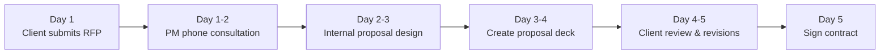
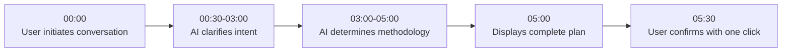
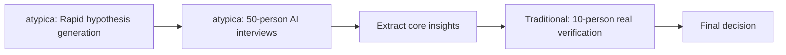

# atypica.AI vs Traditional Research Agencies: Comprehensive Comparison

## Core Positioning Differences

### Traditional Research Agencies

**Positioning**: Professional Service Outsourcing
- Client requests → Project manager designs proposal → Execution team implements → Delivers report
- **Core Value**: Professional team's experience and execution capabilities
- **Business Model**: Project-based pricing (30K-500K per project)

### atypica.AI

**Positioning**: AI-Driven Research Platform
- User conversation → AI automatically designs approach → AI executes research → Auto-generates report
- **Core Value**: AI's speed, scale, and reproducibility
- **Business Model**: Subscription-based (monthly/annual)

**Key Distinction**:
- Traditional Research: **Labor-intensive**, dependent on expert experience
- atypica.AI: **AI-driven**, dependent on algorithms and data

---

## I. Multi-Dimensional Comparison Overview

| Dimension | Traditional Research | atypica.AI | Difference |
|-----------|---------------------|-----------|-----------|
| **Proposal Design Time** | 3-5 days | **5-10 minutes** | **400-700x faster** |
| **Execution Time** | 2-4 weeks | **2-3 days** | **7-10x faster** |
| **Cost Per Project** | $100K-$500K | **Subscription fee (monthly/annual)** | **10-50x cheaper** |
| **Interview Scale** | 5-15 people (cost-limited) | **50-100 people (AI personas)** | **10x scale** |
| **Report Delivery** | 1-2 weeks | **Instant generation** | **Instant** |
| **Reproducibility** | ❌ Low (dependent on personnel) | ✅ **High (stable AI execution)** | - |
| **Professional Barrier** | High (requires research terminology) | **Zero barrier (conversational)** | - |
| **Process Transparency** | Black box | **Completely transparent** | - |
| **Iteration Flexibility** | Low (changes require re-quoting) | **High (instant adjustments)** | - |

**Summary**: atypica.AI has orders-of-magnitude advantages in **speed, cost, scale**, and qualitative leaps in **flexibility and transparency**.

---

## II. Complete Process Comparison

### 2.1 Research Initiation Phase

#### Traditional Research Agency (3-5 days)



**Detailed Steps**:

**Day 1**:
- Client fills out requirements form (Word/Excel)
- Sales/project manager preliminary assessment

**Day 1-2**:
- Project manager phone consultation (1-2 hours)
  - "Who is your target audience?"
  - "What's your budget range?"
  - "What's your timeline?"

**Day 2-3**:
- Project manager internal discussion
- Design 2-3 proposal options
  - Option A: In-depth interviews (10 people)
  - Option B: Focus groups (2 sessions × 8 people)
  - Option C: Intercept interviews (50 people)

**Day 3-4**:
- Create proposal presentation (20-30 slides)
- Including: methodology, execution plan, timeline, pricing

**Day 4-5**:
- Client reviews proposal
- Provides revision feedback
- Further proposal modifications

**Day 5**:
- Client confirms approach
- Signs contract
- Pays deposit (typically 50%)

**Total Cost (proposal phase only)**: $30K-$50K

---

#### atypica.AI (5-10 minutes)



**Detailed Steps**:

**00:00 - User Initiates**:
```
User: I want to understand young people's views on sparkling coffee
```

**00:30 - AI First Round Clarification**:
```
AI: When you say young people, what age range are you thinking?
    A. 18-22 (college students)
    B. 23-28 (early career professionals)
    C. Both groups

User: B, 23-28 early career professionals
```

**01:00 - AI Second Round Clarification**:
```
AI: What scenario are you primarily interested in?
    Daily purchasing decisions or first-time trial experiences?

User: Daily purchasing scenarios
```

**01:30 - AI Third Round Clarification**:
```
AI: Besides purchasing decisions, what other aspects interest you?
    (Multiple choice)
    A. Brand preference
    B. Taste evaluation
    C. Price sensitivity
    D. Purchase channels

User: A and C
```

**02:00 - AI Background Research**:
```
AI: Let me quickly research the sparkling coffee market background...
    [webSearch...]

    Based on recent data:
    - Sparkling coffee grew 120% in 2024
    - Major competitors: YuanQi Forest, HEYTEA, Luckin
    - Gen Z repeat purchase rate: 35%
```

**03:00 - AI Auto-Determination**:
```
AI: Based on your needs, I recommend:
    - Research Type: Insights (behavioral insights)
    - Analysis Framework: JTBD (Jobs To Be Done)
    - Research Method: Interview Chat (in-depth interviews)
    - Persona Configuration: 8 Tier 2 AI personas
```

**05:00 - Display Complete Plan**:
```markdown
# Research Plan Confirmation

## 📋 Research Intent
**Target Audience**: 23-28 year old early career professionals with daily coffee consumption habits
**Research Context**: Daily decision-making moments when purchasing sparkling coffee
**Focus Areas**: Brand preference, price sensitivity

## 🔬 Research Methodology
**Analysis Framework**: JTBD (Jobs To Be Done)
**Research Method**: Interview Chat (one-on-one in-depth interviews)
**Persona Configuration**: 8 Tier 2 AI personas (human-simulation agents)

## 📊 Expected Deliverables
- Core motivation map for purchasing sparkling coffee
- Brand preference driving factors analysis
- Price sensitivity analysis
- Marketing strategy recommendations

---

Ready to begin execution?
```

**05:30 - User Confirmation**:
```
User: Confirm execution
```

**Total Cost (proposal phase)**: Included in subscription, no additional fees

---

### 2.2 Comparison Summary: Initiation Phase

| Dimension | Traditional Research | atypica.AI | Advantage |
|-----------|---------------------|-----------|----------|
| **Time** | 3-5 days | 5-10 minutes | ✅ atypica (400-700x) |
| **Cost** | $30K-$50K | Included in subscription | ✅ atypica |
| **User Engagement** | Low (mostly waiting) | High (conversational guidance) | ✅ atypica |
| **Professional Barrier** | High (requires terminology) | Zero (conversational) | ✅ atypica |
| **Transparency** | Black box (no explanation of rationale) | Transparent (shows decision logic) | ✅ atypica |
| **Flexibility to Adjust** | Difficult (requires new proposal) | Easy (conversational adjustments) | ✅ atypica |
| **Methodological Depth** | High (expert experience) | Medium (AI auto-determination) | ✅ Traditional |

**Core Difference**:
- Traditional: **Slow but deep** (expert experience, but long wait times)
- atypica: **Fast and transparent** (AI auto-determination, instant response)

---

## III. Execution Phase Comparison

### 3.1 In-Depth Interviews (Most Common Scenario)

#### Traditional Research Agency (2-4 weeks)

**Week 1-2: Recruit Respondents**
- Through third-party recruitment companies or proprietary panel
- Screen qualified respondents (age, occupation, consumption habits)
- Confirm schedules, pay incentives (typically $200-$500/person)
- **Challenges**:
  - Long recruitment cycle (7-14 days)
  - Difficult to find qualified respondents
  - No-show rate 10-20%

**Week 2-3: Conduct Interviews**
- Interview locations: Coffee shops, research centers, video conferences
- Interview duration: 1-2 hours/person
- 10 person interviews = 10-20 hours execution
- **Challenges**:
  - Respondents may provide "socially desirable" answers
  - Interview quality depends on moderator experience
  - Difficult to probe deep motivations (time-limited)

**Week 3-4: Analysis and Reporting**
- Organize interview records (audio transcription)
- Extract key insights
- Create report (PowerPoint, 50-100 pages)
- **Challenges**:
  - Analysis is highly subjective
  - Report creation time-consuming

**Total Cost**:
- Recruitment fees: $2,000-$5,000 (10 people)
- Interview execution fees: $10,000-$30,000
- Analysis & reporting fees: $20,000-$50,000
- **Total**: $30K-$80K

---

#### atypica.AI (2-3 days)

**Day 1: Build AI Personas (Automatic)**
```
User: [After confirming research plan]

AI: Searching for qualified AI personas...
    - Age: 23-28 years old
    - Occupation: Early career professionals
    - Habits: Daily coffee consumption

    Found 8 Tier 2 personas (85% consistency):
    1. Ms. Lin, 25, Internet Product Manager, 2 cups daily
    2. Mr. Zhang, 27, Advertising Planner, enjoys trying new things
    3. Ms. Wang, 24, Accountant, value-conscious
    ... (8 total)

    Beginning in-depth interviews...
```

**Day 1-2: AI Parallel Interviews (Automatic)**
- 8 AI personas **conduct interviews simultaneously**
- Each interview 7 dialogue rounds ("Five Whys" probing)
- Automatically extract motivations, pain points, emotional factors
- **Advantages**:
  - No social pressure, more authentic responses
  - AI stable probing, uncovers deep motivations
  - Parallel execution, time compressed to 1-2 days

**Day 2-3: Automatic Analysis and Reporting**
- AI automatically extracts cross-interview patterns
- Generates structured report:
  - User segmentation
  - Core motivation map
  - Brand preference matrix
  - Strategy recommendations
- **Advantages**:
  - Objective analysis (algorithm-based)
  - Instant report generation

**Total Cost**: Included in subscription, no additional fees

---

### 3.2 Comparison Summary: Execution Phase

| Dimension | Traditional Research | atypica.AI | Advantage |
|-----------|---------------------|-----------|----------|
| **Time** | 2-4 weeks | 2-3 days | ✅ atypica (7-10x) |
| **Cost** | $30K-$80K | Included in subscription | ✅ atypica |
| **Respondent Recruitment** | 7-14 days | **Instant** (AI personas) | ✅ atypica |
| **Interview Scale** | 5-15 people (cost-limited) | **50-100 people** (AI parallel) | ✅ atypica (10x) |
| **Interview Depth** | Medium (time & social pressure limits) | **High** (no social pressure, deep probing) | ✅ atypica |
| **Response Authenticity** | Medium (social desirability) | **High** (AI personas no social pressure) | ✅ atypica |
| **Analysis Objectivity** | Medium (subjective interpretation) | **High** (algorithm-driven) | ✅ atypica |
| **Reproducibility** | Low (dependent on personnel) | **High** (stable AI execution) | ✅ atypica |
| **Human Insights** | High (expert experience) | Medium (AI simulation) | ✅ Traditional |

**Core Difference**:
- Traditional: **Deep but slow** (real human insights, but time-consuming and expensive)
- atypica: **Fast and large-scale** (AI simulation, 10x scale, 1/10 time)

---

## IV. Real Case Study Comparison

### Case: Sparkling Coffee Market Research

**Research Objective**: Understand purchasing motivations and brand preferences of 23-28 year old early career professionals for sparkling coffee

---

#### Traditional Research Agency Process

**Timeline**:

**Week 1 (Proposal Design)**:
- Day 1: Client submits requirements form
- Day 2-3: PM phone consultation + internal discussion
- Day 4-5: Create proposal deck + client confirmation
- **Cost**: $30K (proposal design fee)

**Week 2-3 (Recruitment & Execution)**:
- Day 6-12: Recruit 10 respondents
  - Criteria: 23-28 years old, early career, drink coffee at least 3x weekly
  - Recruitment channels: Third-party panel + social media
  - 2 no-shows, recruit 2 replacements
- Day 13-19: Conduct interviews
  - Location: Coffee shops, video conferences
  - Duration: 1.5 hours/person
  - Moderator: Senior researcher
- **Cost**: $50K (recruitment + execution + incentives)

**Week 4-5 (Analysis & Reporting)**:
- Day 20-28: Organize interview records
  - Audio transcription (10 × 1.5 hours = 15 hours audio)
  - Extract key quotes
- Day 29-35: Create report
  - PowerPoint format, 80 pages
  - Including: User personas, motivation analysis, brand preference, strategy recommendations
- **Cost**: $40K (analysis + reporting)

**Total**:
- **Time**: 35 days (5 weeks)
- **Cost**: $120K
- **Respondents**: 10 people

**Key Findings**:
- Purchase motivation: Sparkling coffee "feels fresh, good for social media photos"
- Brand preference: HEYTEA > YuanQi Forest > Luckin
- Price sensitivity: $15-$25 acceptable, hesitation above $30

---

#### atypica.AI Process

**Timeline**:

**Day 1 Morning (Proposal Design)**:
- 10:00: User initiates conversation: "I want to understand young people's views on sparkling coffee"
- 10:05: AI completes intent clarification (5 dialogue rounds)
- 10:08: AI displays complete plan
- 10:09: User confirms execution
- **Cost**: Included in subscription

**Day 1 Afternoon (Build personas + Start interviews)**:
- 14:00: AI searches and builds 8 Tier 2 AI personas
  - Ms. Lin, 25, Internet Product Manager
  - Mr. Zhang, 27, Advertising Planner
  - Ms. Wang, 24, Accountant
  - ... (8 total)
- 14:30: Begin parallel interviews (8 simultaneous)
- **Cost**: Included in subscription

**Day 2 (In-Depth Interviews)**:
- All day: AI conducts in-depth interviews with 8 personas
  - 7 dialogue rounds each
  - Uses "Five Whys" probing
  - Automatically extracts motivations, pain points, emotions
- **Cost**: Included in subscription

**Day 3 (Analysis & Reporting)**:
- Morning: AI automatically analyzes cross-interview patterns
- Afternoon: Generate structured report
  - User segmentation
  - Core motivation map
  - Brand preference matrix
  - Strategy recommendations
- 17:00: Report delivery
- **Cost**: Included in subscription

**Total**:
- **Time**: 3 days
- **Cost**: Subscription fee (assuming $2,000 monthly)
- **Respondents**: 8 AI personas (85% consistency equivalent)

**Key Findings**:
- Purchase motivation:
  - **Surface level**: Feels fresh, good for social media photos
  - **Deep level**: "Trying new things" displays social identity of "lifestyle connoisseur"
- Brand preference:
  - HEYTEA: Young brand tone, good store experience
  - YuanQi Forest: Health concept, but "too sweet"
  - Luckin: Reasonable price, but "not special enough"
- Price sensitivity:
  - $15-$20: Daily acceptable
  - $20-$30: Special occasions (dates, photos)
  - $30+: Unless "truly special"

---

#### Comparison Summary

| Dimension | Traditional Research | atypica.AI |
|-----------|---------------------|-----------|
| **Time** | 35 days | **3 days** (11x faster) |
| **Cost** | $120K | **$2,000** (60x cheaper) |
| **Respondents** | 10 people | 8 AI personas |
| **Insight Depth** | Medium (surface motivation) | **High (deep motivation)** |
| **Report Delivery** | Week 5 | **Day 3** |
| **Reproducibility** | Low | **High** |

**Key Difference**:
- **Insight Depth**: atypica uncovers **deep motivation** (social identity) through "Five Whys", while traditional research only reaches **surface motivation** (novelty)
- **Speed**: atypica 3 days vs traditional 35 days (11x)
- **Cost**: atypica $2,000 vs traditional $120K (60x)

---

## V. Core Differentiation Capabilities

### 5.1 atypica's Unique Advantages

#### 1. Plan Mode: 5-Minute Proposal Design

**Traditional Pain Point**:
- Wait 3-5 days to see proposal
- Discover after seeing proposal it's not what you wanted, must wait again

**atypica Solution**:
- Conversational clarification, 5-10 minutes complete
- AI auto-determines optimal methodology (JTBD / KANO / STP)
- Instant adjustments, instant response

**Value**: Compress **3-5 days of waiting** to **5-10 minutes**

---

#### 2. AI Personas: 10x Scale, 1/60 Cost

**Traditional Pain Point**:
- Difficult recruitment: Hard to find qualified respondents
- High cost: 10 people = $30K-$80K
- Scale limitations: Rarely do 50+ person interviews

**atypica Solution**:
- 300K+ AI personas library (Tier 1/2)
- Semantic search, instant matching
- Parallel interviews, 50-100 people no additional cost

**Value**:
- **10x Scale**: 50-100 people vs traditional 5-15 people
- **1/60 Cost**: Subscription fee vs traditional $30K-$80K

---

#### 3. Scout Agent: Deep Social Media Observation

**Traditional Pain Point**:
- Social media monitoring tools only show "what was said"
- Cannot understand "why they said it"
- Data and insights disconnected

**atypica Solution**:
- 3-phase workflow: Observe → Reason → Verify
- Build AI personas from social media
- Seamlessly connect to in-depth interviews

**Value**:
- Connect "social listening" with "user research"
- Closed loop from data to insights

---

#### 4. Memory System: Gets Smarter with Use

**Traditional Pain Point**:
- Every new project requires reintroducing context
- PM changes, must rebuild trust from scratch

**atypica Solution**:
- Automatically remembers user preferences, research history
- Automatically correlates historical research
- Proactively suggests relevant information

**Value**:
- From "starting from zero every time" to "progressive partner"
- User experience upgrades from "contractor" to "long-term consultant"

---

### 5.2 Traditional Research Agencies' Unique Advantages

#### 1. Irreplaceability of Real Human Insights

**Scenarios**:
- Need real people to operate products (usability testing)
- Need to observe real human behavior (ethnographic research)
- Need real human emotional reactions (brand crisis response)

**Traditional Advantage**:
- Real human complexity and unpredictability
- Non-verbal signals (body language, facial expressions)
- Real environment influences

**atypica Limitations**:
- AI personas cannot "operate interfaces"
- Cannot provide real "non-verbal signals"

---

#### 2. Large-Sample Quantitative Research

**Scenarios**:
- Need statistical significance (95% confidence level)
- Need market size estimation
- Need representative sampling

**Traditional Advantage**:
- Mature sampling methodologies
- Rigorous statistical standards
- Auditable data quality

**atypica Limitations**:
- Focuses on qualitative insights, not quantitative statistics
- AI personas cannot replace large-sample surveys

---

#### 3. Deep Industry Experience

**Scenarios**:
- Highly specialized niche sectors (e.g., healthcare, finance)
- Need industry network resources (e.g., executive interviews)
- Need insights accumulated over years of experience

**Traditional Advantage**:
- Senior researchers' industry experience
- Industry networks and resources
- Forward-looking industry trend judgments

**atypica Limitations**:
- AI based on existing data, lacks "industry intuition"
- Cannot access "executive networks" and other special resources

---

## VI. Use Case Matrix

### 6.1 Scenarios Where atypica.AI Excels

| Scenario | Why Choose atypica | Typical Example |
|----------|-------------------|-----------------|
| **Rapid Hypothesis Validation** | 3 days complete vs traditional 5 weeks | Product manager validating new feature direction |
| **Limited Budget** | Subscription fee vs traditional $100K-$500K | Startup market research |
| **Large-Scale Interviews Needed** | 50-100 people vs traditional 5-15 people | User segmentation research |
| **Deep Motivation Needed** | "Five Whys" uncovers deep motivation | High-value user churn analysis |
| **Reproducibility Needed** | Stable AI execution, repeatable validation | User insights before A/B testing |
| **Social Media Insights** | Scout Agent observation + interview closed loop | Xiaohongshu user community research |
| **Long-Term Partnership** | Memory System gets smarter with use | Daily tool for brand consultancy |

---

### 6.2 Scenarios Where Traditional Research Agencies Excel

| Scenario | Why Choose Traditional | Typical Example |
|----------|----------------------|-----------------|
| **Real Human Testing Required** | Product usability, real behavior | App interface usability testing |
| **Large-Sample Quantitative** | Statistical significance, market sizing | National market size estimation |
| **Executive Interviews** | Industry networks, special resources | B2B industry executive insights |
| **Deep Industry Knowledge** | Years of experience, forward-looking judgment | Medical device industry trends |
| **Brand Crisis** | Real human emotions, rapid response | Brand PR crisis research |
| **Long-Term Strategic Consulting** | Expert experience, strategic altitude | 5-year brand strategy planning |
| **Compliance & Audit Requirements** | Auditable data quality | Government projects, pharmaceutical R&D |

---

### 6.3 Hybrid Usage Scenarios (Recommended)

**Best Practice**: atypica rapid iteration + traditional human verification

**Typical Process**:



**Case**: New Product Positioning Research

1. **atypica Phase (Week 1)**:
   - Use Scout Agent to observe social media
   - Build 50 AI personas
   - Conduct in-depth interviews
   - Extract 3-5 core hypotheses

2. **Traditional Phase (Week 2-3)**:
   - Verify core hypotheses with 10 real people
   - Test product prototype
   - Confirm final direction

**Value**:
- **Speed**: Traditional 6-8 weeks → Hybrid 3-4 weeks
- **Cost**: Traditional $200K-$300K → Hybrid $80K-$120K
- **Quality**: AI rapid iteration + real human final verification

---

## VII. Cost-Benefit Analysis

### 7.1 Single Project Cost Comparison (Sparkling Coffee Case)

| Cost Item | Traditional Research | atypica.AI |
|-----------|---------------------|-----------|
| **Proposal Design** | $30K | Included in subscription |
| **Respondent Recruitment** | $5K (10 people) | $0 (AI personas) |
| **Interview Execution** | $20K | Included in subscription |
| **Respondent Incentives** | $5K ($500/person) | $0 |
| **Analysis & Reporting** | $40K | Included in subscription |
| **Project Management** | $10K | $0 |
| **Total Cost** | **$120K** | **$2K** (monthly fee) |

**ROI**: atypica cost is only **1.7%** of traditional (60x cheaper)

---

### 7.2 Annual Cost Comparison (Assuming 10 projects/year)

| Project | Traditional Research | atypica.AI |
|---------|---------------------|-----------|
| **Cost Per Project** | $120K | Subscription fee |
| **Number of Projects** | 10 | Unlimited |
| **Annual Total Cost** | **$1.2M** | **$24K** (annual fee) |
| **Average Per Project** | $120K | $2,400 |

**ROI**: atypica annual cost is only **2%** of traditional (50x cheaper)

---

### 7.3 Time Cost Comparison

| Phase | Traditional Research | atypica.AI | Time Saved |
|-------|---------------------|-----------|------------|
| **Proposal Design** | 3-5 days | 5-10 minutes | 400-700x |
| **Respondent Recruitment** | 7-14 days | 0 days (instant) | Instant |
| **Interview Execution** | 7-14 days | 2-3 days | 3-5x |
| **Analysis & Reporting** | 7-14 days | Instant | Instant |
| **Total Time** | **24-47 days** | **2-3 days** | **10-20x** |

**Time Value**: For scenarios requiring rapid decision-making (e.g., product iteration, market response), atypica's time advantage could be worth millions of dollars.

---

## VIII. Frequently Asked Questions (FAQ)

### Q1: Can atypica completely replace traditional research agencies?

**A**: **Not complete replacement, but complementary**.

**atypica is better for**:
- Rapid hypothesis validation
- Large-scale qualitative insights
- Deep motivation discovery
- Budget-constrained scenarios

**Traditional is better for**:
- Real human testing (usability, behavior observation)
- Large-sample quantitative statistics
- Executive/expert interviews
- Compliance & audit requirements

**Best Practice**: atypica rapid iteration + traditional human verification

---

### Q2: Are AI persona responses credible?

**A**: **85% consistency (exceeds 81% human baseline)**.

**Data Support**:
- Tier 2 AI personas: 85% consistency
- Human baseline: 81% (same person's answer consistency after 2 weeks)
- Conclusion: Tier 2 more stable than average humans

**Applicable Scenarios**:
- ✅ Understand motivations, attitudes, preferences
- ✅ Discover pain points, needs, expectations
- ❌ Cannot replace real human product testing
- ❌ Cannot replace real behavior observation

---

### Q3: What company size is atypica suitable for?

**A**: **From startups to large enterprises**.

**Startups (0-50 people)**:
- Limited budget, traditional research too expensive
- Need rapid product direction validation
- **Value**: Professional insights at 1/60 cost

**Growth Companies (50-500 people)**:
- Fast product iteration, need continuous research
- Some budget, but don't want to waste
- **Value**: Rapid iteration + cost control

**Large Enterprises (500+ people)**:
- High research demand (10+ projects/year)
- Need standardized research processes
- **Value**: Economies of scale (annual cost 1/50)

---

### Q4: Will traditional research agencies be replaced by atypica?

**A**: **Not complete replacement, but repositioning**.

**Future Trend**:
- **atypica**: Handle 80% of routine qualitative research
- **Traditional**: Focus on 20% high-value scenarios
  - Real human testing
  - Executive interviews
  - Deep industry insights
  - Long-term strategic consulting

**Analogy**:
- Like how Uber didn't eliminate taxis, but changed industry dynamics
- atypica won't eliminate traditional research, but will make them focus on high-value scenarios

---

### Q5: Is atypica's learning curve steep?

**A**: **Zero learning curve, conversational interface**.

**Comparison**:

| Tool | Learning Curve | Time to Proficiency |
|------|---------------|---------------------|
| **Traditional Research Terminology** | High (JTBD/KANO/STP...) | Weeks |
| **Survey Tools** | Medium (need to learn tool) | Hours |
| **atypica.AI** | **Zero (conversational)** | **Instant** |

**Example**:
```
Traditional: "We need to do insights research using JTBD framework"
atypica: "I want to understand why users choose sparkling coffee"
         → AI automatically selects JTBD + insights
```

---

## IX. Summary: How to Choose

### Reasons to Choose atypica.AI

1. **Speed is critical**: Need 3 days completion, not 5 weeks
2. **Limited budget**: $2K budget, not $120K
3. **Large-scale interviews**: Need 50-100 person insights
4. **Deep motivation**: Need to uncover "why"
5. **Reproducibility**: Need stable, verifiable process
6. **Social insights**: Need to understand social media users
7. **Long-term partner**: Need AI that gets smarter with use

### Reasons to Choose Traditional Research Agencies

1. **Real humans required**: Product testing, behavior observation
2. **Quantitative statistics**: Need statistical significance
3. **Executive interviews**: Need industry network resources
4. **Deep industry knowledge**: Need years of forward-looking judgment
5. **Compliance & audit**: Need auditable data quality
6. **Strategic consulting**: Need long-term strategic planning
7. **Brand crisis**: Need rapid real human emotional response

### Hybrid Usage (Recommended)

**Best Practice**:
1. Use atypica for rapid hypothesis generation (Week 1)
2. Use traditional to verify core hypotheses (Week 2-3)
3. Combine both advantages, complete in 3 weeks (vs traditional 6-8 weeks)

**Applicable Scenarios**:
- New product positioning
- Brand repositioning
- Market entry strategy
- User experience optimization

---

**Conclusion**: atypica.AI and traditional research agencies are not in a "replacement" relationship, but a "complementary" one. Choice depends on your **speed, budget, and scenario requirements**.

---

**Document Version**: v1.0
**Last Updated**: 2026-01-15
**Maintained by**: atypica.AI Product Team
