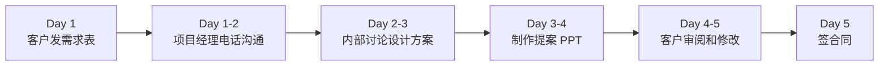
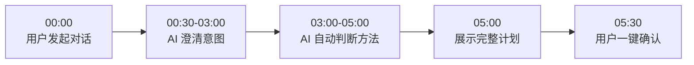
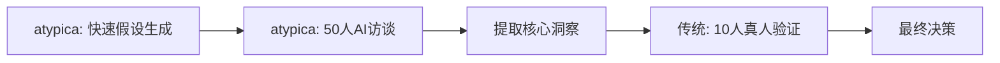

# atypica.AI vs 传统调研公司：全面对比

## 核心定位差异

### 传统调研公司

**定位**：专业服务外包商
- 客户提需求 → 项目经理设计方案 → 执行团队实施 → 交付报告
- **核心价值**：专业团队的经验和执行能力
- **业务模式**：项目制收费（3-50万/项目）

### atypica.AI

**定位**：AI 驱动的研究平台
- 用户对话 → AI 自动设计方案 → AI 执行研究 → 自动生成报告
- **核心价值**：AI 的速度、规模和可复现性
- **业务模式**：订阅制（月费/年费）

**关键区别**：
- 传统调研：**人力密集型**，依赖专家经验
- atypica.AI：**AI 驱动型**，依赖算法和数据

---

## 一、全维度对比总览

| 维度 | 传统调研公司 | atypica.AI | 差异倍数 |
|------|------------|-----------|---------|
| **方案设计时间** | 3-5 天 | **5-10 分钟** | **400-700x faster** |
| **执行时间** | 2-4 周 | **2-3 天** | **7-10x faster** |
| **单项目成本** | 10-50 万元 | **订阅费（月费/年费）** | **10-50x cheaper** |
| **访谈规模** | 5-15 人（受成本限制） | **50-100 人（AI personas）** | **10x scale** |
| **报告交付** | 1-2 周 | **即时生成** | **Instant** |
| **可复现性** | ❌ 低（依赖执行人员） | ✅ **高（AI 稳定执行）** | - |
| **专业门槛** | 高（需懂调研术语） | **零门槛（对话即可）** | - |
| **流程透明度** | 黑盒 | **完全透明** | - |
| **迭代灵活性** | 低（修改需重新报价） | **高（秒级调整）** | - |

**总结**：atypica.AI 在**速度、成本、规模**上有数量级优势，在**灵活性、透明度**上有质的飞跃。

---

## 二、完整流程对比

### 2.1 研究启动阶段

#### 传统调研公司（3-5 天）



**详细步骤**：

**Day 1**：
- 客户填写需求表（Word/Excel）
- 销售/项目经理初步评估

**Day 1-2**：
- 项目经理电话沟通（1-2 小时）
  - "你们的目标用户是？"
  - "预算范围是多少？"
  - "交付时间要求？"

**Day 2-3**：
- 项目经理内部讨论
- 设计 2-3 个方案选项
  - 方案 A：深度访谈（10 人）
  - 方案 B：焦点小组（2 场 × 8 人）
  - 方案 C：街头拦访（50 人）

**Day 3-4**：
- 制作提案 PPT（20-30 页）
- 包含：方法论、执行计划、时间表、报价

**Day 4-5**：
- 客户审阅提案
- 提出修改意见
- 再次修改方案

**Day 5**：
- 客户确认方案
- 签订合同
- 支付预付款（通常 50%）

**总成本（仅方案设计）**：3-5 万元

---

#### atypica.AI（5-10 分钟）



**详细步骤**：

**00:00 - 用户发起**：
```
用户: 我想了解年轻人对气泡咖啡的看法
```

**00:30 - AI 第一轮澄清**：
```
AI: 你说的年轻人，大概是哪个年龄段？
    A. 18-22岁（大学生）
    B. 23-28岁（职场新人）
    C. 都想了解

用户: B，23-28岁职场新人
```

**01:00 - AI 第二轮澄清**：
```
AI: 主要想了解他们在什么场景下的选择？
    是日常购买的时候，还是第一次尝试的时候？

用户: 日常购买的场景
```

**01:30 - AI 第三轮澄清**：
```
AI: 除了购买决策，还关注哪些方面？
    （多选）
    A. 品牌偏好
    B. 口味评价
    C. 价格敏感度
    D. 购买渠道

用户: A 和 C
```

**02:00 - AI 背景调研**：
```
AI: 好的，让我快速搜索一下气泡咖啡市场的背景...
    [webSearch...]

    根据最新信息：
    - 气泡咖啡 2024 年增长 120%
    - 主要竞品：元气森林、喜茶、瑞幸
    - Z 世代复购率 35%
```

**03:00 - AI 自动判断**：
```
AI: 根据你的需求，我推荐：
    - 研究类型：insights（行为洞察）
    - 分析框架：JTBD（Jobs To Be Done）
    - 研究方式：Interview Chat（深度访谈）
    - 人设配置：8 个 Tier 2 AI personas
```

**05:00 - 展示完整计划**：
```markdown
# 研究计划确认

## 📋 研究意图
**研究对象**: 23-28岁职场新人，有日常咖啡消费习惯
**研究场景**: 购买气泡咖啡的日常决策时刻
**关注维度**: 品牌偏好、价格敏感度

## 🔬 研究方法
**分析框架**: JTBD (Jobs To Be Done)
**研究方式**: Interview Chat（一对一深度访谈）
**人设配置**: 8 个 Tier 2 AI personas（真人模拟智能体）

## 📊 预期产出
- 用户购买气泡咖啡的核心动机地图
- 品牌偏好的驱动因素分析
- 价格敏感度分析
- 营销策略建议

---

是否开始执行？
```

**05:30 - 用户确认**：
```
用户: 确认执行
```

**总成本（方案设计）**：包含在订阅费中，无额外费用

---

### 2.2 对比总结：启动阶段

| 维度 | 传统调研公司 | atypica.AI | 优势方 |
|------|------------|-----------|-------|
| **时间** | 3-5 天 | 5-10 分钟 | ✅ atypica（400-700x） |
| **成本** | 3-5 万元 | 订阅费包含 | ✅ atypica |
| **用户参与度** | 低（等待为主） | 高（对话引导） | ✅ atypica |
| **专业门槛** | 高（需懂术语） | 零（对话即可） | ✅ atypica |
| **透明度** | 黑盒（不解释为何） | 透明（显示判断逻辑） | ✅ atypica |
| **灵活调整** | 难（需重新提案） | 易（对话调整） | ✅ atypica |
| **方法论深度** | 高（专家经验） | 中（AI 自动判断） | ✅ 传统 |

**核心差异**：
- 传统：**慢但深**（专家经验，但等待时间长）
- atypica：**快且透明**（AI 自动判断，秒级响应）

---

## 三、执行阶段对比

### 3.1 深度访谈（最常见场景）

#### 传统调研公司（2-4 周）

**Week 1-2：招募受访者**
- 通过第三方招募公司或自有panel
- 筛选符合条件的受访者（年龄、职业、消费习惯）
- 确认时间、支付费用（通常 200-500 元/人）
- **挑战**：
  - 招募周期长（7-14 天）
  - 符合条件的人难找
  - 爽约率 10-20%

**Week 2-3：执行访谈**
- 访谈地点：咖啡厅、研究中心、视频会议
- 访谈时长：1-2 小时/人
- 10 人访谈 = 10-20 小时执行
- **挑战**：
  - 受访者可能"社交理想化"回答
  - 访谈质量依赖主持人经验
  - 难以追问深层动机（时间有限）

**Week 3-4：分析和报告**
- 整理访谈记录（录音转文字）
- 提取关键洞察
- 制作报告（PPT，50-100 页）
- **挑战**：
  - 分析主观性强
  - 报告制作耗时

**总成本**：
- 招募费用：2,000-5,000 元（10人）
- 访谈执行费：10,000-30,000 元
- 分析报告费：20,000-50,000 元
- **总计**：3-8 万元

---

#### atypica.AI（2-3 天）

**Day 1：构建 AI Personas（自动）**
```
用户: [确认研究计划后]

AI: 开始搜索符合条件的 AI personas...
    - 年龄：23-28岁
    - 职业：职场新人
    - 习惯：日常咖啡消费

    找到 8 个 Tier 2 personas（85分一致性）：
    1. 林女士，25岁，互联网产品经理，每天2杯咖啡
    2. 张先生，27岁，广告策划，喜欢尝新
    3. 王女士，24岁，会计，注重性价比
    ... (8个)

    开始深度访谈...
```

**Day 1-2：AI 并行访谈（自动）**
- 8 个 AI personas **同时进行**访谈
- 每个访谈 7 轮对话（"五个为什么"追问）
- 自动提取动机、痛点、情感因素
- **优势**：
  - 无社交压力，回答更真实
  - AI 稳定追问，挖掘深层动机
  - 并行执行，时间压缩到 1-2 天

**Day 2-3：自动分析和报告**
- AI 自动提取跨访谈的共性模式
- 生成结构化报告：
  - 用户细分
  - 核心动机地图
  - 品牌偏好矩阵
  - 策略建议
- **优势**：
  - 分析客观（基于算法）
  - 报告即时生成

**总成本**：订阅费包含，无额外费用

---

### 3.2 对比总结：执行阶段

| 维度 | 传统调研公司 | atypica.AI | 优势方 |
|------|------------|-----------|-------|
| **时间** | 2-4 周 | 2-3 天 | ✅ atypica（7-10x） |
| **成本** | 3-8 万元 | 订阅费包含 | ✅ atypica |
| **受访者招募** | 7-14 天 | **即时**（AI personas） | ✅ atypica |
| **访谈规模** | 5-15 人（受成本限制） | **50-100 人**（AI 并行） | ✅ atypica（10x） |
| **访谈深度** | 中（时间和社交压力限制） | **高**（无社交压力，深层追问） | ✅ atypica |
| **回答真实性** | 中（社交理想化） | **高**（AI personas 无社交压力） | ✅ atypica |
| **分析客观性** | 中（主观解读） | **高**（算法驱动） | ✅ atypica |
| **可复现性** | 低（依赖执行人员） | **高**（AI 稳定执行） | ✅ atypica |
| **人类洞察** | 高（专家经验） | 中（AI 模拟） | ✅ 传统 |

**核心差异**：
- 传统：**深但慢**（真人洞察，但时间长、成本高）
- atypica：**快且大规模**（AI 模拟，规模 10x，时间 1/10）

---

## 四、真实案例对比

### 案例：气泡咖啡市场研究

**研究目标**：了解 23-28 岁职场新人对气泡咖啡的购买动机和品牌偏好

---

#### 传统调研公司流程

**时间线**：

**Week 1（方案设计）**：
- Day 1：客户发需求表
- Day 2-3：项目经理电话沟通 + 内部讨论
- Day 4-5：制作提案 PPT + 客户确认
- **成本**：3 万元（方案设计费）

**Week 2-3（招募执行）**：
- Day 6-12：招募 10 位受访者
  - 条件：23-28岁，职场新人，每周至少喝 3 次咖啡
  - 招募渠道：第三方 panel + 朋友圈转发
  - 爽约 2 人，补招 2 人
- Day 13-19：执行访谈
  - 地点：咖啡厅、视频会议
  - 时长：1.5 小时/人
  - 主持人：资深研究员
- **成本**：5 万元（招募 + 执行 + 受访者费用）

**Week 4-5（分析报告）**：
- Day 20-28：整理访谈记录
  - 录音转文字（10 × 1.5 小时 = 15 小时录音）
  - 提取关键引用
- Day 29-35：制作报告
  - PPT 格式，80 页
  - 包含：用户画像、动机分析、品牌偏好、策略建议
- **成本**：4 万元（分析 + 报告）

**总计**：
- **时间**：35 天（5 周）
- **成本**：12 万元
- **受访者**：10 人

**关键发现**：
- 购买动机：气泡咖啡"有新鲜感，适合拍照分享"
- 品牌偏好：喜茶 > 元气森林 > 瑞幸
- 价格敏感度：15-25 元可接受，超过 30 元会犹豫

---

#### atypica.AI 流程

**时间线**：

**Day 1 上午（方案设计）**：
- 10:00：用户发起对话："我想了解年轻人对气泡咖啡的看法"
- 10:05：AI 完成意图澄清（5 轮对话）
- 10:08：AI 展示完整计划
- 10:09：用户确认执行
- **成本**：订阅费包含

**Day 1 下午（构建 personas + 开始访谈）**：
- 14:00：AI 搜索并构建 8 个 Tier 2 AI personas
  - 林女士，25岁，互联网产品经理
  - 张先生，27岁，广告策划
  - 王女士，24岁，会计
  - ... (8个)
- 14:30：开始并行访谈（8 个同时进行）
- **成本**：订阅费包含

**Day 2（深度访谈）**：
- 全天：AI 对 8 个 personas 进行深度访谈
  - 每个 7 轮对话
  - 使用"五个为什么"追问
  - 自动提取动机、痛点、情感
- **成本**：订阅费包含

**Day 3（分析报告）**：
- 上午：AI 自动分析跨访谈模式
- 下午：生成结构化报告
  - 用户细分
  - 核心动机地图
  - 品牌偏好矩阵
  - 策略建议
- 17:00：报告交付
- **成本**：订阅费包含

**总计**：
- **时间**：3 天
- **成本**：订阅费（假设月费 2,000 元）
- **受访者**：8 个 AI personas（等效 85 分一致性）

**关键发现**：
- 购买动机：
  - **表层**：有新鲜感，适合拍照分享
  - **深层**：通过"尝新"展示自己"懂生活"的社交身份
- 品牌偏好：
  - 喜茶：品牌调性年轻，门店体验好
  - 元气森林：健康概念，但"太甜"
  - 瑞幸：价格合适，但"不够特别"
- 价格敏感度：
  - 15-20 元：日常可接受
  - 20-30 元：特殊场合（约会、拍照）
  - 30+ 元：除非"真的很特别"

---

#### 对比总结

| 维度 | 传统调研公司 | atypica.AI |
|------|------------|-----------|
| **时间** | 35 天 | **3 天**（11x faster） |
| **成本** | 12 万元 | **2,000 元**（60x cheaper） |
| **受访者** | 10 人 | 8 个 AI personas |
| **洞察深度** | 中（表层动机） | **高（深层动机）** |
| **报告交付** | Week 5 | **Day 3** |
| **可复现性** | 低 | **高** |

**关键差异**：
- **洞察深度**：atypica 通过"五个为什么"挖掘出**深层动机**（社交身份），传统调研只到**表层动机**（新鲜感）
- **速度**：atypica 3 天 vs 传统 35 天（11x）
- **成本**：atypica 2,000 元 vs 传统 12 万元（60x）

---

## 五、核心差异化能力

### 5.1 atypica 的独特优势

#### 1. Plan Mode：5 分钟完成方案设计

**传统痛点**：
- 等待 3-5 天才能看到方案
- 看到方案后发现不是想要的，又要重新等

**atypica 解决方案**：
- 对话式澄清，5-10 分钟完成
- AI 自动判断最优方法（JTBD / KANO / STP）
- 即时调整，秒级响应

**价值**：将 **3-5 天的等待**压缩到 **5-10 分钟**

---

#### 2. AI Personas：规模 10x，成本 1/60

**传统痛点**：
- 招募难：符合条件的受访者难找
- 成本高：10 人 = 3-8 万元
- 规模受限：很少做 50+ 人访谈

**atypica 解决方案**：
- 30 万+ AI personas 库（Tier 1/2）
- 语义搜索，秒级匹配
- 并行访谈，50-100 人无额外成本

**价值**：
- **规模 10x**：50-100 人 vs 传统 5-15 人
- **成本 1/60**：订阅费 vs 传统 3-8 万元

---

#### 3. Scout Agent：社交媒体深度观察

**传统痛点**：
- 社交媒体监听工具只能看"说了什么"
- 无法理解"为什么这么说"
- 数据和洞察割裂

**atypica 解决方案**：
- 3 阶段工作流：观察 → 推理 → 验证
- 从社交媒体构建 AI personas
- 无缝衔接到深度访谈

**价值**：
- 将"社交监听"和"用户研究"打通
- 从数据到洞察的闭环

---

#### 4. Memory System：越用越懂你

**传统痛点**：
- 每次新项目都要重新介绍背景
- 项目经理换人，又要重新建立信任

**atypica 解决方案**：
- 自动记住用户偏好、研究历史
- 自动关联历史研究
- 主动提示相关信息

**价值**：
- 从"每次从零开始"到"渐进式伙伴"
- 用户体验从"外包商"升级到"长期顾问"

---

### 5.2 传统调研公司的独特优势

#### 1. 真人洞察的不可替代性

**场景**：
- 需要真人操作产品（可用性测试）
- 需要观察真人行为（民族志研究）
- 需要真人情绪反应（品牌危机应对）

**传统优势**：
- 真人的复杂性和不可预测性
- 非语言信号（肢体语言、面部表情）
- 真实环境的影响

**atypica 局限**：
- AI personas 无法"操作界面"
- 无法提供真实的"非语言信号"

---

#### 2. 大样本定量调研

**场景**：
- 需要统计显著性（95% 置信度）
- 需要市场规模估算
- 需要代表性抽样

**传统优势**：
- 成熟的抽样方法论
- 严格的统计学标准
- 可审计的数据质量

**atypica 局限**：
- 聚焦定性洞察，不做定量统计
- AI personas 不能替代大样本问卷

---

#### 3. 行业深度经验

**场景**：
- 高度专业的细分领域（如医疗、金融）
- 需要行业人脉资源（如高管访谈）
- 需要多年经验积累的洞察

**传统优势**：
- 资深研究员的行业经验
- 行业人脉和资源
- 对行业趋势的前瞻性判断

**atypica 局限**：
- AI 基于已有数据，缺少"行业直觉"
- 无法触达"高管人脉"等特殊资源

---

## 六、适用场景矩阵

### 6.1 atypica.AI 更适合的场景

| 场景 | 为什么选 atypica | 典型案例 |
|------|----------------|---------|
| **快速验证假设** | 3 天完成 vs 传统 5 周 | 产品经理验证新功能方向 |
| **预算有限** | 订阅费 vs 传统 10-50 万 | 创业公司市场调研 |
| **需要大规模访谈** | 50-100 人 vs 传统 5-15 人 | 用户细分研究 |
| **需要深度动机** | "五个为什么"挖掘深层动机 | 高端用户流失原因分析 |
| **需要可复现** | AI 稳定执行，可重复验证 | A/B 测试前的用户洞察 |
| **社交媒体洞察** | Scout Agent 观察 + 访谈闭环 | 小红书用户群体研究 |
| **长期合作伙伴** | Memory System 越用越懂 | 品牌咨询公司的日常工具 |

---

### 6.2 传统调研公司更适合的场景

| 场景 | 为什么选传统 | 典型案例 |
|------|------------|---------|
| **需要真人测试** | 产品可用性、真实行为 | App 界面可用性测试 |
| **大样本定量** | 统计显著性、市场规模 | 全国市场规模估算 |
| **高管访谈** | 行业人脉、特殊资源 | B2B 行业高管洞察 |
| **行业深度** | 多年经验、前瞻判断 | 医疗器械行业趋势 |
| **品牌危机** | 真人情绪、快速应对 | 品牌公关危机调研 |
| **长期战略咨询** | 专家经验、战略高度 | 5 年品牌战略规划 |
| **合规审计要求** | 可审计的数据质量 | 政府项目、药品研发 |

---

### 6.3 混合使用场景（推荐）

**最佳实践**：atypica 快速迭代 + 传统真人验证

**典型流程**：



**案例**：新产品定位研究

1. **atypica 阶段（Week 1）**：
   - 使用 Scout Agent 观察社交媒体
   - 构建 50 个 AI personas
   - 进行深度访谈
   - 提取 3-5 个核心假设

2. **传统阶段（Week 2-3）**：
   - 对 10 个真人验证核心假设
   - 测试原型产品
   - 确认最终方向

**价值**：
- **速度**：传统 6-8 周 → 混合 3-4 周
- **成本**：传统 20-30 万 → 混合 8-12 万
- **质量**：AI 快速迭代 + 真人最终验证

---

## 七、成本效益分析

### 7.1 单项目成本对比（气泡咖啡案例）

| 成本项 | 传统调研公司 | atypica.AI |
|--------|------------|-----------|
| **方案设计** | 3 万元 | 订阅费包含 |
| **受访者招募** | 5,000 元（10人） | 0 元（AI personas） |
| **访谈执行** | 2 万元 | 订阅费包含 |
| **受访者费用** | 5,000 元（500元/人） | 0 元 |
| **分析报告** | 4 万元 | 订阅费包含 |
| **项目管理** | 1 万元 | 0 元 |
| **总成本** | **12 万元** | **2,000 元**（月费） |

**ROI**：atypica 成本仅为传统的 **1.7%**（60x cheaper）

---

### 7.2 年度成本对比（假设 10 个项目/年）

| 项目 | 传统调研公司 | atypica.AI |
|------|------------|-----------|
| **单项目成本** | 12 万元 | 订阅费 |
| **项目数量** | 10 个 | 不限 |
| **年度总成本** | **120 万元** | **2.4 万元**（年费） |
| **单项目平均** | 12 万元 | 2,400 元 |

**ROI**：atypica 年度成本仅为传统的 **2%**（50x cheaper）

---

### 7.3 时间成本对比

| 阶段 | 传统调研公司 | atypica.AI | 节省时间 |
|------|------------|-----------|---------|
| **方案设计** | 3-5 天 | 5-10 分钟 | 400-700x |
| **受访者招募** | 7-14 天 | 0 天（即时） | 即时 |
| **访谈执行** | 7-14 天 | 2-3 天 | 3-5x |
| **分析报告** | 7-14 天 | 即时 | 即时 |
| **总时间** | **24-47 天** | **2-3 天** | **10-20x** |

**时间价值**：对于需要快速决策的场景（如产品迭代、市场响应），atypica 的时间优势可能价值数百万元。

---

## 八、常见问题（FAQ）

### Q1: atypica 能完全替代传统调研公司吗？

**A**: **不能完全替代，但可以互补**。

**atypica 更适合**：
- 快速假设验证
- 大规模定性洞察
- 深度动机挖掘
- 预算有限的场景

**传统更适合**：
- 真人测试（可用性、行为观察）
- 大样本定量统计
- 高管/专家访谈
- 合规审计要求

**最佳实践**：atypica 快速迭代 + 传统真人验证

---

### Q2: AI personas 的回答可信吗？

**A**: **85 分一致性（超越人类 81% 基准）**。

**数据支持**：
- Tier 2 AI personas：85 分一致性
- 人类基准：81%（同一人 2 周后回答一致性）
- 结论：Tier 2 比普通人更稳定

**适用场景**：
- ✅ 理解动机、态度、偏好
- ✅ 发现痛点、需求、期待
- ❌ 不能替代真人产品测试
- ❌ 不能替代真实行为观察

---

### Q3: atypica 适合什么规模的公司？

**A**: **从创业公司到大企业都适合**。

**创业公司（0-50 人）**：
- 预算有限，传统调研太贵
- 需要快速验证产品方向
- **价值**：以 1/60 成本获得专业洞察

**成长期公司（50-500 人）**：
- 产品迭代快，需要持续研究
- 有一定预算，但不想浪费
- **价值**：快速迭代 + 成本可控

**大企业（500+ 人）**：
- 研究需求量大（10+ 项目/年）
- 需要标准化研究流程
- **价值**：规模效应（年度成本 1/50）

---

### Q4: 传统调研公司会被 atypica 取代吗？

**A**: **不会完全取代，但会重新定位**。

**未来趋势**：
- **atypica**：承接 80% 的常规定性研究
- **传统**：聚焦 20% 的高价值场景
  - 真人测试
  - 高管访谈
  - 行业深度洞察
  - 长期战略咨询

**类比**：
- 就像 Uber 没有消灭出租车，但改变了行业格局
- atypica 不会消灭传统调研，但会让它们更聚焦高价值场景

---

### Q5: atypica 的学习成本高吗？

**A**: **零学习成本，对话即可**。

**对比**：

| 工具 | 学习成本 | 上手时间 |
|------|---------|---------|
| **传统调研术语** | 高（JTBD/KANO/STP...） | 数周 |
| **问卷工具** | 中（需学习工具） | 数小时 |
| **atypica.AI** | **零（对话即可）** | **即时** |

**示例**：
```
传统: "我们需要用 JTBD 框架做 insights 研究"
atypica: "我想了解用户为什么选择气泡咖啡"
         → AI 自动选择 JTBD + insights
```

---

## 九、总结：如何选择

### 选择 atypica.AI 的理由

1. **速度是关键**：需要 3 天内完成，而非 5 周
2. **预算有限**：2,000 元预算，而非 12 万
3. **大规模访谈**：需要 50-100 人洞察
4. **深度动机**：需要挖掘"为什么"
5. **可复现**：需要稳定、可验证的流程
6. **社交洞察**：需要理解社交媒体用户
7. **长期伙伴**：需要 AI 越用越懂你

### 选择传统调研公司的理由

1. **真人必需**：产品测试、行为观察
2. **定量统计**：需要统计显著性
3. **高管访谈**：需要行业人脉资源
4. **行业深度**：需要多年经验的前瞻判断
5. **合规审计**：需要可审计的数据质量
6. **战略咨询**：需要长期战略规划
7. **品牌危机**：需要快速真人情绪反应

### 混合使用（推荐）

**最佳实践**：
1. 用 atypica 快速生成假设（Week 1）
2. 用传统验证核心假设（Week 2-3）
3. 结合两者优势，3 周完成（vs 传统 6-8 周）

**适用场景**：
- 新产品定位
- 品牌重塑
- 市场进入策略
- 用户体验优化

---

**结论**：atypica.AI 和传统调研公司不是"替代"关系，而是"互补"关系。选择取决于你的**速度、预算、场景需求**。

---

**文档版本**：v1.0
**最后更新**：2026-01-15
**维护者**：atypica.AI 产品团队
