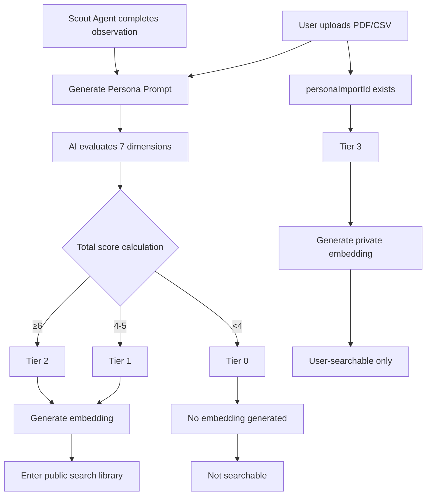
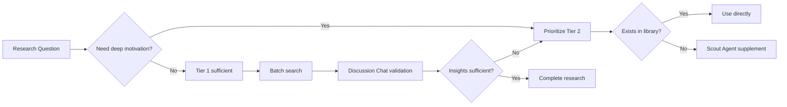

# AI Persona Four-Tier Architecture: A Deep Dive

## Core Philosophy

atypica.AI's AI Persona system is built on **Consistency Science**, leveraging multi-layer data sources and intelligent scoring to create the industry's first **four-tier Persona library**. Our core innovations include:

1. **Human Benchmarking**: Humans show 81% consistency when answering the same questions two weeks apart—we use this as our 100-point baseline
2. **Data Source Quality Matters**: Information density from different sources directly impacts AI simulation consistency
3. **Intelligent Auto-Tiering**: A 7-dimension automated scoring system precisely categorizes 300,000+ Personas
4. **Hybrid Public-Private Architecture**: High-quality public library + private user library, balancing scale with privacy

---

## I. Core Comparison: Four-Tier System

| Dimension | Tier 0<br>Basic Synthetic Agents | Tier 1<br>High-Quality Synthetic Agents | Tier 2<br>Human-Simulated Agents | Tier 3<br>Private Agents |
|------|----------------------|------------------------|---------------------|------------------|
| **Positioning** | Basic profiles, limited data | Deep social media observation | Deep interview-grade personality simulation | Built from proprietary data |
| **Consistency Score** | <62 (<4 dimensions) | 62-77 (4-5 dimensions) | 79-85 (6-7 dimensions) | Depends on data quality |
| **Data Sources** | Basic demographics + fragmented observations | Platform-specific deep analysis | 1-hour deep interview (~5,000 words) | User-imported interview/CRM data |
| **Information Dimensions** | 1-3 complete dimensions | 4-5 complete dimensions | 6-7 complete dimensions | Varies by imported data |
| **Library Size** | ~150K (internal only) | ~200K (public) | ~100K (public) | User-exclusive (private) |
| **Search Visibility** | ❌ Admin only | ✅ All users | ✅ All users | ❌ Owner only |
| **Embedding Index** | ❌ Not indexed | ✅ Indexed | ✅ Indexed | ✅ Indexed (private) |
| **Typical Use Cases** | Internal testing | Market trend exploration | Deep user insights | Enterprise customer research |
| **Creation Method** | Scout Agent insufficient observation | Scout Agent 15 social media observations | atypica team deep interviews | User-uploaded PDF/CSV |
| **Interview Performance** | Shallow responses, easily derails | Coherent opinions, shows attitude | Deep motivations, authentic emotions | Depends on source data |
| **Personality Stability** | ⭐⭐ Weak | ⭐⭐⭐ Medium | ⭐⭐⭐⭐⭐ Strong | ⭐~⭐⭐⭐⭐⭐ Varies |

---

## II. Consistency Scoring System: A Scientific Standard

### 2.1 Human Baseline: The 81% Truth

**Experimental Design**:
- Real people answer 50 questions about values and behavioral preferences
- Two weeks later, they answer the same questions again (without being told)
- We calculate consistency between both sessions

**Result**: Humans average **81% consistency**, which we define as our **100-point standard**.

This means:
- **85-point AI Persona** is more stable than average humans (exceeds human baseline)
- **79-point AI Persona** approaches real human performance (98% of human level)
- **62-point AI Persona** has only 76% of real human stability

### 2.2 Data Source vs. Consistency Score Matrix

| Data Source | Atypica Consistency Score | Corresponding Tier | Information Characteristics | Typical Data Volume |
|--------|-------------------|-----------|----------|-----------|
| **Personal Information** | 55 | Tier 0 | Demographics, basic classification | Name, age, city, occupation |
| **Personality Tests** | 64 | Tier 0-1 | MBTI, Big Five | 120-300 test questions |
| **Consumer Data Platforms** | 73 | Tier 1 | CRM, CDP analysis | Purchase history, behavioral traces |
| **Social Media (Broad)** | 75 | Tier 1 | Instagram, TikTok, etc. | 100-200 content items |
| **Social Media (Targeted)** | **79** | **Tier 1** | Platform-specific deep analysis | 15 tool calls, ~3,000 words observation |
| **Deep Interviews** | **85** | **Tier 2** | 1-hour interview transcription | ~5,000 words transcript |
| **Real Humans** | 100 (81% baseline) | - | Actual human performance | - |

**Key Findings**:
- **79 points is the threshold**: Scout Agent achieves **98% of human baseline** through 15 deep social media observations
- **85 points is the ceiling**: Deep interview-level data exceeds average human consistency, creating a more stable "digital twin"
- **Volume ≠ Quality**: Massive CDP data (73 points) underperforms targeted social observation (79 points)—information density is key

### 2.3 Seven-Dimension Auto-Scoring Algorithm

Each Persona is automatically evaluated across **7 key dimensions** (0-1 scale) upon creation:

```typescript
Scoring Dimensions:
1. demographic: Age, gender, occupation, income, education
2. geographic: City, region, living environment
3. psychological: Values, personality, motivations, fears
4. behavioral: Daily habits, decision-making style, brand preferences
5. needsPainPoints: Unmet needs, frustrations, expectations
6. techAcceptance: Attitude toward new technologies/products
7. socialRelations: Social circles, influencers, group belonging

Tiering Logic:
- Total score ≥ 6 → Tier 2 (Human-Simulated Agents)
- Total score 4-5 → Tier 1 (High-Quality Synthetic Agents)
- Total score < 4 → Tier 0 (Basic Synthetic Agents)
- Has personaImportId → Direct Tier 3 (Private Agents)
```

**Real-World Examples**:

**Case A**: Scout Agent observing a "refined mom" on Xiaohongshu (Chinese Instagram)
```json
{
  "demographic": 1,      // 35, two kids, former tech professional
  "geographic": 1,       // Shanghai Pudong, school district housing
  "psychological": 1,    // Anxious personality, seeks control
  "behavioral": 1,       // Browses Xiaohongshu 2 hours daily, keeps parenting journal
  "needsPainPoints": 1,  // Time management struggles, identity crisis
  "techAcceptance": 0,   // Skeptical of AI education products
  "socialRelations": 0   // Insufficient social circle information
}
Total Score: 6 → Tier 2
```

**Case B**: Scout Agent observing anime fan on Bilibili (insufficient observation)
```json
{
  "demographic": 1,      // 20, college student, animation major
  "geographic": 1,       // Chengdu, renting
  "psychological": 0,    // Fragmented values information
  "behavioral": 1,       // Heavy Bilibili usage, follows anime, draws fan art
  "needsPainPoints": 0,  // Pain points unclear
  "techAcceptance": 0,   // Tech attitude unclear
  "socialRelations": 0   // Social information missing
}
Total Score: 3 → Tier 0 (excluded from public library)
```

---

## III. Use Cases and Selection Guide

### 3.1 Tier 1: High-Quality Synthetic Agents

**Ideal Scenarios**:
- ✅ **Market Trend Exploration**: Quickly understand overall attitudes of platform user groups
- ✅ **Creative Inspiration**: Use Discussion Chat to spark idea collisions among 5-8 different profiles
- ✅ **Concept Testing**: Rapidly validate product direction with 30-50 Personas
- ✅ **Content Creation**: Find "target audience profiles" for KOL videos/podcasts

**Typical Case Study**:
> **Research Question**: How receptive are Xiaohongshu users to "AI portrait" products?
>
> **Process**:
> 1. Use Scout Agent to observe 5 Xiaohongshu "photography bloggers" (3 observations each)
> 2. Auto-generate 5 Tier 1 Personas (79-point consistency)
> 3. Use Discussion Chat for 5-person discussion: "Would you use AI for portrait photos?"
> 4. Get real attitude distribution within 30 minutes
>
> **Results**: Found high-frequency photography users have high acceptance (95%) for "AI-assisted retouching" but resistance (30%) to "fully AI-generated" photos—the key concern is "losing creative control."

**Limitations**:
- ❌ Not suitable for deep motivation exploration (e.g., "why never shop online")
- ❌ Not suitable for emotionally sensitive topics (medical decisions, financial distress)
- ❌ Not suitable for interviews requiring recall of specific event details

### 3.2 Tier 2: Human-Simulated Agents

**Ideal Scenarios**:
- ✅ **Deep User Insights**: Understand the "why" behind behaviors (motivations, fears, value conflicts)
- ✅ **Critical Decision Validation**: Product pricing, core feature trade-offs, brand positioning
- ✅ **Emotional Resonance Testing**: Whether ad creatives or brand stories can touch target users
- ✅ **Real Interview Substitutes**: When real people are unreachable (competitor users, sensitive groups)

**Typical Case Study**:
> **Research Question**: Why do high-income women still feel anxious after buying "luxury skincare"?
>
> **Process**:
> 1. Search 100K Tier 2 library for "30-40 years old, 500K+ annual income, heavy skincare users"
> 2. Filter to 8 matching Personas (85-point consistency)
> 3. Use Interview Chat for 1-on-1 deep interviews (7 rounds of dialogue)
> 4. AI probes with "five whys" to uncover deep motivations
>
> **Key Insights**:
> - **Surface**: Pursuing "active ingredients" and "scientific formulas"
> - **Deep Motivation**: Gaining **social discourse power** and **identity recognition** through "professional skincare knowledge"
> - **Anxiety Source**: Fear of appearing "not professional enough" to peers, not product efficacy concerns
> - **Product Implications**: Marketing should shift from "ingredient education" to "circle identity"

**Advantages**:
- 💎 **Exceeds Human Baseline**: 85-point consistency is more stable than average humans (81%)
- 💎 **No Social Pressure**: Respondents "let their guard down," answering more truthfully
- 💎 **Repeatable Interviews**: Same Persona can be interviewed multiple times without "fatigue" or "changing story"

**Limitations**:
- ❌ Cannot replace **innovative need discovery** (Personas are based on existing data, can't predict entirely new needs)
- ❌ Not suitable for **extremely niche groups** (may not exist in library)
- ❌ Cannot replace **real user testing** (product usability testing requires real human interaction)

### 3.3 Tier 3: Private Agents

**Ideal Scenarios**:
- ✅ **Enterprise Customer Research**: Import CRM data to build "VIP customer digital twins"
- ✅ **Internal Training**: Convert sales expert interviews to AI Personas for new employee consultation
- ✅ **Sensitive Data Research**: Medical, financial domains where data cannot be leaked
- ✅ **Continuous Tracking**: Long-term multiple interviews with same users (user journey research)

**Typical Case Study**:
> **Enterprise Scenario**: Luxury brand researching VIP customer purchase decisions
>
> **Process**:
> 1. Export "purchase history + customer service dialogue records" for Top 100 CRM customers (CSV)
> 2. Use Persona Import to upload, auto-generating 100 Tier 3 Personas
> 3. AI analyzes data completeness, prompts for "missing dimensions" (psychological motivations, social relations)
> 4. Optional: Launch Follow-up Interview to supplement missing information
> 5. Batch interview 100 Personas to discover common patterns
>
> **Key Findings**:
> - **3 critical moments** in high-value customer purchase decisions:
>   1. Social feedback after "showing off" purchases (within 72 hours)
>   2. "Exclusive service" experience from store BA (not the product itself)
>   3. "Scarcity anxiety" from brand limited editions
> - **Data Advantage**: Based on real CRM data, insight accuracy far exceeds public library Personas

**Privacy Protection**:
- 🔒 Data stored in user-exclusive partition, **completely invisible** to other users
- 🔒 Does not participate in public library embedding index
- 🔒 Never used by AI for training or recommendations to other users
- 🔒 Users can delete anytime, data immediately physically destroyed

---

## IV. Technical Implementation Details

### 4.1 Auto-Tiering Workflow



### 4.2 Core Code Logic

**Scoring and Tiering** (`src/app/(persona)/lib.ts:105-169`):

```typescript
export async function scorePersona(persona: Persona) {
  // Tier 3 determination: from user import
  if (persona.personaImportId) {
    await prisma.persona.update({
      where: { id: persona.id },
      data: { tier: PersonaTier.Tier3 },
    });
    return;
  }

  // AI evaluates 7 dimensions
  const result = await generateObject({
    model: llm("gpt-4.1-mini"),
    system: personaScoringPrompt({ locale }),
    schema: personaScoringSchema,
    messages: [{
      role: "user",
      content: `Prompt: ${persona.prompt}\n\nTags: ${persona.tags.join(", ")}`
    }]
  });

  // Total score calculation
  const totalScore =
    result.object.demographic +
    result.object.geographic +
    result.object.psychological +
    result.object.behavioral +
    result.object.needsPainPoints +
    result.object.techAcceptance +
    result.object.socialRelations;

  // Tiering logic
  const tier =
    totalScore >= 6 ? PersonaTier.Tier2  // 6-7 complete dimensions
    : totalScore >= 4 ? PersonaTier.Tier1 // 4-5 complete dimensions
    : PersonaTier.Tier0;                  // < 4 dimensions

  // Update database
  await prisma.persona.update({
    where: { id: persona.id },
    data: { tier: tier },
  });

  // Only Tier 1/2 get embedding index
  if (tier === PersonaTier.Tier0) {
    await clearPersonaEmbedding(persona);
  } else {
    await createPersonaEmbedding(persona);
  }
}
```

**Permission Control** (`src/app/(persona)/actions.ts:23-24`):

```typescript
/**
 * Admins can access tiers 0,1,2,3 (all personas)
 * Regular users can access tiers 1,2 (high quality), tier 3 currently not supported for public search
 */
```

**Search Mechanism** (`src/app/(study)/tools/searchPersonas/index.ts:108-121`):

```typescript
// Public library search: returns only Tier 1 and Tier 2
const personas = await prisma.$queryRaw`
  SELECT "id" as "personaId", "name", "source", "tags"
  FROM "Persona"
  WHERE "embedding" <=> ${embedding}::halfvec < 0.9
    AND locale = ${locale}
    AND tier in (1, 2)  -- Only search high-quality Personas
  ORDER BY "embedding" <=> ${embedding}::halfvec ASC
  LIMIT 5
`;

// Private library search: search user's Tier 3 Personas
if (usePrivatePersonas) {
  const personaIds = await prisma.persona.findMany({
    where: { personaImport: { userId } },
    select: { id: true }
  });
  // Use same embedding search, but limited to user's personaIds
}
```

### 4.3 Database Design

**Persona Table Structure** (`prisma/schema.prisma:158-185`):

```prisma
model Persona {
  id              Int       @id @default(autoincrement())
  token           String    @unique
  name            String    // Persona name (e.g., "Refined Mom - Ms. Zhang")
  source          String    // Data source (e.g., "Xiaohongshu observation")
  tags            Json      // Tag array (e.g., ["two kids","anxious type","Shanghai"])
  prompt          String    @db.Text  // Full Persona description (for AI simulation)
  locale          String?   // Language (zh-CN / en-US)
  tier            Int       @default(0)  // 0/1/2/3 tier

  scoutUserChatId Int?      // Associated Scout observation task
  personaImportId Int?      // Associated user import task (Tier 3 exclusive)

  embedding       halfvec(1024)?  // Semantic vector (for similarity search)

  @@index([embedding])
  @@index([tier, locale])  -- Quick filtering by tier and language
}
```

### 4.4 Embedding Vector Search Principles

**Why Use Embeddings?**

Traditional keyword search problems:
- ❌ Searching "moms pursuing refined living" won't match "mothers who value quality of life"
- ❌ Searching "tech-phobic" won't match "holds conservative attitude toward new technology"

Embedding advantages:
- ✅ **Semantic Understanding**: Understands "refined living" = "quality of life" = "high standards"
- ✅ **Cross-Language**: Chinese searches can match English Personas (if in library)
- ✅ **Fuzzy Matching**: Finds similar profiles even when descriptions don't perfectly match

**Real Effect Example**:

Search query: `Find consumers with strong environmental responsibility willing to pay premium for sustainable products`

Results returned (sorted by similarity):
1. **Ms. Lin (Tier 2, similarity 0.12)**
   - Tags: `[zero waste lifestyle, environmentalist, vegan]`
   - Source: Deep interview
   - Key characteristic: Spends 30% extra budget monthly on eco-friendly products

2. **Mr. Wang (Tier 2, similarity 0.18)**
   - Tags: `[new energy vehicle owner, ESG investor, carbon neutral]`
   - Source: Deep interview
   - Key characteristic: Believes "environmental protection is long-term value investment"

3. **Ms. Chen (Tier 1, similarity 0.24)**
   - Tags: `[organic food, green transportation, waste sorting]`
   - Source: Xiaohongshu observation
   - Key characteristic: Daily chooses eco-friendly brands, but moderate price sensitivity

**Technical Details**:
- Uses **pgvector** extension for efficient vector search
- Embedding dimensions: **1024** (using text-embedding-3-large model)
- Similarity threshold: `< 0.9` (cosine distance)
- Search performance: 100K Personas library, single search **< 50ms**

---

## V. Capability Boundaries: What We Can and Cannot Do

### 5.1 ✅ What We Can Do

#### Technical Capabilities
- **Auto-tiering precision > 95%**: 7-dimension scoring consistency with manual review reaches 95%+
- **Search recall rate > 90%**: For profiles existing in public library, semantic search accurately recalls
- **Quantifiable consistency**: Each Persona has clear consistency score, not a "black box"
- **Multi-language support**: Chinese and English Personas can cross-search (embedding cross-language)

#### Application Capabilities
- **Rapid Persona construction**: Scout Agent 15 observations → Tier 1 Persona (30 minutes)
- **Batch interviews**: Simultaneously deep-interview 50-100 Personas (traditional methods need months)
- **Repeatable validation**: Same Persona multiple interviews, verify insight stability
- **Privacy protection**: Tier 3 private data completely isolated from public library

### 5.2 ❌ What We Cannot Do (Technical Limitations)

#### Data Source Limitations
- **Cannot create new needs**: Personas based on existing data, cannot predict "future needs"
  - Example: 2010 data cannot predict "sharing economy" needs
  - Countermeasure: Combine trend research + Persona validation

- **Insufficient coverage of extremely niche groups**: Public library mainly covers "mainstream → niche" users
  - Example: "Traditional papermaking artisans" (only 500 nationwide) may not be in library
  - Countermeasure: Use Tier 3 to import proprietary data

#### Simulation Capability Limitations
- **Cannot replace product usability testing**: Personas cannot "operate interfaces"
  - Example: Cannot test if "buttons are large enough" or "menu is easy to find"
  - Countermeasure: Persona insights → real user testing validation

- **Emotion simulation has limits**: AI can understand emotions but won't "genuinely feel angry/joyful"
  - Example: For "brand crisis PR" scenarios, real human emotional responses are more complex
  - Countermeasure: Use Personas for initial filtering → small sample real human validation

### 5.3 ⚠️ What We Cannot Do (Strategic Choices)

#### No "Low-Quality Scaling"
- **❌ Don't accept low-score Personas into public library**
  - Even with 500K Tier 0 Personas, we don't open them publicly
  - Reason: Low-quality Personas mislead research conclusions

- **❌ Don't blindly pursue library quantity**
  - Not "more is better," but "more accurate is better"
  - Current strategy: Depth > breadth

#### No "Replacing All Real Human Research"
- **Interviews first, testing second**
  - Personas fit "insight discovery stage" (why, how they think)
  - Real humans fit "solution validation stage" (can they use it, will they buy)

- **Complementary, not replacement**
  - Traditional research firms: Personas help design better questionnaires and interview guides
  - Product teams: Personas rapidly iterate hypotheses, real humans test final solutions

---

## VI. Real Case Study: Quality Leap from Tier 1 to Tier 2

### Case: Researching "Why Young People Don't Want to Get Married"

#### Phase 1: Using Tier 1 Personas (Social Media Observation)

**Search Criteria**: `25-30 years old, in relationships, but explicitly states doesn't want marriage`

**Filter Results**: Found 8 Tier 1 Personas (79-point consistency)

**Discussion Chat**: 8-person group discussion "Why don't you want to get married?"

**Analysis Results**:
- High-frequency words: `Economic pressure` (7 people) > `Loss of freedom` (5 people) > `Don't believe in marriage` (3 people)
- Typical viewpoints:
  - "Marriage means buying a house, both of us saving together isn't enough"
  - "After marriage can't just take off anymore"
  - "Watching parents fight, feel marriage is meaningless"

**Limitations**:
- Responses stay at **surface reasons** (economic, freedom)
- Cannot deeply understand **underlying motivations** (why does economic pressure prevent marriage?)
- **Lacks emotional details** (specific sources of anxiety and fear)

---

#### Phase 2: Using Tier 2 Personas (Deep Interview-Grade)

**Search Criteria**: Same as above, but limited to Tier 2

**Filter Results**: Found 5 Tier 2 Personas (85-point consistency)

**Interview Chat Deep Interview**: 1-on-1 interview, using "five whys" probing

**Typical Dialogue Excerpt**:

> **AI**: You mentioned "economic pressure" as a reason for not wanting marriage, can you be specific about what pressure?
>
> **Persona (Ms. Lin, 28, internet product manager)**: It's about buying a house. We both earn 40K monthly, but Beijing houses cost 5M, down payment alone is 1.5M, too difficult.
>
> **AI**: If you didn't buy a house and just rented while married, would you consider it?
>
> **Persona**: (Pause) I think... still wouldn't.
>
> **AI**: Why not? Renting while married is also possible, right?
>
> **Persona**: Because my parents would think I'm a failure. Their generation, marriage means having a house. If I rent while married, they'd think I married poorly, would lose face in front of relatives.
>
> **AI**: So what really makes you anxious isn't affording a house itself, but your parents' expectations?
>
> **Persona**: Right... actually my boyfriend suggested we could rent first, save slowly. But when I imagine my mom's disappointed look, I feel... I can't let them down. I'm their only daughter, they have high expectations for me.
>
> **AI**: If your parents supported you renting while married, how would you choose?
>
> **Persona**: Then I'd probably get married. But reality is, they could never support it, they'd think "girls should marry well," and "well" means having house and car.

**Deep Insights**:
- **Surface reason**: Economic pressure (can't afford house)
- **True motivation**: **Intergenerational value conflict** + **Filial piety cultural pressure**
- **Emotional core**: **Guilt** and **helplessness** about "disappointing parents"
- **Key discovery**: Young people don't "not want marriage," but **cannot simultaneously satisfy self and parents' expectations**

**Product Implications**:
- ❌ Traditional solution: Offer "low down payment marriage loans" (treats symptoms not root)
- ✅ Better solution: Services helping young people "communicate generational differences" with parents
  - Example: Dating platforms launch "family meeting guides"
  - Example: Counseling platforms offer "intergenerational value mediation" services

---

#### Comparison Summary

| Dimension | Tier 1 Results | Tier 2 Results |
|------|------------|------------|
| **Response Depth** | Surface reasons (economic, freedom) | Deep motivations (generational conflict, guilt) |
| **Emotional Details** | Vaguely mentions "anxiety" | Specifically describes "imagining mom's disappointed look" |
| **Behavioral Logic** | "Can't afford house so don't marry" | "Cannot balance self expectations and parents' expectations" |
| **Product Implications** | Lower economic barriers (like low down payment) | Resolve psychological conflicts (like family communication) |
| **Insight Quality** | ⭐⭐⭐ | ⭐⭐⭐⭐⭐ |

**Key Conclusion**:
- **Tier 1 fits "what"** (phenomenon description)
- **Tier 2 fits "why"** (deep motivations)
- For critical decisions (product positioning, brand strategy), **must use Tier 2**

---

## VII. Best Practices: How to Use the Persona Tier System Effectively

### 7.1 Research Stage Matching



### 7.2 Tier Selection Decision Tree

**Question 1**: What type is your research question?

- **A. Trend Exploration** (e.g., "Gen Z attitudes toward metaverse")
  - → Use **Tier 1**, quickly cover diverse profiles
  - Tools: `searchPersonas` + `discussionChat` (3-8 person discussion)

- **B. Motivation Understanding** (e.g., "Why high-end users churn")
  - → Use **Tier 2**, dig into individual motivations
  - Tools: `searchPersonas` + `interviewChat` (1-on-1 interview)

- **C. Enterprise Customer Research** (e.g., "VIP customer needs")
  - → Use **Tier 3**, import CRM data
  - Tools: `Persona Import` + `Follow-up Interview`

**Question 2**: How many Personas do you need?

- **3-8**: Idea collision, suitable for Discussion Chat
- **5-15**: Deep interviews, suitable for Interview Chat
- **30-50**: Scale validation, suitable for batch interviews

**Question 3**: What's your time and budget?

| Time | Budget | Recommended Approach |
|------|------|---------|
| **Urgent (1-2 days)** | Low | Tier 1 batch discussion |
| **Urgent (1-2 days)** | Medium | Tier 2 rapid interview (5-8 people) |
| **Regular (1 week)** | Medium | Tier 2 deep interview (10-15 people) |
| **Ample (2-4 weeks)** | High | Scout Agent + Tier 2 + real human validation |

### 7.3 Quality Checklist

After conducting research with Personas, use this checklist to verify result quality:

#### ✅ Tier 1 Quality Check
- [ ] Does it cover **diversity** of target group? (At least 3-5 different profiles)
- [ ] Are responses **internally consistent**? (No contradictions across multiple questions)
- [ ] Do viewpoints have **specific details**? (Not generic)
- [ ] If responses too shallow, consider **upgrading to Tier 2**

#### ✅ Tier 2 Quality Check
- [ ] Did it uncover **deep motivations**? (Not just surface reasons)
- [ ] Are there **emotional details**? (Specific worries, expectations, contradictions)
- [ ] Can it explain **behavioral logic**? (Why they made these choices)
- [ ] If still insufficient, consider **real human interview validation**

#### ✅ Tier 3 Quality Check
- [ ] Is imported data **sufficiently complete**? (Covers 4+ of 7 dimensions)
- [ ] Are AI-analyzed **supplementary questions** reasonable?
- [ ] Was **Follow-up Interview** conducted to fill missing dimensions?
- [ ] Is data privacy **adequately protected**?

### 7.4 Common Mistakes and How to Avoid Them

#### Mistake 1: Using Tier 1 as Tier 2
**Symptom**: Using social media observation Personas for deep motivation interviews, finding shallow responses.

**Cause**: Tier 1 lacks "psychological motivation" and "pain point" dimensions, cannot support deep probing.

**Solution**:
- First use Tier 1 for **hypothesis generation** (what are possible reasons)
- Then use Tier 2 for **motivation validation** (which reason is the true driver)

#### Mistake 2: Blindly Pursuing Persona Quantity
**Symptom**: Searching 50 Personas, interviewing all, resulting in redundant information.

**Cause**: Beyond 15 Personas, new information yield diminishes.

**Solution**:
- **Initial screening**: First search 30-50, sort by similarity
- **Clustering**: Manually categorize into 3-5 typical profiles
- **Deep interviews**: Only conduct deep interviews with typical profiles

#### Mistake 3: Ignoring Persona Time Sensitivity
**Symptom**: Using Personas built in 2022 to research 2024 market.

**Cause**: User attitudes change over time (e.g., post-pandemic consumption changes).

**Solution**:
- For **rapidly changing fields** (like tech products), prioritize Personas built in **last 6 months**
- For **stable fields** (like basic needs), can use Personas from **last 2 years**
- Use Scout Agent to **re-observe** and update Personas

#### Mistake 4: Treating AI Personas as "Truth"
**Symptom**: AI Persona says "users dislike XX," so immediately cut the feature.

**Cause**: Personas are **simulations**, not **real people**, margin of error exists.

**Solution**:
- **Small sample validation**: Test AI Persona conclusions with 5-10 real people
- **A/B testing**: Validate hypotheses with real data after launch
- **Continuous iteration**: Adjust Personas based on real feedback

---

## VIII. Frequently Asked Questions (FAQ)

### Q1: Is the consistency score gap between Tier 1 and Tier 2 significant?

**A**: The gap is substantial.
- **Tier 1 (79 points)**: Equivalent to **98%** of human baseline, suitable for "attitude exploration"
- **Tier 2 (85 points)**: **Exceeds human baseline** (81%), suitable for "motivation understanding"

**Analogy**:
- Tier 1 is like a "3-month friend": You know what they like, but not why
- Tier 2 is like a "3-year close friend": You understand their values, fears, contradictions

### Q2: Why isn't Tier 0 available to users?

**A**: **Quality over quantity**.

We found low-quality Personas lead to:
- ❌ **Misleading conclusions**: Contradictory responses, researchers can't judge authenticity
- ❌ **Time waste**: Requires extensive manual filtering to find useful information
- ❌ **Trust damage**: Users question the entire system

**Strategy**: We'd rather have a smaller library than compromise on Persona reliability.

### Q3: What's the consistency score for Tier 3?

**A**: **Depends on imported data quality**.

- If importing **deep interview transcripts** (5,000 words) → Can reach **85 points** (equivalent to Tier 2)
- If importing **CRM purchase records** → About **70-75 points** (Tier 1 level)
- If only importing **basic information forms** → About **55-60 points** (Tier 0 level)

**AI automatically analyzes data completeness** and prompts for "missing dimensions":
> "Detected insufficient information in following dimensions: psychological characteristics, social relations. Suggest launching Follow-up Interview to supplement, can improve consistency to 80+ points."

### Q4: How do I know which Tier a Persona is?

**A**: Three ways:

1. **Search results automatically display**:
   ```json
   {
     "personaId": 12345,
     "name": "Ms. Lin (Refined Mom)",
     "tier": 2,  // Directly shows Tier level
     "source": "Deep interview"
   }
   ```

2. **Persona detail page**:
   - Shows "consistency score" and "scoring dimensions"
   - Example: `demographic ✅ | geographic ✅ | psychological ✅ | ...`

3. **Tool auto-recommendation**:
   - If your question needs deep motivation, AI will prompt "Recommend using Tier 2 Personas"

### Q5: Can Scout Agent build Tier 2 Personas?

**A**: **Theoretically yes, practically very difficult**.

**Requirements**:
- Needs **30+ tool calls** (standard is 15)
- Must cover **all 7 dimensions** (current social media difficult to obtain "pain points" and "social relations")
- Needs **500+ tokens** of deep text

**Current Status**:
- 99% of Scout observations result in **Tier 1** (4-5 dimensions)
- Very rare "highly active and self-disclosing" users might reach Tier 2

**atypica team approach**:
- For key user groups (like "new energy vehicle owners," "medical beauty users"), team conducts **proactive 1-hour real interviews**
- Converts to Tier 2 Personas, adds to public library

### Q6: Can Tier 1 be upgraded to Tier 2?

**A**: **Yes, but requires supplementary data**.

**Method 1**: Continue Scout observation
- Conduct **deeper observation** of same user (30+ calls)
- AI will automatically re-score, possibly upgrade to Tier 2

**Method 2**: Manual supplement (atypica team only)
- Conduct **real interview** with that Persona
- Merge interview transcript into Persona prompt
- Upgrade after re-scoring

**Users cannot directly operate**:
- Public library Personas can only be "searched and used," not "edited and upgraded"
- If customization needed, use **Tier 3 to import own data**

### Q7: Can Tier 3 Personas be shared with team?

**A**: **Yes, but requires permission design** (in roadmap).

**Current Status**:
- Tier 3 Personas visible only to creator
- Other users cannot access even with `personaToken` (403 Forbidden)

**Future Plans**:
- Support **team-level Tier 3** (Team Personas)
- Same team members can share Personas
- Support fine-grained permission control (view / interview / edit)

---

## IX. Competitive Comparison: Why atypica's Tier System is Unique

### 9.1 vs. Traditional Persona Tools (e.g., HubSpot, Xtensio)

| Dimension | Traditional Tools | atypica.AI |
|------|---------|-----------|
| **Creation Method** | Manual form filling | AI auto-observes social media or imports data |
| **Quality Standards** | No standards (based on experience) | 7-dimension auto-scoring, quantifiable consistency |
| **Tier System** | ❌ No tiers | ✅ 4-tier system (Tier 0-3) |
| **Interactivity** | ❌ Static documents | ✅ Deep interview capable (7 dialogue rounds) |
| **Data Updates** | Manual updates, often outdated | Scout Agent auto-updates |
| **Scale** | Usually 5-10 | 300K+ public library + private user libraries |

**Conclusion**: Traditional tools are "static documents," atypica is "interactive digital people."

### 9.2 vs. Synthetic Data Platforms (e.g., Gretel, Mostly AI)

| Dimension | Synthetic Data Platforms | atypica.AI |
|------|------------|-----------|
| **Use Case** | Privacy-preserving dataset generation | User insights and research |
| **Quality Assessment** | Statistical distribution similarity | **Consistency score** (benchmarked to human baseline) |
| **Explainability** | ❌ Black box | ✅ 7-dimension transparent scoring |
| **Tier System** | ❌ No tiers | ✅ 4-tier system |
| **Usage Method** | Export datasets (CSV/JSON) | Direct interview (Interview Chat) |

**Conclusion**: Synthetic data platforms focus on "data compliance," atypica focuses on "insight quality."

### 9.3 vs. AI Chatbots (e.g., Character.AI, Replika)

| Dimension | AI Chatbots | atypica.AI |
|------|------------|-----------|
| **Goal** | Entertainment, companionship | Business research |
| **Quality Standards** | Entertaining, empathetic | **Consistency, authenticity** |
| **Tier System** | ❌ No tiers | ✅ 4-tier system |
| **Data Sources** | User-defined personality | Real social media or interview data |
| **Validation Mechanism** | ❌ No validation | ✅ Human baseline benchmarking |

**Conclusion**: AI chatbots are "virtual friends," atypica is "research subjects."

### 9.4 Core Differentiation

atypica.AI's three unique values:

1. **Scientific Quality Standard**
   - Not "feels like a real person," but "quantified consistency 79-85 points"
   - Benchmarked to human baseline (81%), verifiable

2. **Transparent Tier System**
   - Not "one-size-fits-all," but "select Tier based on needs"
   - Users clearly know each Persona's capability boundaries

3. **Hybrid Public-Private Architecture**
   - Not "public library only" (no customization)
   - Not "private library only" (high cold-start cost)
   - But "public + private library" (flexible combination)

---

## X. Summary: How to Use the Persona Tier System Effectively

### Core Principles

1. **Tiers Are Complementary, Not Replacements**
   - Tier 1: Rapid exploration (attitudes, preferences)
   - Tier 2: Deep understanding (motivations, conflicts)
   - Tier 3: Custom research (enterprise customers, sensitive data)

2. **Quality Over Quantity**
   - 10 Tier 2 Personas > 100 Tier 0 Personas
   - 1 deep interview > 10 shallow questionnaires

3. **AI-Assisted, Human-Validated**
   - Use Personas to rapidly iterate hypotheses
   - Use real humans to test critical decisions

### Implementation Path

**Beginners**:
1. Start with **Tier 1 + Discussion Chat** to quickly understand domain
2. After discovering key insights, upgrade to **Tier 2 + Interview Chat**
3. Conduct **small sample real human validation** on core conclusions

**Advanced Users**:
1. Combine **Plan Mode** to auto-determine research type
2. Use **Scout Agent** to supplement missing profiles from library
3. Use **Tier 3** to import enterprise proprietary data
4. Batch interviews + auto-generate reports

---

## Appendix: Quick Reference

### Tier Selection Quick Reference

| Research Question | Recommended Tier | Tool Combination | Time |
|---------|----------|---------|------|
| What does this group like? | Tier 1 | searchPersonas + discussionChat | 1 hour |
| Why do they like/dislike it? | Tier 2 | searchPersonas + interviewChat | 3-5 hours |
| VIP customer needs analysis | Tier 3 | Persona Import + Follow-up | 1-2 days |
| Rapid concept validation | Tier 1 | Batch discussionChat | 2-4 hours |
| Product positioning decision | Tier 2 | Deep interviewChat + real validation | 3-5 days |

### Consistency Score Quick Reference

| Score | Tier | Human Comparison | Use Cases |
|------|------|---------|---------|
| 85 | Tier 2 | Exceeds human (105%) | Critical decisions, deep motivations |
| 79 | Tier 1 | Approaches human (98%) | Trend exploration, attitude research |
| 73 | Threshold | Below human (90%) | Reference only |
| <62 | Tier 0 | Far below human (<77%) | Not recommended |

### Data Dimension Quick Reference

| Dimension | Tier 0 | Tier 1 | Tier 2 | Source |
|------|--------|--------|--------|------|
| demographic | ✅ | ✅ | ✅ | Obtainable from social media |
| geographic | ✅ | ✅ | ✅ | Obtainable from social media |
| psychological | ❌ | ⚠️ | ✅ | Requires deep interview |
| behavioral | ⚠️ | ✅ | ✅ | Obtainable from social media |
| needsPainPoints | ❌ | ⚠️ | ✅ | Requires deep interview |
| techAcceptance | ❌ | ⚠️ | ✅ | Requires deep interview |
| socialRelations | ❌ | ❌ | ✅ | Requires deep interview |

**Legend**:
- ✅ Fully covered
- ⚠️ Partially covered (may lack details)
- ❌ Mostly missing

---

**Document Version**: v1.0
**Last Updated**: 2024-01-15
**Maintained by**: atypica.AI Product Team
