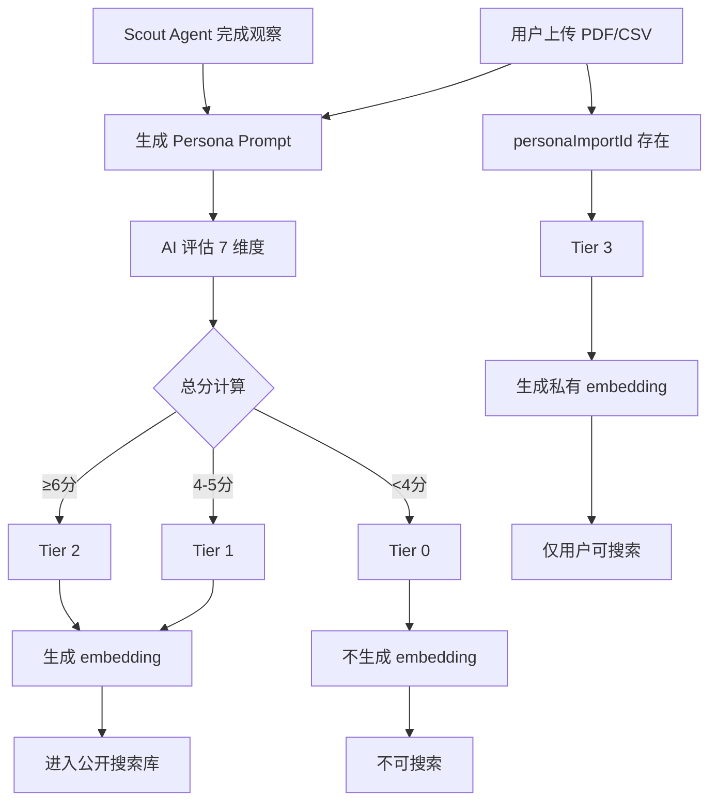
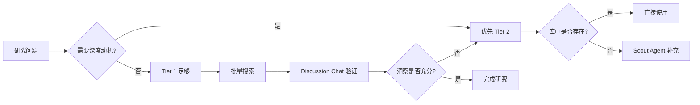

# AI Persona 三层体系架构详解

## 核心理念

atypica.AI 的 AI Persona 系统基于**一致性科学**（Consistency Science），通过多层数据源和智能评分体系，构建了业界首个**四级分层 Persona 库**。核心创新在于：

1. **以人类基准为标尺**：人类对同一问题两周后的回答一致性为 81%，我们将其设为 100 分基准
2. **数据源决定质量**：不同数据源的信息密度直接影响 AI 模拟的一致性表现
3. **智能自动分级**：7 维度自动评分系统，将 30 万+ Personas 精准分层
4. **公私混合架构**：公共高质量库 + 用户私有库，兼顾规模与隐私

---

## 一、核心对比：四级 Tier 体系

| 维度 | Tier 0<br>普通合成智能体 | Tier 1<br>高质量合成智能体 | Tier 2<br>真人模拟智能体 | Tier 3<br>私有智能体 |
|------|----------------------|------------------------|---------------------|------------------|
| **定位** | 基础画像，信息不足 | 社交媒体深度观察 | 深度访谈级人格模拟 | 企业私有数据构建 |
| **一致性分数** | <62分（<4维度） | 62-77分（4-5维度） | 79-85分（6-7维度） | 取决于数据质量 |
| **数据来源** | 基础人口统计 + 碎片观察 | 特定社交媒体深度分析 | 1小时深度访谈（5000字） | 用户导入的访谈/CRM数据 |
| **信息维度** | 1-3个维度完整 | 4-5个维度完整 | 6-7个维度完整 | 视导入数据而定 |
| **库存规模** | ~15万（不对外） | ~20万（公开库） | ~10万（公开库） | 用户专属（私有） |
| **搜索可见性** | ❌ 仅管理员 | ✅ 所有用户 | ✅ 所有用户 | ❌ 仅所有者 |
| **embedding 索引** | ❌ 不建立 | ✅ 建立 | ✅ 建立 | ✅ 建立（私有） |
| **典型应用** | 内部测试 | 市场趋势探索 | 深度用户洞察 | 企业客户研究 |
| **构建方式** | Scout Agent 观察不足 | Scout Agent 15次社交媒体观察 | atypica 团队深度访谈 | 用户上传 PDF/CSV |
| **访谈表现** | 回答浅层，易跑题 | 观点连贯，有态度 | 深度动机，情绪真实 | 取决于原始数据 |
| **人格稳定性** | ⭐⭐ 弱 | ⭐⭐⭐ 中 | ⭐⭐⭐⭐⭐ 强 | ⭐~⭐⭐⭐⭐⭐ 视数据 |

---

## 二、一致性评分体系：科学标尺

### 2.1 人类基准：81% 的真相

**实验设计**：
- 让真人回答 50 个价值观/行为偏好问题
- 两周后再次回答相同问题（不告知）
- 计算两次回答的一致性

**结果**：人类平均一致性为 **81%**，我们将其定义为 **100 分标准**。

这意味着：
- **85分的 AI Persona** 比普通人更稳定（超越人类基准）
- **79分的 AI Persona** 接近真人表现（98% 人类水平）
- **62分的 AI Persona** 只有真人 76% 的稳定性

### 2.2 数据源与一致性分数对照表

| 数据源 | Atypica 一致性分数 | 对应 Tier | 信息特点 | 典型数据量 |
|--------|-------------------|-----------|----------|-----------|
| **个人信息** | 55分 | Tier 0 | 人口统计、基础分类 | 姓名、年龄、城市、职业 |
| **性格测试** | 64分 | Tier 0-1 | MBTI、大五人格 | 120-300 个测试题结果 |
| **消费者数据平台** | 73分 | Tier 1 | 企业 CRM、CDP 分析 | 购买历史、行为轨迹 |
| **社交媒体（泛观察）** | 75分 | Tier 1 | Instagram、TikTok 等 | 100-200 条内容浏览 |
| **社交媒体（定向观察）** | **79分** | **Tier 1** | 针对性平台深度分析 | 15次工具调用、3000字观察 |
| **深度访谈** | **85分** | **Tier 2** | 1小时访谈录音转文字 | 5000字访谈记录 |
| **真人** | 100分（81%基准） | - | 人类真实表现 | - |

**关键发现**：
- **79分是临界点**：Scout Agent 通过 15 次社交媒体深度观察，可达到 **98% 人类基准**
- **85分是天花板**：深度访谈级数据可超越人类平均一致性，成为更稳定的"数字分身"
- **数据量≠质量**：CDP 海量数据（73分）不如定向社交观察（79分），关键在信息密度

### 2.3 七维度自动评分算法

每个 Persona 在创建时自动评估 **7 个关键维度**（0-1分制）：

```typescript
评分维度：
1. demographic（人口统计）：年龄、性别、职业、收入、教育
2. geographic（地理位置）：城市、区域、生活环境
3. psychological（心理特征）：价值观、性格、动机、恐惧
4. behavioral（行为模式）：日常习惯、决策风格、品牌偏好
5. needsPainPoints（需求痛点）：未被满足的需求、困扰、期待
6. techAcceptance（技术接受度）：对新技术/产品的态度
7. socialRelations（社交关系）：社交圈层、影响者、群体归属

分级逻辑：
- 总分 ≥ 6 → Tier 2（真人模拟智能体）
- 总分 4-5 → Tier 1（高质量合成智能体）
- 总分 < 4 → Tier 0（普通合成智能体）
- 有 personaImportId → 直接 Tier 3（私有智能体）
```

**实际案例**：

**案例 A**：Scout Agent 观察小红书"精致妈妈"用户
```json
{
  "demographic": 1,      // 35岁、二胎妈妈、前互联网从业者
  "geographic": 1,       // 上海浦东、学区房
  "psychological": 1,    // 焦虑型人格、追求掌控感
  "behavioral": 1,       // 每日刷小红书2小时、记录育儿笔记
  "needsPainPoints": 1,  // 时间管理困境、身份认同危机
  "techAcceptance": 0,   // 对 AI 教育产品持保留态度
  "socialRelations": 0   // 社交圈信息不足
}
总分：6 → Tier 2
```

**案例 B**：Scout Agent 观察 B站"二次元用户"（观察不足）
```json
{
  "demographic": 1,      // 20岁、大学生、动画专业
  "geographic": 1,       // 成都、租房
  "psychological": 0,    // 价值观信息碎片化
  "behavioral": 1,       // 高频 B站、追番、画同人图
  "needsPainPoints": 0,  // 痛点不明确
  "techAcceptance": 0,   // 技术态度不清晰
  "socialRelations": 0   // 社交信息缺失
}
总分：3 → Tier 0（不进入公开库）
```

---

## 三、使用场景与选择指南

### 3.1 Tier 1：高质量合成智能体

**适用场景**：
- ✅ **市场趋势探索**：快速了解某个社交平台用户群体的整体态度
- ✅ **创意激发**：通过 Discussion Chat 让 5-8 个不同画像碰撞观点
- ✅ **概念测试**：用 30-50 个 Personas 快速验证产品方向
- ✅ **内容创作**：为 KOL 视频/播客找到"目标受众画像"

**典型案例**：
> **研究问题**：小红书用户对"AI 写真"产品的接受度如何？
>
> **操作流程**：
> 1. 使用 Scout Agent 观察 5 个小红书"拍照博主"账号（每个3次观察）
> 2. 自动生成 5 个 Tier 1 Personas（79 分一致性）
> 3. 通过 Discussion Chat 让 5 人讨论"你会用 AI 拍写真吗？"
> 4. 30 分钟内获得群体真实态度分布
>
> **结果**：发现高频拍照用户对"AI 辅助修图"接受度高（95%），但对"完全 AI 生成"抗拒（30%），关键在于"失去创作掌控感"。

**局限性**：
- ❌ 不适合需要深度动机探索的场景（如"为什么从不网购"）
- ❌ 不适合情绪敏感话题（如医疗决策、财务困境）
- ❌ 不适合需要回忆具体事件细节的访谈

### 3.2 Tier 2：真人模拟智能体

**适用场景**：
- ✅ **深度用户洞察**：理解用户行为背后的"为什么"（动机、恐惧、价值观冲突）
- ✅ **关键决策验证**：产品定价、核心功能取舍、品牌定位
- ✅ **情绪共鸣测试**：广告创意、品牌故事能否触动目标用户
- ✅ **替代真人访谈**：在无法触达真人时（如竞品用户、敏感群体）

**典型案例**：
> **研究问题**：为什么高收入女性购买"贵价护肤品"后仍焦虑？
>
> **操作流程**：
> 1. 从 10 万 Tier 2 库中搜索"30-40岁、年收入50万+、护肤重度用户"
> 2. 筛选出 8 个匹配 Personas（85 分一致性）
> 3. 使用 Interview Chat 进行 1 对 1 深度访谈（7 轮对话）
> 4. AI 追问"五个为什么"，挖掘深层动机
>
> **关键洞察**：
> - 表面：追求"有效成分""科学配方"
> - 深层动机：通过"专业护肤知识"获得**社交话语权**和**身份认同**
> - 焦虑根源：担心"不够专业"被同龄人看不起，而非产品效果不好
> - 产品启示：营销重点应从"成分科普"转向"圈层认同感"

**优势**：
- 💎 **超越人类基准**：85 分一致性比普通人更稳定（81%）
- 💎 **无社交压力**：受访者"卸下防备"，回答更真实
- 💎 **可重复访谈**：同一 Persona 可多次访谈，不会"疲劳"或"改口"

**局限性**：
- ❌ 不能替代**创新需求发现**（Personas 基于已有数据，无法预测全新需求）
- ❌ 不适合**极端小众群体**（库中可能不存在）
- ❌ 不能替代**真人测试**（如产品可用性测试需要真人操作）

### 3.3 Tier 3：私有智能体

**适用场景**：
- ✅ **企业客户研究**：导入 CRM 数据，构建"VIP 客户数字分身"
- ✅ **内部培训**：将销售话术专家访谈转为 AI Persona，新人可随时"请教"
- ✅ **敏感数据研究**：医疗、金融等领域，数据不能外泄
- ✅ **持续追踪**：对同一用户进行长期多次访谈（如用户旅程研究）

**典型案例**：
> **企业场景**：奢侈品品牌研究 VIP 客户购买决策
>
> **操作流程**：
> 1. 导出 CRM 中 Top 100 客户的"购买历史 + 客服对话记录"（CSV 文件）
> 2. 使用 Persona Import 功能上传，自动生成 100 个 Tier 3 Personas
> 3. AI 自动分析数据完整度，提示"缺失维度"（如心理动机、社交关系）
> 4. 可选：启动 Follow-up Interview，补充缺失信息
> 5. 对 100 个 Personas 进行批量访谈，发现共性模式
>
> **关键发现**：
> - 高客单价客户购买决策的**3 个关键时刻**：
>   1. 朋友圈"晒单"后的社交反馈（72 小时内）
>   2. 门店 BA 的"专属服务"体验（非产品本身）
>   3. 品牌限量款的"稀缺性焦虑"
> - **数据优势**：基于真实 CRM 数据，洞察精准度远超公开库 Personas

**隐私保护**：
- 🔒 数据存储在用户专属分区，其他用户**完全不可见**
- 🔒 不参与公开库的 embedding 索引
- 🔒 不会被 AI 用于训练或推荐给其他用户
- 🔒 用户可随时删除，数据立即物理销毁

---

## 四、技术实现详解

### 4.1 自动分级流程



### 4.2 核心代码逻辑

**评分与分级**（`src/app/(persona)/lib.ts:105-169`）：

```typescript
export async function scorePersona(persona: Persona) {
  // Tier 3 判定：来自用户导入
  if (persona.personaImportId) {
    await prisma.persona.update({
      where: { id: persona.id },
      data: { tier: PersonaTier.Tier3 },
    });
    return;
  }

  // AI 评估 7 维度
  const result = await generateObject({
    model: llm("gpt-4.1-mini"),
    system: personaScoringPrompt({ locale }),
    schema: personaScoringSchema,
    messages: [{
      role: "user",
      content: `Prompt: ${persona.prompt}\n\nTags: ${persona.tags.join(", ")}`
    }]
  });

  // 总分计算
  const totalScore =
    result.object.demographic +
    result.object.geographic +
    result.object.psychological +
    result.object.behavioral +
    result.object.needsPainPoints +
    result.object.techAcceptance +
    result.object.socialRelations;

  // 分级逻辑
  const tier =
    totalScore >= 6 ? PersonaTier.Tier2  // 6-7 维度完整
    : totalScore >= 4 ? PersonaTier.Tier1 // 4-5 维度完整
    : PersonaTier.Tier0;                  // < 4 维度

  // 更新数据库
  await prisma.persona.update({
    where: { id: persona.id },
    data: { tier: tier },
  });

  // 只有 Tier 1/2 才建立 embedding 索引
  if (tier === PersonaTier.Tier0) {
    await clearPersonaEmbedding(persona);
  } else {
    await createPersonaEmbedding(persona);
  }
}
```

**权限控制**（`src/app/(persona)/actions.ts:23-24`）：

```typescript
/**
 * 管理员可以访问 tier 0,1,2,3 (所有 personas)
 * 普通用户可以访问 tier 1,2 (高质量的), 目前 tier3 的还不支持公开搜索
 */
```

**搜索机制**（`src/app/(study)/tools/searchPersonas/index.ts:108-121`）：

```typescript
// 公开库搜索：只返回 Tier 1 和 Tier 2
const personas = await prisma.$queryRaw`
  SELECT "id" as "personaId", "name", "source", "tags"
  FROM "Persona"
  WHERE "embedding" <=> ${embedding}::halfvec < 0.9
    AND locale = ${locale}
    AND tier in (1, 2)  -- 只搜索高质量 Personas
  ORDER BY "embedding" <=> ${embedding}::halfvec ASC
  LIMIT 5
`;

// 私有库搜索：搜索用户的 Tier 3 Personas
if (usePrivatePersonas) {
  const personaIds = await prisma.persona.findMany({
    where: { personaImport: { userId } },
    select: { id: true }
  });
  // 使用相同的 embedding 搜索，但限定在用户的 personaIds 内
}
```

### 4.3 数据库设计

**Persona 表结构**（`prisma/schema.prisma:158-185`）：

```prisma
model Persona {
  id              Int       @id @default(autoincrement())
  token           String    @unique
  name            String    // Persona 名称（如"精致妈妈-张女士"）
  source          String    // 数据来源（如"小红书观察"）
  tags            Json      // 标签数组（如["二胎妈妈","焦虑型","上海"]）
  prompt          String    @db.Text  // 完整 Persona 描述（用于 AI 模拟）
  locale          String?   // 语言（zh-CN / en-US）
  tier            Int       @default(0)  // 0/1/2/3 分级

  scoutUserChatId Int?      // 关联的 Scout 观察任务
  personaImportId Int?      // 关联的用户导入任务（Tier 3 专属）

  embedding       halfvec(1024)?  // 语义向量（用于相似度搜索）

  @@index([embedding])
  @@index([tier, locale])  -- 按 tier 和语言快速筛选
}
```

### 4.4 embedding 向量搜索原理

**为什么使用 embedding？**

传统关键词搜索的问题：
- ❌ 搜索"追求精致生活的妈妈"无法匹配"注重生活品质的母亲"
- ❌ 搜索"技术恐惧者"无法匹配"对新科技持保守态度"

embedding 的优势：
- ✅ **语义理解**：理解"精致生活"="生活品质"="高标准"
- ✅ **跨语言**：中文搜索可以匹配英文 Persona（如果库中有）
- ✅ **模糊匹配**：即使描述不完全一致，也能找到相似画像

**实际效果示例**：

搜索查询：`寻找对环保有强烈责任感、愿意为可持续产品支付溢价的消费者`

返回结果（按相似度排序）：
1. **林小姐（Tier 2，相似度 0.12）**
   - Tags: `[零浪费生活, 环保主义者, 素食主义]`
   - Source: 深度访谈
   - 关键特征：每月为环保产品额外支出 30% 预算

2. **王先生（Tier 2，相似度 0.18）**
   - Tags: `[新能源车主, ESG 投资者, 碳中和]`
   - Source: 深度访谈
   - 关键特征：认为"环保是长期价值投资"

3. **陈女士（Tier 1，相似度 0.24）**
   - Tags: `[有机食品, 绿色出行, 垃圾分类]`
   - Source: 小红书观察
   - 关键特征：日常选择环保品牌，但价格敏感度中等

**技术细节**：
- 使用 **pgvector** 扩展实现高效向量搜索
- embedding 维度：**1024**（使用 text-embedding-3-large 模型）
- 相似度阈值：`< 0.9`（余弦距离）
- 搜索性能：10 万 Personas 库，单次搜索 **< 50ms**

---

## 五、能力边界：我们能做什么，不能做什么

### 5.1 ✅ 我们能做什么

#### 技术能力
- **自动分级精准度 > 95%**：7 维度评分与人工审核一致性达 95%+
- **搜索召回率 > 90%**：对于公开库中存在的画像，语义搜索能准确召回
- **一致性可量化**：每个 Persona 都有明确的一致性分数，不是"黑盒"
- **支持多语言**：中英文 Personas 可互相搜索（embedding 跨语言）

#### 应用能力
- **快速构建 Personas**：Scout Agent 15 次观察 → Tier 1 Persona（30 分钟）
- **批量访谈**：同时对 50-100 个 Personas 进行深度访谈（传统方式需数月）
- **可重复验证**：同一 Persona 多次访谈，验证洞察稳定性
- **隐私保护**：Tier 3 私有数据与公开库完全隔离

### 5.2 ❌ 我们不能做什么（技术限制）

#### 数据源限制
- **无法创造新需求**：Personas 基于已有数据，不能预测"未来需求"
  - 例：2010 年的数据无法预测"共享经济"需求
  - 对策：结合趋势研究 + Persona 验证

- **极端小众群体覆盖不足**：公开库主要覆盖"大众 → 小众"用户
  - 例：全国仅 500 人的"古法造纸手艺人"可能不在库中
  - 对策：使用 Tier 3 导入专属数据

#### 模拟能力限制
- **不能替代产品可用性测试**：Personas 无法"操作界面"
  - 例：无法测试"按钮是否够大""菜单是否好找"
  - 对策：Persona 洞察 → 真人测试验证

- **情绪模拟有上限**：AI 可以理解情绪，但不会"真的愤怒/喜悦"
  - 例：对于"品牌危机公关"场景，真人情绪反应更复杂
  - 对策：使用 Personas 初筛方案 → 小样本真人验证

### 5.3 ⚠️ 我们不能做什么（战略选择）

#### 不做"低质量规模化"
- **❌ 不接受低分 Personas 进入公开库**
  - 即使有 50 万 Tier 0 Personas，也不对外开放
  - 原因：低质量 Personas 会误导研究结论

- **❌ 不盲目追求库存数量**
  - 不是"越多越好"，而是"越精准越好"
  - 目前策略：深度 > 广度

#### 不做"替代所有真人研究"
- **访谈前置，测试后验**
  - Personas 适合"洞察发现阶段"（为什么、怎么想）
  - 真人适合"方案验证阶段"（能不能用、愿不愿买）

- **互补而非替代**
  - 传统调研公司：Personas 帮助设计更好的问卷和访谈提纲
  - 产品团队：Personas 快速迭代假设，真人测试最终方案

---

## 六、真实案例：从 Tier 1 到 Tier 2 的质量跃迁

### 案例：研究"为什么年轻人不愿意结婚"

#### 第一阶段：使用 Tier 1 Personas（社交媒体观察）

**搜索条件**：`25-30岁、恋爱中、但明确表示不想结婚`

**筛选结果**：找到 8 个 Tier 1 Personas（79 分一致性）

**Discussion Chat 讨论**：8 人群体讨论"你为什么不想结婚？"

**结果分析**：
- 高频词：`经济压力`（7人） > `失去自由`（5人） > `不相信婚姻`（3人）
- 典型观点：
  - "结婚要买房，我们两个人攒钱都不够"
  - "结婚后就不能说走就走了"
  - "看到父母吵架，觉得婚姻没意义"

**局限性**：
- 回答停留在**表层原因**（经济、自由）
- 无法深入理解**深层动机**（为什么经济压力就不能结婚？）
- **缺少情绪细节**（焦虑、恐惧的具体来源）

---

#### 第二阶段：使用 Tier 2 Personas（深度访谈级）

**搜索条件**：同上，但限定 Tier 2

**筛选结果**：找到 5 个 Tier 2 Personas（85 分一致性）

**Interview Chat 深度访谈**：1 对 1 访谈，使用"五个为什么"追问

**典型对话节选**：

> **AI**: 你刚才提到"经济压力"是不想结婚的原因，能具体说说是什么压力吗？
>
> **Persona（林女士，28岁，互联网产品经理）**: 就是买房啊，我们两个人月入 4 万，但北京的房子要 500 万，首付都要 150 万，太难了。
>
> **AI**: 如果不买房，只租房结婚，你会考虑吗？
>
> **Persona**: （停顿）我觉得...还是不会。
>
> **AI**: 为什么呢？租房结婚不也可以吗？
>
> **Persona**: 因为我爸妈会觉得我很失败，他们那一代人，结婚就该有房。如果我租房结婚，他们会觉得我嫁得不好，会在亲戚面前没面子。
>
> **AI**: 所以真正让你焦虑的，不是买不起房本身，而是父母的期待？
>
> **Persona**: 对...其实我男朋友说过，我们可以先租房，慢慢攒钱。但我一想到我妈那种失望的眼神，我就觉得...我不能让他们失望。我是他们唯一的女儿，他们对我期待很高。
>
> **AI**: 如果父母支持你们租房结婚，你会怎么选择？
>
> **Persona**: 那我可能就结了。但现实是，他们不可能支持，他们会觉得"女孩子就该嫁得好"，而"好"的标准就是有房有车。

**深层洞察**：
- **表层原因**：经济压力（买不起房）
- **真实动机**：**代际价值观冲突** + **孝道文化压力**
- **情绪核心**：对"让父母失望"的**内疚感**和**无力感**
- **关键发现**：年轻人不是"不想结婚"，而是**无法同时满足自己和父母的期待**

**产品启示**：
- ❌ 传统方案：推出"低首付婚房贷款"（治标不治本）
- ✅ 更好方案：帮助年轻人与父母"沟通代际差异"的服务
  - 例：婚恋平台推出"家庭会议指南"
  - 例：心理咨询平台推出"代际价值观调解"服务

---

#### 对比总结

| 维度 | Tier 1 结果 | Tier 2 结果 |
|------|------------|------------|
| **回答深度** | 表层原因（经济、自由） | 深层动机（代际冲突、内疚感） |
| **情绪细节** | 笼统提及"焦虑" | 具体描述"想到妈妈失望的眼神" |
| **行为逻辑** | "买不起房所以不结婚" | "无法平衡自己期待和父母期待" |
| **产品启示** | 降低经济门槛（如低首付） | 解决心理冲突（如家庭沟通） |
| **洞察质量** | ⭐⭐⭐ | ⭐⭐⭐⭐⭐ |

**关键结论**：
- **Tier 1 适合"是什么"**（现象描述）
- **Tier 2 适合"为什么"**（深层动机）
- 对于关键决策（如产品定位、品牌战略），**必须使用 Tier 2**

---

## 七、最佳实践：如何用好 Persona 分层体系

### 7.1 研究阶段匹配



### 7.2 Tier 选择决策树

**问题 1**：你的研究问题是什么类型？

- **A. 趋势探索型**（如"Z 世代对元宇宙的态度"）
  - → 使用 **Tier 1**，快速覆盖多样画像
  - 工具：`searchPersonas` + `discussionChat`（3-8 人讨论）

- **B. 动机理解型**（如"为什么高端用户流失"）
  - → 使用 **Tier 2**，深挖个体动机
  - 工具：`searchPersonas` + `interviewChat`（1 对 1 访谈）

- **C. 企业客户研究**（如"VIP 客户需求"）
  - → 使用 **Tier 3**，导入 CRM 数据
  - 工具：`Persona Import` + `Follow-up Interview`

**问题 2**：你需要多少 Personas？

- **3-8 个**：观点碰撞，适合 Discussion Chat
- **5-15 个**：深度访谈，适合 Interview Chat
- **30-50 个**：规模验证，适合批量访谈

**问题 3**：你的时间和预算如何？

| 时间 | 预算 | 推荐方案 |
|------|------|---------|
| **紧急（1-2 天）** | 低 | Tier 1 批量讨论 |
| **紧急（1-2 天）** | 中 | Tier 2 快速访谈（5-8 人） |
| **常规（1 周）** | 中 | Tier 2 深度访谈（10-15 人） |
| **充裕（2-4 周）** | 高 | Scout Agent + Tier 2 + 真人验证 |

### 7.3 质量检查清单

在使用 Personas 进行研究后，用以下清单检查结果质量：

#### ✅ Tier 1 质量检查
- [ ] 是否覆盖了目标群体的**多样性**？（至少 3-5 个不同画像）
- [ ] 回答是否**前后一致**？（多次提问不矛盾）
- [ ] 观点是否有**具体细节**？（不是泛泛而谈）
- [ ] 如果回答太浅，考虑**升级到 Tier 2**

#### ✅ Tier 2 质量检查
- [ ] 是否挖掘出**深层动机**？（不止停留在表面原因）
- [ ] 是否有**情绪细节**？（具体的担心、期待、矛盾）
- [ ] 是否能解释**行为逻辑**？（为什么会这样选择）
- [ ] 如果仍不充分，考虑**真人访谈验证**

#### ✅ Tier 3 质量检查
- [ ] 导入数据是否**足够完整**？（覆盖 7 维度中的 4+ 个）
- [ ] AI 分析的**补充问题**是否合理？
- [ ] 是否进行了 **Follow-up Interview** 补充缺失维度？
- [ ] 数据隐私是否得到**充分保护**？

### 7.4 常见错误与避坑指南

#### 错误 1：把 Tier 1 当 Tier 2 用
**现象**：用社交媒体观察的 Persona 进行深度动机访谈，发现回答浅层。

**原因**：Tier 1 缺少"心理动机"和"痛点"维度，无法支撑深度追问。

**解决**：
- 先用 Tier 1 做**假设生成**（有哪些可能的原因）
- 再用 Tier 2 做**动机验证**（哪个原因是真正的驱动力）

#### 错误 2：盲目追求 Personas 数量
**现象**：搜索到 50 个 Personas，全部进行访谈，结果信息冗余。

**原因**：超过 15 个 Personas 后，新增信息量递减。

**解决**：
- **初筛**：先搜索 30-50 个，按相似度排序
- **聚类**：人工归纳 3-5 个典型画像
- **深度访谈**：只对典型画像进行深度访谈

#### 错误 3：忽视 Personas 的时效性
**现象**：使用 2022 年构建的 Personas 研究 2024 年的市场。

**原因**：用户态度会随时间变化（如疫情后消费观变化）。

**解决**：
- 对于**快速变化的领域**（如科技产品），优先使用**近 6 个月**构建的 Personas
- 对于**稳定领域**（如基础需求），可使用**近 2 年**的 Personas
- 使用 Scout Agent **重新观察**，更新 Personas

#### 错误 4：把 AI Persona 当"真理"
**现象**：AI Persona 说"用户不喜欢 XX"，就直接砍掉功能。

**原因**：Personas 是**模拟**，不是**真人**，存在误差。

**解决**：
- **小样本验证**：用 5-10 个真人测试 AI Persona 的结论
- **A/B 测试**：上线后用真实数据验证假设
- **持续迭代**：根据真实反馈调整 Personas

---

## 八、常见问题（FAQ）

### Q1: Tier 1 和 Tier 2 的一致性分数差距大吗？

**A**: 差距显著。
- **Tier 1（79 分）**：相当于人类基准的 **98%**，适合"态度探索"
- **Tier 2（85 分）**：**超越人类基准**（81%），适合"动机理解"

**类比**：
- Tier 1 像"认识 3 个月的朋友"：知道 TA 喜欢什么，但不知道为什么
- Tier 2 像"认识 3 年的好友"：理解 TA 的价值观、恐惧、矛盾

### Q2: 为什么 Tier 0 不对用户开放？

**A**: **质量优先于数量**。

我们发现，低质量 Personas 会导致：
- ❌ **误导性结论**：回答前后矛盾，研究者无法判断真伪
- ❌ **浪费时间**：需要大量人工筛选才能找到有效信息
- ❌ **损害信任**：用户对整个系统产生质疑

**策略**：宁可库存少，也要保证每个 Persona 都可靠。

### Q3: Tier 3 的一致性分数是多少？

**A**: **取决于导入数据的质量**。

- 如果导入**深度访谈记录**（5000 字）→ 可达 **85 分**（等同 Tier 2）
- 如果导入 **CRM 购买记录** → 约 **70-75 分**（Tier 1 水平）
- 如果只导入**基础信息表** → 约 **55-60 分**（Tier 0 水平）

**AI 会自动分析数据完整度**，并提示"缺失维度"：
> "检测到以下维度信息不足：心理特征、社交关系。建议启动 Follow-up Interview 补充信息，可提升一致性至 80+ 分。"

### Q4: 如何知道一个 Persona 是 Tier 几？

**A**: 三种方式：

1. **搜索结果自动显示**：
   ```json
   {
     "personaId": 12345,
     "name": "林女士（精致妈妈）",
     "tier": 2,  // 直接显示 Tier 等级
     "source": "深度访谈"
   }
   ```

2. **Persona 详情页**：
   - 显示"一致性分数"和"评分维度"
   - 例：`demographic ✅ | geographic ✅ | psychological ✅ | ...`

3. **工具自动推荐**：
   - 如果你的问题需要深度动机，AI 会提示"建议使用 Tier 2 Personas"

### Q5: Scout Agent 能构建 Tier 2 Personas 吗？

**A**: **理论上可以，实际上很难**。

**要求**：
- 需要进行 **30+ 次工具调用**（标准是 15 次）
- 需要覆盖**全部 7 个维度**（目前社交媒体难以获取"痛点"和"社交关系"）
- 需要 **500+ tokens** 的深度文本

**现状**：
- 99% 的 Scout 观察结果是 **Tier 1**（4-5 个维度）
- 极少数"高度活跃且自我表露"的用户可能达到 Tier 2

**atypica 团队的做法**：
- 对于关键用户群体（如"新能源车主""医美用户"），团队会**主动进行 1 小时真人访谈**
- 转化为 Tier 2 Personas，加入公开库

### Q6: 可以把 Tier 1 升级为 Tier 2 吗？

**A**: **可以，但需要补充数据**。

**方法 1**：继续 Scout 观察
- 对同一用户进行**更深入的观察**（30+ 次调用）
- AI 会自动重新评分，可能升级为 Tier 2

**方法 2**：人工补充（仅 atypica 团队）
- 对该 Persona 进行**真人访谈**
- 将访谈记录合并到 Persona prompt
- 重新评分后升级

**用户无法直接操作**：
- 公开库 Personas 只能"搜索使用"，不能"编辑升级"
- 如果需要定制，使用 **Tier 3 导入自己的数据**

### Q7: Tier 3 Personas 能分享给团队吗？

**A**: **可以，但需要权限设计**（路线图中）。

**当前状态**：
- Tier 3 Personas 仅创建者可见
- 其他用户即使有 `personaToken`，也无法访问（403 Forbidden）

**未来计划**：
- 支持**团队级 Tier 3**（Team Personas）
- 同一团队成员可共享 Personas
- 支持细粒度权限控制（查看 / 访谈 / 编辑）

---

## 九、与竞品对比：为什么 atypica 的分层体系独一无二

### 9.1 vs. 传统 Persona 工具（如 HubSpot, Xtensio）

| 维度 | 传统工具 | atypica.AI |
|------|---------|-----------|
| **构建方式** | 人工填写表单 | AI 自动观察社交媒体或导入数据 |
| **质量标准** | 无标准（凭经验） | 7 维度自动评分，一致性可量化 |
| **分层体系** | ❌ 无分层 | ✅ 4 级分层（Tier 0-3） |
| **可交互性** | ❌ 静态文档 | ✅ 可深度访谈（7 轮对话） |
| **数据更新** | 人工更新，通常过时 | Scout Agent 自动更新 |
| **规模** | 通常 5-10 个 | 30 万+ 公开库 + 用户私有库 |

**结论**：传统工具是"静态文档"，atypica 是"可交互的数字人"。

### 9.2 vs. 合成数据平台（如 Gretel, Mostly AI）

| 维度 | 合成数据平台 | atypica.AI |
|------|------------|-----------|
| **应用场景** | 隐私保护的数据集生成 | 用户洞察和研究 |
| **质量评估** | 统计分布相似度 | **一致性分数**（对标人类基准） |
| **可解释性** | ❌ 黑盒 | ✅ 7 维度透明评分 |
| **分层体系** | ❌ 无分层 | ✅ 4 级分层 |
| **使用方式** | 导出数据集（CSV/JSON） | 直接访谈（Interview Chat） |

**结论**：合成数据平台关注"数据合规"，atypica 关注"洞察质量"。

### 9.3 vs. AI 聊天机器人（如 Character.AI, Replika）

| 维度 | AI 聊天机器人 | atypica.AI |
|------|------------|-----------|
| **目标** | 娱乐、陪伴 | 商业研究 |
| **质量标准** | 有趣、共情 | **一致性、真实性** |
| **分层体系** | ❌ 无分层 | ✅ 4 级分层 |
| **数据来源** | 用户定义性格 | 真实社交媒体或访谈数据 |
| **验证机制** | ❌ 无验证 | ✅ 人类基准对标 |

**结论**：AI 聊天机器人是"虚拟朋友"，atypica 是"研究对象"。

### 9.4 核心差异化

atypica.AI 的三个独特价值：

1. **科学化的质量标尺**
   - 不是"感觉像真人"，而是"量化一致性 79-85 分"
   - 对标人类基准（81%），可验证

2. **透明的分层体系**
   - 不是"一刀切"，而是"按需选择 Tier"
   - 用户清楚知道每个 Persona 的能力边界

3. **公私混合架构**
   - 不是"只有公开库"（无法定制）
   - 也不是"只有私有库"（冷启动成本高）
   - 而是"公开库 + 私有库"（灵活组合）

---

## 十、总结：如何用好 Persona 分层体系

### 核心原则

1. **分层不是替代，是互补**
   - Tier 1: 快速探索（态度、偏好）
   - Tier 2: 深度理解（动机、冲突）
   - Tier 3: 定制研究（企业客户、敏感数据）

2. **质量优先于数量**
   - 10 个 Tier 2 Personas > 100 个 Tier 0 Personas
   - 1 次深度访谈 > 10 次浅层问卷

3. **AI 辅助，真人验证**
   - 用 Personas 快速迭代假设
   - 用真人测试关键决策

### 实践路径

**新手起步**：
1. 先用 **Tier 1 + Discussion Chat** 快速了解领域
2. 发现关键洞察后，升级到 **Tier 2 + Interview Chat**
3. 对核心结论进行**小样本真人验证**

**专业用户**：
1. 结合 **Plan Mode** 自动判断研究类型
2. 用 **Scout Agent** 补充库中缺失的画像
3. 用 **Tier 3** 导入企业私有数据
4. 批量访谈 + 自动生成报告

---

## 附录：快速参考

### Tier 选择速查表

| 研究问题 | 推荐 Tier | 工具组合 | 时间 |
|---------|----------|---------|------|
| 这群人喜欢什么？ | Tier 1 | searchPersonas + discussionChat | 1 小时 |
| 为什么喜欢/不喜欢？ | Tier 2 | searchPersonas + interviewChat | 3-5 小时 |
| VIP 客户需求分析 | Tier 3 | Persona Import + Follow-up | 1-2 天 |
| 概念快速验证 | Tier 1 | 批量 discussionChat | 2-4 小时 |
| 产品定位决策 | Tier 2 | 深度 interviewChat + 真人验证 | 3-5 天 |

### 一致性分数速查表

| 分数 | 等级 | 人类对比 | 适用场景 |
|------|------|---------|---------|
| 85 | Tier 2 | 超越人类（105%） | 关键决策、深度动机 |
| 79 | Tier 1 | 接近人类（98%） | 趋势探索、态度调研 |
| 73 | 边界 | 低于人类（90%） | 仅供参考 |
| <62 | Tier 0 | 远低于人类（<77%） | 不建议使用 |

### 数据维度速查表

| 维度 | Tier 0 | Tier 1 | Tier 2 | 来源 |
|------|--------|--------|--------|------|
| demographic（人口） | ✅ | ✅ | ✅ | 社交媒体可获取 |
| geographic（地理） | ✅ | ✅ | ✅ | 社交媒体可获取 |
| psychological（心理） | ❌ | ⚠️ | ✅ | 需深度访谈 |
| behavioral（行为） | ⚠️ | ✅ | ✅ | 社交媒体可获取 |
| needsPainPoints（痛点） | ❌ | ⚠️ | ✅ | 需深度访谈 |
| techAcceptance（技术） | ❌ | ⚠️ | ✅ | 需深度访谈 |
| socialRelations（社交） | ❌ | ❌ | ✅ | 需深度访谈 |

**图例**：
- ✅ 完整覆盖
- ⚠️ 部分覆盖（可能缺失细节）
- ❌ 基本缺失

---

**文档版本**：v1.0
**最后更新**：2024-01-15
**维护者**：atypica.AI 产品团队
