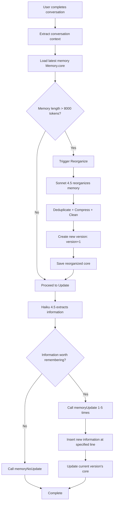
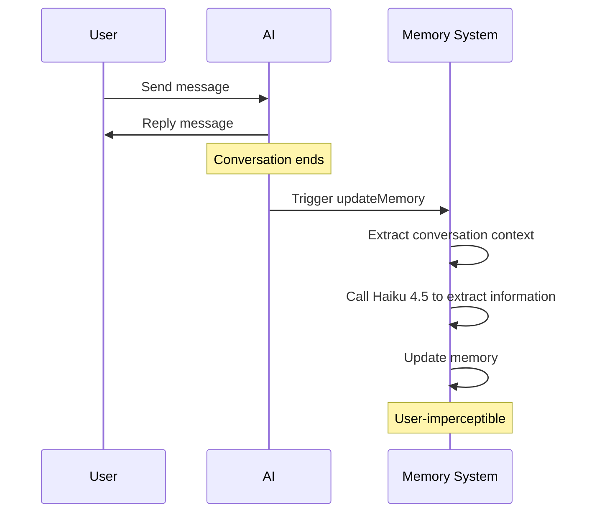

# Memory System: AI's Persistent Learning Mechanism

## Core Philosophy

atypica.AI's Memory System is a **progressive learning system** that enables AI to gradually understand users across multiple conversations without requiring repetitive explanations. The core innovations include:

1. **Memory as Signposts**: Stores key indexes and context rather than complete content
2. **Progressive Accumulation**: Each conversation deepens the AI's understanding of the user
3. **Intelligent Reorganization**: Automatically compresses and deduplicates when thresholds are exceeded to maintain clarity
4. **Dual-Layer Architecture**: Supports both personal and team-shared memory

**Core Value**: Evolution from "starting from scratch every conversation" to "AI that understands you better with each use."

---

## I. Core Comparison: With Memory vs. Without Memory

### 1.1 Traditional AI Conversations (Without Memory)

```
First Conversation (Monday):
User: Help me research the sparkling coffee market
AI: Sure, which age group would you like to focus on?
User: 23-28 year old early-career professionals
AI: Got it, what aspects are you interested in?
User: Purchase motivations and brand preferences
[Conducting research...]

Second Conversation (Wednesday):
User: Can you dive deeper into that sparkling coffee research from last time?
AI: Sure, what would you like to analyze? Which user group was the research about?
User: 😩 Have to repeat everything... 23-28 year old professionals, purchase motivations and all that
```

**Issues**:
- ❌ Every conversation starts from zero
- ❌ Need to repeatedly provide background information
- ❌ AI cannot connect historical research

---

### 1.2 atypica Memory System (With Memory)

```
First Conversation (Monday):
User: Help me research the sparkling coffee market
AI: Sure, which age group would you like to focus on?
User: 23-28 year old early-career professionals
AI: Got it, what aspects are you interested in?
User: Purchase motivations and brand preferences
[Conducting research...]
[AI automatically updates memory]

Memory Updated >
- [ResearchHistory] Sparkling coffee market research - Purchase motivations and brand preferences of 23-28 year old professionals

Second Conversation (Wednesday):
User: Can you dive deeper into that sparkling coffee research from last time?
AI: Absolutely! You're referring to the previous study on 23-28 year old professionals and sparkling coffee.
    Which aspect would you like to explore further? Purchase motivations or brand preferences?
User: 😊 Love this understanding! Mainly brand preferences
```

**Advantages**:
- ✅ AI remembers research context
- ✅ Naturally references historical context
- ✅ Users don't need to repeat explanations

---

### 1.3 Comparison Summary

| Dimension | Without Memory (Traditional AI) | Memory System |
|-----------|--------------------------------|---------------|
| **Starting 2nd Conversation** | "What would you like to research?" | "Continue with the sparkling coffee research?" |
| **User Experience** | Re-introducing yourself each time | AI understands you better with use |
| **Historical Association** | ❌ Cannot associate | ✅ Automatic association |
| **Learning Curve** | Flat (no learning) | Rising (progressive learning) |
| **Use Case** | One-time consultation | Long-term partnership |

---

## II. Memory System Architecture Explained

### 2.1 Database Structure

```prisma
model Memory {
  id      Int   @id @default(autoincrement())

  // User or team (mutually exclusive)
  userId  Int?
  teamId  Int?

  // Version number (supports historical tracking)
  version Int

  // Core memory (Markdown format)
  core    String @db.Text

  // Working memory (JSON format, currently unused)
  working Json   @default("[]")

  // Change records
  changeNotes String @db.Text
  extra       Json   @default("{}")

  createdAt DateTime @default(now())
  updatedAt DateTime @updatedAt

  @@unique([userId, version])
  @@unique([teamId, version])
  @@index([userId, version(sort: Desc)])
  @@index([teamId, version(sort: Desc)])
}
```

**Key Design Elements**:
- **User and Team Mutual Exclusion**: `userId` XOR `teamId`
- **Version Management**: Each Reorganize creates a new version
- **Core Memory (core)**: Markdown format, readable and maintainable
- **Working Memory (working)**: JSON format, reserved for future expansion

### 2.2 Complete Flow Diagram



### 2.3 Two Core Flows

#### Flow 1: Update (Updating Memory)

**Trigger Timing**: Automatically triggered after each conversation ends

**Process**:

```typescript
async function updateMemory({
  userId, teamId,
  conversationContext
}) {
  // 1. Load latest memory
  const latestMemory = await prisma.memory.findFirst({
    where: { userId },
    orderBy: { version: "desc" }
  });

  // 2. Check if reorganization is needed (>8000 tokens)
  if (isMemoryThresholdMet(latestMemory.core)) {
    const reorganized = await reorganizeMemory(latestMemory.core);

    // Create new version
    await prisma.memory.create({
      data: {
        userId,
        version: latestMemory.version + 1,
        core: reorganized,
        changeNotes: "Reorganized memory"
      }
    });
  }

  // 3. Extract new information
  const extracted = await extractFromConversation(
    latestMemory.core,
    conversationContext
  );

  // 4. Update memory
  await prisma.memory.update({
    where: { id: latestMemory.id },
    data: {
      core: applyUpdates(latestMemory.core, extracted),
      changeNotes: "Updated: added new information"
    }
  });
}
```

**Key Features**:
- **Automatic Trigger**: User-imperceptible
- **Silent Failure**: Update failures don't affect main flow
- **Concurrency Safe**: Uses version numbers to prevent conflicts

#### Flow 2: Reorganize (Reorganizing Memory)

**Trigger Timing**: Memory length > 8000 tokens

**Process**:

```typescript
async function reorganizeMemory(currentCore: string): Promise<string> {
  const result = await generateText({
    model: llm("claude-sonnet-4-5"),
    system: memoryReorganizeSystemPrompt,
    messages: [
      { role: "user", content: currentCore }
    ]
  });

  return result.text.trim();
}
```

**Reorganization Rules**:
1. **Deduplicate**: Remove duplicate information
2. **Merge**: Combine related facts into single entries
3. **Clean**: Remove no-longer-relevant temporary information
4. **Preserve**: Keep only persistent, actionable information

**Example**:

Input (10,000 tokens):
```markdown
- [Profile] Works in brand strategy at a private equity firm
- [Profile] Operates mainly between France and China
- [Profile] Focuses on China-Europe cross-border e-commerce
- [Preference] Needs deep user persona research
- [Preference] Needs in-depth customer insights
- [Preference] Needs brand value validation
- [Preference] Customer range is $100K to $20M investable assets
- [Preference] Product 1: beta-level investment projects - rare, well-timed opportunities
- [Preference] Product 2: little known deals - easier to access but people don't understand
- [Preference] Prefers comprehensive, in-depth professional assessments
- [Preference] Wants to focus on positioning and evaluation phase first
... (many more repetitive and temporary items)
```

Output (3,000 tokens):
```markdown
- [Profile] Works in brand strategy at private equity firm, operates between France and China
- [Preference] Prefers comprehensive professional assessments, focusing on positioning and evaluation before action recommendations
```

**Compression Rate**: From 10,000 tokens → 3,000 tokens (70% compression)

---

## III. 5 Memory Categories Explained

### 3.1 Category Overview

| Category | Purpose | Extraction Standard | Example |
|----------|---------|-------------------|---------|
| **[Profile]** | User basic information | Only explicitly stated facts | "Backend engineer at Tencent" |
| **[Preference]** | Work preferences and habits | Persistent preferences | "Prefers data-driven analysis approach" |
| **[ResearchHistory]** | Research history index | Completed research projects | "Olay Gen-Z skincare research - Emotion > Price" |
| **[RecurringTheme]** | Cross-project themes | Patterns appearing 2+ times | "Consistently focuses on Gen-Z consumer behavior" |
| **[UnexploredInterest]** | Unexplored interests | "Want to try but haven't tried" | "Wants to try AI video tools but hasn't implemented" |

### 3.2 [Profile] - User Basic Information

**Definition**: Basic factual information about the user (name, position, location, background)

**Extraction Standards**:
- ✅ **Extract only explicit statements**: What the user clearly states
- ❌ **Don't extract inferences**: What's inferred from context

**Examples**:

```
Conversation:
User: My name is Zhang Wei, I'm a product manager at Tencent, responsible for WeChat Pay
AI: [Extracted]
```

**Extracted**:
```markdown
- [Profile] Name: Zhang Wei, product manager at Tencent, responsible for WeChat Pay
```

**Should NOT Extract**:
```
Conversation:
User: Our company is currently optimizing payment products
AI: [Not Extracted] - Didn't clearly state which company they work for
```

### 3.3 [Preference] - Work Preferences and Habits

**Definition**: Persistent preferences that improve future interaction efficiency

**Extraction Standards**:
- ✅ **Persistent preferences**: "I always..." / "I'm used to..."
- ❌ **One-time choices**: "Let's try this time..." / "Use this time..."

**Examples**:

```
Conversation:
User: When I do research, I'm always used to looking at qualitative insights first, then quantitative data
AI: [Extracted]
```

**Extracted**:
```markdown
- [Preference] Prefers qualitative insights before quantitative data in research
```

**Should NOT Extract**:
```
Conversation:
User: This time let's try starting with quantitative research
AI: [Not Extracted] - This is a one-time experiment, not a persistent preference
```

### 3.4 [ResearchHistory] - Research History Index

**Definition**: Brief research project index (doesn't store complete content)

**Extraction Standards**:
- ✅ **Completed research**: With clear conclusions
- ✅ **One-line summary**: Project/client name + topic + key insight
- ❌ **No detailed storage**: Full content is in the database
- ❌ **No temporal words**: Memory is static

**Format Requirements**:
```
[Client/Project Name] + [Research Topic] - [Core Insight]
```

**Examples**:

```
Conversation:
[User completed Olay skincare Gen-Z research, found emotional triggers more important than price]

AI: [Extracted]
```

**Extracted**:
```markdown
- [ResearchHistory] Olay skincare Gen-Z research - Emotional triggers more important than price sensitivity
```

**Why Not Use Temporal Words**:
- ❌ Wrong: "Olay skincare Gen-Z research (3 months ago) - ..."
- ❌ Wrong: "Olay skincare Gen-Z research (recently) - ..."
- ✅ Correct: "Olay skincare Gen-Z research - ..."

**Reason**:
- Memory entries are static and won't update over time
- "3 months ago" becomes outdated as "4 months ago", but memory doesn't update
- Let entry order and project names provide implicit temporal context

**Complete Example**:

```markdown
- [ResearchHistory] Olay skincare Gen-Z research - Emotional triggers > Price
- [ResearchHistory] ByteDance gaming Gen-Z research - Community more important than graphics
- [ResearchHistory] Nike sportswear Gen-Z research - Authenticity most important
```

From top to bottom implicitly expresses "old to new" temporal order, without explicit time markers.

### 3.5 [RecurringTheme] - Cross-Project Recurring Themes

**Definition**: User interests or patterns that repeatedly appear across multiple different projects

**Extraction Standards**:
- ✅ **2+ occurrences**: Appears in at least 2 different research projects
- ✅ **Cross-project pattern**: Not a one-time coincidence
- ❌ **Single mention**: Doesn't count if it only appears once

**Examples**:

```
Existing Memory:
- [ResearchHistory] Olay skincare Gen-Z research - Emotion > Price
- [ResearchHistory] ByteDance gaming Gen-Z research - Community > Graphics

New Conversation:
[User completes Nike Gen-Z sportswear research]

AI: [Extract RecurringTheme]
```

**Extracted**:
```markdown
- [RecurringTheme] Consistently focuses on Gen-Z cross-category consumer behavior patterns
```

### 3.6 [UnexploredInterest] - Unexplored Interests

**Definition**: Tools, methods, or ideas the user mentions wanting to try but hasn't implemented

**Extraction Standards**:
- ✅ **Clear intent**: "Want to try..." / "Always wanted to use..." / "Next time try..."
- ❌ **Casual mention**: "Quite interesting" / "Might be worth looking at"

**Purpose**: Allows AI to proactively remind at appropriate times

**Examples**:

```
Conversation:
User: This insight would be perfect for video content. I've always wanted to try AI video tools like Runway or Kling, but haven't had time
AI: [Extracted]
```

**Extracted**:
```markdown
- [UnexploredInterest] Wants to try AI video generation tools (Runway/Kling) but hasn't implemented
```

**Future AI Proactive Reminder**:

```
3 months later conversation:
User: I want to do something different with the output format for this research
AI: You previously mentioned wanting to try AI video generation tools (Runway/Kling),
    and this research's insights would be perfect for video. Want to try it now?
User: 😲 You actually remember! Let's try it
```

---

## IV. Memory Extraction Process Explained

### 4.1 Extraction Timing

**Automatic Trigger**: After each conversation ends

**Trigger Conditions**:
- User sends message
- AI completes response
- Conversation pauses or ends

**Process**:



### 4.2 Extraction Process (Haiku 4.5)

**Input**:

```typescript
{
  currentMemory: `
    - [Profile] Product manager at Tencent
    - [Preference] Prefers data-driven analysis
  `,
  conversationContext: [
    { role: "user", content: "Help me research sparkling coffee market, targeting 23-28 year old professionals" },
    { role: "assistant", content: "Great, we'll use the JTBD framework..." },
    { role: "assistant", content: "[Research complete] Key finding: Emotional triggers > Price" }
  ]
}
```

**AI Judgment**:

```
Analyzing conversation context...
✅ User completed a research (sparkling coffee market)
✅ Target users: 23-28 year old professionals
✅ Key finding: Emotional triggers more important than price
✅ Meets [ResearchHistory] extraction standards

Call memoryUpdate tool:
- lineIndex: -1 (append to end)
- newLine: "- [ResearchHistory] Sparkling coffee market research - 23-28 year old professionals, emotional triggers>price"
```

**Output**:

```markdown
- [Profile] Product manager at Tencent
- [Preference] Prefers data-driven analysis
- [ResearchHistory] Sparkling coffee market research - 23-28 year old professionals, emotional triggers>price
```

### 4.3 Multiple Tool Calls

**Scenario**: Extracting multiple pieces of information from one conversation

**Example**:

```
Conversation:
User: My name is Li Ming, I'm a growth product manager at ByteDance.
      When I do research, I'm always used to looking at qualitative first, then quantitative.
      Just completed a TikTok e-commerce Gen-Z user research, found live streaming converts 3x better than images/text.
```

**AI Extraction** (3 tool calls):

```
First memoryUpdate call:
- lineIndex: -1
- newLine: "- [Profile] Li Ming, growth product manager at ByteDance"

Second memoryUpdate call:
- lineIndex: -1
- newLine: "- [Preference] Prefers qualitative insights before quantitative data in research"

Third memoryUpdate call:
- lineIndex: -1
- newLine: "- [ResearchHistory] TikTok e-commerce Gen-Z research - Live streaming conversion 3x higher than images/text"
```

**Final Memory**:

```markdown
- [Profile] Li Ming, growth product manager at ByteDance
- [Preference] Prefers qualitative insights before quantitative data in research
- [ResearchHistory] TikTok e-commerce Gen-Z research - Live streaming conversion 3x higher than images/text
```

### 4.4 memoryNoUpdate Tool

**Trigger Condition**: Conversation contains no information worth remembering

**Example**:

```
Conversation:
User: Nice weather today
AI: Yes, the weather is quite nice

AI Judgment:
❌ No user information
❌ No work preferences
❌ No research completed
❌ Nothing worth remembering

Call memoryNoUpdate tool
```

---

## V. Memory Reorganization Process Explained

### 5.1 Trigger Conditions

**Threshold**: 8000 tokens

**Calculation Method**:

```typescript
function countMemoryLength(memory: string): number {
  // Tokenize by spaces and punctuation
  return memory
    .split(/[\s.,!?;:"'(){}\[\]-]+/)
    .filter(token => token.length > 0)
    .length;
}

// Example:
const memory = `
- [Profile] Product manager at Tencent
- [Preference] Prefers data-driven analysis
`;
countMemoryLength(memory); // ≈ 15 tokens
```

**Why 8000**:
- Claude Sonnet 4.5 context: 200K tokens
- Memory proportion: < 5% (8K / 200K)
- Preserves 95% for conversation history and tool calls
- Empirical value: 8K is the threshold of "feeling cluttered"

### 5.2 Reorganization Process (Sonnet 4.5)

**Input** (10,000 tokens):

```markdown
- [Profile] Works in brand strategy at private equity firm
- [Profile] Mainly works in France
- [Profile] Also has business in China
- [Profile] Focuses on China-Europe cross-border e-commerce
- [Profile] Focuses on cross-border business
- [Preference] Needs deep user persona research
- [Preference] Needs in-depth customer insights
- [Preference] Needs brand value validation
- [Preference] Wants comprehensive analysis
- [Preference] Customer range is $100K to $20M
- [Preference] Might divide into two segments
- [Preference] Product 1 is beta-level investment projects
- [Preference] These projects are rare
- [Preference] Timing is crucial
- [Preference] Obtained through founder connections
- [Preference] Product 2 is little known deals
- [Preference] These are easier to obtain
- [Preference] But people don't understand investment value
- [Preference] Also provides paid research content
- [Preference] These reports are high quality
- [Preference] These reports are timely
- [Preference] These reports are easily accessible
- [Preference] Customers are hard to find
- [Preference] Needs deep customer personas
- [Preference] Needs media habit analysis
- [Preference] Needs consumption habit analysis
- [Preference] Needs interest topic research
- [Preference] Most important is brand value assessment
- [Preference] Needs brand value validation
- [Preference] Needs brand value recommendations
- [Preference] Prefers comprehensive in-depth professional assessments
- [Preference] Wants to focus on positioning and evaluation phase first
- [Preference] Not in a hurry for action recommendations
... (many more repetitions)
```

**AI Reorganization Logic**:

1. **Deduplicate**:
   ```
   - "Needs deep user persona research"
   - "Needs in-depth customer insights"
   - "Needs deep customer personas"
   → Merge to: "Needs deep customer personas and insight research"
   ```

2. **Merge Related Facts**:
   ```
   - "Works in brand strategy at private equity firm"
   - "Mainly works in France"
   - "Also has business in China"
   → Merge to: "Works in brand strategy at private equity firm, operates between France and China"
   ```

3. **Remove Temporary Information**:
   ```
   - "Might divide into two segments" → Remove (one-time discussion, not persistent preference)
   - "Not in a hurry for action recommendations" → Remove (temporary state)
   ```

4. **Preserve Core Information**:
   ```
   ✅ "Works in brand strategy at private equity firm" (Profile)
   ✅ "Prefers comprehensive in-depth professional assessments" (Preference)
   ```

**Output** (3,000 tokens):

```markdown
- [Profile] Works in brand strategy at private equity firm, operates between France and China, focuses on cross-border business
- [Preference] Needs deep customer personas and insight research (Chinese high-net-worth USD investors)
- [Preference] Prefers comprehensive in-depth professional assessments, focusing on positioning and evaluation before action recommendations
```

**Compression Rate**: 70% (10K → 3K)

### 5.3 Version Management

**Creating New Version During Reorganization**:

```typescript
// Before reorganize
{
  userId: 123,
  version: 5,
  core: "[10,000 token memory]"
}

// After reorganize
{
  userId: 123,
  version: 6,  // New version
  core: "[3,000 token reorganized memory]",
  changeNotes: "Reorganized memory from 10000 to 3000 characters"
}
```

**Why Create New Versions**:
- ✅ Traceable: Preserves pre-reorganization history
- ✅ Rollback-able: Can revert if reorganization errors occur
- ✅ Auditable: Tracks memory evolution process

---

## VI. User-Level vs. Team-Level Memory

### 6.1 Architecture Comparison

| Dimension | User-Level Memory | Team-Level Memory |
|-----------|------------------|-------------------|
| **Storage Location** | `Memory.userId` | `Memory.teamId` |
| **Visibility Scope** | User only | All team members |
| **Update Trigger** | Personal conversations | Any team member conversation |
| **Typical Content** | Personal preferences, personal research history | Team clients, team projects, team norms |
| **Use Case** | Personal user subscription | Team subscription |

### 6.2 User-Level Memory Example

```markdown
- [Profile] Li Ming, growth product manager at ByteDance
- [Preference] Prefers qualitative before quantitative in research
- [ResearchHistory] TikTok e-commerce Gen-Z research - Live streaming>images
- [RecurringTheme] Consistently focuses on e-commerce growth strategies
- [UnexploredInterest] Wants to try AI video tools but hasn't implemented
```

### 6.3 Team-Level Memory Example

```markdown
- [Profile] Brand consulting firm serving fast-moving consumer goods brands
- [Preference] Team prefers using JTBD framework for user research
- [Preference] Reports must include actionable recommendations, not just insights
- [ResearchHistory] Olay skincare Gen-Z research - Emotion>Price
- [ResearchHistory] P&G shampoo middle-aged women research - Efficacy>Brand
- [RecurringTheme] Most clients are FMCG brands
- [UnexploredInterest] Team discussed trying Scout Agent but hasn't used it
```

### 6.4 Concurrency Conflict Handling

**Scenario**: 2 team members converse simultaneously, both triggering memory updates

```
Timeline:
10:00 - Member A completes conversation, triggers updateMemory
10:00 - Member B completes conversation, triggers updateMemory

10:01 - A's updateMemory begins execution
        - Reads Memory version=5
        - Checks threshold, needs reorganization
        - Creates version=6

10:01 - B's updateMemory begins execution
        - Reads Memory version=5
        - Checks threshold, needs reorganization
        - Attempts to create version=6 → ❌ Unique constraint violation

10:02 - A completes successfully
10:02 - B fails, logs error, silently exits
```

**Design Philosophy**:
- ✅ **Acceptable Failure**: Memory updates are infrequent, occasional failures have no impact
- ✅ **Eventual Consistency**: Next successful update will catch up
- ✅ **Non-Blocking Main Flow**: Update failures don't affect conversations

---

## VII. Capability Boundaries: What We Can and Cannot Do

### 7.1 ✅ What We Can Do

#### Memory Capabilities
- **Progressive Learning**: Each conversation deepens AI's understanding of the user
- **Automatic Association**: References historical research without user repetition
- **Intelligent Compression**: 8K token threshold with automatic reorganization for clarity
- **Dual-Layer Support**: Separate management of personal and team memory

#### Extraction Capabilities
- **5 Categories**: Profile / Preference / ResearchHistory / RecurringTheme / UnexploredInterest
- **Intelligent Judgment**: Automatically identifies what should and shouldn't be remembered
- **Multiple Calls**: One conversation can extract multiple pieces of information (up to 5)

### 7.2 ❌ What We Cannot Do (Technical Limitations)

#### Cannot Store Complete Content
- **Cannot**: Store complete research reports (tens of thousands of words)
- **Solution**: Only store brief indexes, complete content in database

#### Cannot Guarantee 100% Extraction Accuracy
- **Cannot**: Guarantee every important piece of information is extracted
- **Solution**: Users can proactively tell AI "remember this"

#### Cannot Share Across Users/Teams
- **Cannot**: User A see User B's memory
- **Solution**: Team memory vs. personal memory separation

### 7.3 ⚠️ What We Cannot Do (Strategic Choices)

#### Not Storing "Complete Conversation History"
- **Why**: Memory is "signposts," not "archives"
- **Reason**: Complete conversations in the database's ChatMessage table

#### Not Storing "All Mentioned Information"
- **Why**: Only store persistent, actionable information
- **Reason**: Avoid memory clutter, quality > quantity

#### Not Supporting "User Manual Memory Editing"
- **Why**: Memory managed automatically by AI
- **Reason**: Prevent user errors from breaking memory structure

---

## VIII. Real Case Studies: How Memory Transforms Experience

### Case 1: Brand Consultant's 3-Month Evolution

#### 1st Conversation (Day 1)

```
User: Help me research Olay skincare acceptance among Gen-Z
AI: Sure, which age group would you like to focus on?
User: 18-25 year old women
AI: Got it, what aspects are you interested in?
User: Purchase motivations and brand perception
[Conducting research...]

Memory Updated >
- [Preference] Prefers using JTBD framework for user research
- [ResearchHistory] Olay skincare Gen-Z research - Emotional triggers>Price
```

#### 2nd Conversation (Day 30)

```
User: Help me research P&G shampoo market performance among middle-aged women
AI: Great! Similar to the last Olay research, should we use the JTBD framework again?
User: Yes, still JTBD
[Conducting research...]

Memory Updated >
- [ResearchHistory] P&G shampoo middle-aged women research - Efficacy>Brand
- [RecurringTheme] Most clients are P&G brands
```

#### 3rd Conversation (Day 60)

```
User: This time I need to research SK-II positioning in the premium market
AI: Understood. I notice you've previously done research on Olay and P&G shampoo,
    both focusing on skincare/personal care categories.
    For this SK-II positioning research, should we still use the JTBD framework?
User: 😲 You remember my previous research! Yes, still JTBD
[Conducting research...]

Memory Updated >
- [ResearchHistory] SK-II premium market positioning research - Technology endorsement>Ingredients
- [RecurringTheme] Consistently focuses on skincare/personal care brand positioning
```

#### 4th Conversation (Day 90)

```
User: Want to do a comprehensive analysis connecting the several skincare research projects I've done
AI: Great! Let me look at your previous research:
    1. Olay skincare Gen-Z research - Emotional triggers>Price
    2. P&G shampoo middle-aged women research - Efficacy>Brand
    3. SK-II premium market positioning research - Technology endorsement>Ingredients

    I notice an interesting pattern:
    - Gen-Z: Values emotional resonance
    - Middle-aged women: Values efficacy proof
    - Premium market: Values technology endorsement

    How about we analyze from the angle of "decision factor differences across age groups"?
User: 🤩 Perfect! That's exactly the angle
```

**Memory Value**:
- **Day 1**: Starting from scratch, gradual clarification needed
- **Day 30**: Remembers preference (JTBD), direct confirmation
- **Day 60**: Associates historical research, proactively suggests similarities
- **Day 90**: Automatically connects multiple research projects, discovers deeper patterns

---

### Case 2: Product Manager's Unexplored Interest Reminder

#### 1st Conversation (Week 1)

```
User: This research insight would be perfect for video content.
      I've always wanted to try AI video tools like Runway or Kling,
      but haven't had time
AI: Understood, let's focus on text report for now, video can wait for another opportunity

Memory Updated >
- [UnexploredInterest] Wants to try AI video tools (Runway/Kling) but hasn't implemented
```

#### 2nd Conversation (Week 5)

```
User: I want to do something different with the output format for this research
AI: You previously mentioned wanting to try AI video generation tools (Runway/Kling).
    This research's insights would be perfect for video.
    Do you have time to try it now?

User: 😲 You actually remember! Let's try it
AI: Excellent! Let me help you organize the core insights into a video script...
```

**Memory Value**:
- Remembers user's **unfinished intent**
- Proactively reminds at **appropriate time**
- User experience: "AI understands me better than I understand myself"

---

## IX. Best Practices: How to Use Memory System Effectively

### 9.1 User-Side Best Practices

#### 1. Proactively Tell AI Your Preferences

```
✅ Good approach:
User: When I do research, I'm used to looking at qualitative insights before quantitative data
AI: [Remembers] Preference

❌ Not good approach:
User: Let's look at qualitative first this time
AI: [Doesn't remember] One-time choice
```

#### 2. Clearly State Project/Client Names

```
✅ Good approach:
User: Just completed Olay's Gen-Z research
AI: [Remembers] ResearchHistory: Olay skincare Gen-Z research...

❌ Not good approach:
User: Just completed a skincare research
AI: [Remembers] But lacks project name, hard to reference in future
```

#### 3. Tell AI What You Want to Try But Haven't Tried

```
✅ Good approach:
User: I've always wanted to try Scout Agent for social media observation, but haven't used it yet
AI: [Remembers] UnexploredInterest

❌ Not good approach:
User: Scout Agent looks quite interesting
AI: [Doesn't remember] Too vague, uncertain if they really want to try
```

### 9.2 Team-Side Best Practices

#### 1. Clarify Team Consensus

```
✅ Good approach:
Team member: Our team uniformly uses JTBD framework for user research
AI: [Remembers] Preference (team-level)

Future conversations with any member:
AI: Following the team's usual JTBD framework...
```

#### 2. Record Team Client Information

```
✅ Good approach:
Team member: We just completed Olay's Gen-Z research
AI: [Remembers] ResearchHistory (team-level)

Future conversation with another member:
AI: I see the team previously did Olay Gen-Z research...
```

### 9.3 Common Mistakes and Pitfall Guide

#### Mistake 1: Over-Relying on Memory

**Phenomenon**:
```
User: What was the detailed data from that last research?
AI: Sorry, I only remember the core insights from the research, you'll need to check the report for detailed data
```

**Lesson**:
- Memory is "signposts," not "archives"
- Complete content is in the database reports

#### Mistake 2: Expecting All Mentioned Content to be Remembered

**Phenomenon**:
```
User: I casually mentioned yesterday that I wanted to try XX feature
AI: Sorry, I didn't remember that
```

**Lesson**:
- AI only remembers **persistent, actionable** information
- "Casual mentions" won't be remembered
- If you really want it remembered, explicitly say "I want to try"

#### Mistake 3: Thinking Memory Auto-Updates

**Phenomenon**:
```
User: I previously said I prefer qualitative before quantitative, but I've changed my mind, let's do quantitative first
AI: [Still follows old preference] Then let's start with qualitative...
```

**Lesson**:
- Memory doesn't auto-update
- Need to explicitly say "I've changed my mind" or "this time is different"

---

## X. Competitor Comparison: Why Memory System is Unique

### 10.1 vs. ChatGPT Memory

| Dimension | ChatGPT Memory | atypica Memory System |
|-----------|----------------|----------------------|
| **Memory Content** | Complete memory (remembers everything) | **Curated memory** (only persistent information) |
| **Memory Structure** | Unstructured (free text) | **5 categories** (Profile/Preference/...) |
| **Reorganization** | ❌ No auto-reorganization | ✅ Auto-compression at 8K tokens |
| **Team Support** | ❌ Personal only | ✅ Personal + Team dual-layer |
| **Version Management** | ❌ No versioning | ✅ Version tracking |
| **Memory Transparency** | Black box (users can't see) | ✅ Can view memory content |

**Core Difference**:
- ChatGPT: Complete memory, prone to clutter
- atypica: Curated memory, quality > quantity

### 10.2 vs. Notion AI

| Dimension | Notion AI | atypica Memory System |
|-----------|-----------|----------------------|
| **Memory Method** | Manual knowledge base creation | **Automatic extraction** from conversations |
| **Learning Curve** | Requires user organization | **Zero learning curve** |
| **Memory Updates** | Manual updates | **Automatic updates** |
| **Memory Reference** | Requires manual search | **Automatic association** |

**Core Difference**:
- Notion: Manual knowledge management
- atypica: Automatic memory management

### 10.3 vs. Claude Projects

| Dimension | Claude Projects | atypica Memory System |
|-----------|-----------------|----------------------|
| **Memory Scope** | Project-level (requires manual project creation) | **User-level** (across all conversations) |
| **Memory Content** | User-uploaded documents | **Auto-extracted from conversations** |
| **Memory Structure** | Unstructured | **5 categories** |
| **Team Support** | ❌ No team support | ✅ Team memory |

**Core Difference**:
- Claude Projects: Project-based document library
- atypica: User-based progressive learning

### 10.4 Unique Value Summary

atypica Memory System's three unique values:

1. **Memory as Signposts, Not Archives**
   - Not "storing everything," but "indexing key information"
   - Helps AI find the right information at the right time

2. **Automated Progressive Learning**
   - No need for users to organize knowledge bases
   - Auto-extracts and auto-updates with each conversation

3. **Dual-Layer Architecture + Version Management**
   - Separate personal and team memory
   - Version tracking with rollback capability

---

## XI. Frequently Asked Questions (FAQ)

### Q1: Will memory store my private information?

**A**: Only stores information you **explicitly state**.

**Examples**:
- ✅ You say "My name is Zhang Wei" → AI remembers
- ❌ AI infers from context you might be named Zhang Wei → AI doesn't remember

**Privacy Protection**:
- Memory stored in your dedicated database partition
- Other users **completely cannot access**
- You can view and delete memory anytime

### Q2: What if I want AI to forget certain information?

**A**: Currently requires contacting customer service for manual deletion (self-service interface coming in future).

**Alternative**:
- If you temporarily don't want it mentioned, say "don't reference XX from before this time"
- AI will understand it as a one-time exception

### Q3: What happens if memory update fails?

**A**: **Doesn't affect conversation**, fails silently.

**Failure Scenarios**:
- Concurrency conflicts (team members conversing simultaneously)
- Network issues
- Model call failures

**After Failure**:
- Conversation proceeds normally
- Next conversation will retry update

### Q4: Can memory work across languages?

**A**: **Yes**, memory primarily uses English but preserves original proper nouns.

**Examples**:
```markdown
- [Profile] Works at 腾讯 as a backend engineer
- [Preference] Prefers Markdown format documents
```

**Reason**:
- English is AI's strongest language
- Preserving original nouns avoids translation ambiguity

### Q5: Will team memory override personal memory?

**A**: **No**, they are completely independent.

**Architecture**:
- Team memory: `Memory.teamId`
- Personal memory: `Memory.userId`
- No interference between them

**When AI Uses Them**:
- Team conversation → Reads team memory
- Personal conversation → Reads personal memory

### Q6: Is the 8000 token threshold sufficient?

**A**: **Sufficient**. Empirical values:
- Regular users: 3-6 months to reach 8K
- Heavy users: 1-2 months to reach 8K
- After reaching, auto-compresses to 3K, continues working

**Why Sufficient**:
- Memory is "signposts," not "archives"
- Only stores most core information
- Auto-compression maintains clarity

### Q7: Can I view AI's memory of me?

**A**: **Yes** (interface coming in future).

**Currently**:
- Contact customer service to view
- Future will provide "View Memory" feature in user settings

### Q8: Will memory affect AI's response quality?

**A**: **Positive impact**.

**Benefits**:
- Reduces repetitive clarification, improves efficiency
- Auto-associates history, improves accuracy
- Proactively suggests relevant information, improves experience

**Drawbacks**:
- In rare cases, AI may over-rely on old memory
- Solution: Explicitly say "this time is different"

---

## XII. Summary: Core Value of Memory System

### Core Value

1. **Progressive Learning**: Each conversation deepens AI's understanding of you
2. **Automated Management**: No manual organization needed, AI auto-extracts and updates
3. **Intelligent Compression**: 8K threshold with auto-reorganization for clarity

### Target Users

- **Long-term users**: Need AI that "understands you better with use"
- **Team users**: Need to share client/project context
- **Repetitive research**: Frequently do research in similar domains

### Not Suitable For

- **One-time consultations**: 1-2 conversations then stop using
- **Extremely privacy-sensitive**: Completely unwilling to let AI remember anything
- **Multi-user shared accounts**: Memory will get mixed up

### Future Directions

- **User-viewable memory**: View AI's memory of you in settings
- **User-editable memory**: Manually add/delete/modify memory
- **Memory export**: Export as Markdown file
- **Cross-agent memory**: Different agents share the same memory system

---

**Document Version**: v1.0
**Last Updated**: 2026-01-15
**Maintained By**: atypica.AI Product Team
