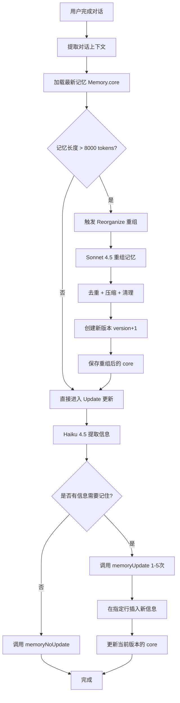
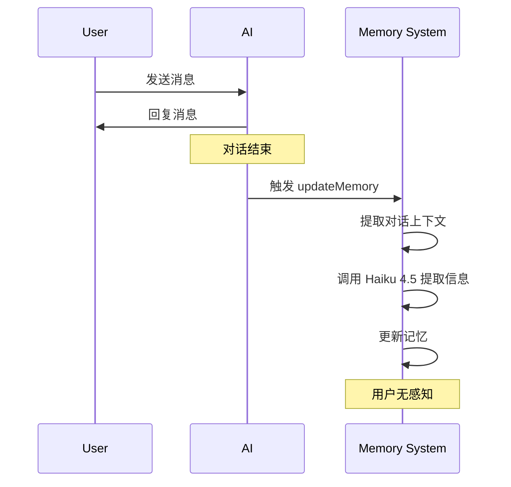

# Memory System：AI 的持久化记忆机制

## 核心理念

atypica.AI 的 Memory System 是一个**渐进式学习系统**，让 AI 在多次对话中逐步理解用户，无需重复询问。核心创新在于：

1. **记忆即路标**：不存储完整内容，只存储关键索引和上下文
2. **渐进式累积**：每次对话都让 AI 对用户理解更深一层
3. **智能重组**：超过阈值自动压缩去重，保持记忆清晰
4. **用户和团队双层**：支持个人记忆和团队共享记忆

**核心价值**：从"每次对话从零开始"进化到"AI 越用越懂你"。

---

## 一、核心对比：有记忆 vs 无记忆

### 1.1 传统 AI 对话（无记忆）

```
第一次对话（周一）:
用户: 帮我研究一下气泡咖啡的市场
AI: 好的，你想了解哪个年龄段的用户？
用户: 23-28岁职场新人
AI: 明白了，你关注哪些方面？
用户: 购买动机和品牌偏好
[进行研究...]

第二次对话（周三）:
用户: 上次那个气泡咖啡研究，能帮我再深入分析一下吗？
AI: 好的，你想深入分析什么？能告诉我研究的是哪个用户群体吗？
用户: 😩 又要重新说一遍...23-28岁职场新人，购买动机那些
```

**问题**：
- ❌ 每次对话都从零开始
- ❌ 需要重复提供背景信息
- ❌ AI 无法关联历史研究

---

### 1.2 atypica Memory System（有记忆）

```
第一次对话（周一）:
用户: 帮我研究一下气泡咖啡的市场
AI: 好的，你想了解哪个年龄段的用户？
用户: 23-28岁职场新人
AI: 明白了，你关注哪些方面？
用户: 购买动机和品牌偏好
[进行研究...]
[AI 自动更新记忆]

记忆更新 >
- [ResearchHistory] 气泡咖啡市场研究 - 23-28岁职场新人的购买动机和品牌偏好

第二次对话（周三）:
用户: 上次那个气泡咖啡研究，能帮我再深入分析一下吗？
AI: 好的！你是指上次对 23-28岁职场新人的气泡咖啡研究。
    具体想深入哪个方面？是购买动机还是品牌偏好？
用户: 😊 就喜欢这种懂我的感觉！主要是品牌偏好
```

**优势**：
- ✅ AI 记住了研究背景
- ✅ 自然引用历史上下文
- ✅ 用户无需重复说明

---

### 1.3 对比总结

| 维度 | 无记忆（传统 AI） | Memory System |
|------|----------------|--------------|
| **第 2 次对话开始方式** | "你想研究什么？" | "继续上次的气泡咖啡研究？" |
| **用户体验** | 每次重新自我介绍 | AI 越用越懂你 |
| **关联历史能力** | ❌ 无法关联 | ✅ 自动关联 |
| **学习曲线** | 平的（不学习） | 上升的（渐进学习） |
| **适用场景** | 一次性咨询 | 长期合作伙伴 |

---

## 二、Memory System 架构详解

### 2.1 数据库结构

```prisma
model Memory {
  id      Int   @id @default(autoincrement())

  // 用户或团队（互斥）
  userId  Int?
  teamId  Int?

  // 版本号（支持历史追溯）
  version Int

  // 核心记忆（Markdown 格式）
  core    String @db.Text

  // 工作记忆（JSON 格式，暂未使用）
  working Json   @default("[]")

  // 变更记录
  changeNotes String @db.Text
  extra       Json   @default("{}")

  createdAt DateTime @default(now())
  updatedAt DateTime @updatedAt

  @@unique([userId, version])
  @@unique([teamId, version])
  @@index([userId, version(sort: Desc)])
  @@index([teamId, version(sort: Desc)])
}
```

**关键设计**：
- **用户和团队互斥**：`userId` XOR `teamId`
- **版本管理**：每次 Reorganize 创建新版本
- **核心记忆（core）**：Markdown 格式，易读易维护
- **工作记忆（working）**：JSON 格式，预留未来扩展

### 2.2 完整流程图



### 2.3 两个核心流程

#### Flow 1: Update（更新记忆）

**触发时机**：每次对话结束后自动触发

**流程**：

```typescript
async function updateMemory({
  userId, teamId,
  conversationContext
}) {
  // 1. 加载最新记忆
  const latestMemory = await prisma.memory.findFirst({
    where: { userId },
    orderBy: { version: "desc" }
  });

  // 2. 检查是否需要重组（>8000 tokens）
  if (isMemoryThresholdMet(latestMemory.core)) {
    const reorganized = await reorganizeMemory(latestMemory.core);

    // 创建新版本
    await prisma.memory.create({
      data: {
        userId,
        version: latestMemory.version + 1,
        core: reorganized,
        changeNotes: "Reorganized memory"
      }
    });
  }

  // 3. 提取新信息
  const extracted = await extractFromConversation(
    latestMemory.core,
    conversationContext
  );

  // 4. 更新记忆
  await prisma.memory.update({
    where: { id: latestMemory.id },
    data: {
      core: applyUpdates(latestMemory.core, extracted),
      changeNotes: "Updated: added new information"
    }
  });
}
```

**关键特点**：
- **自动触发**：用户无感知
- **失败静默**：更新失败不影响主流程
- **并发安全**：使用版本号防止冲突

#### Flow 2: Reorganize（重组记忆）

**触发时机**：记忆长度 > 8000 tokens

**流程**：

```typescript
async function reorganizeMemory(currentCore: string): Promise<string> {
  const result = await generateText({
    model: llm("claude-sonnet-4-5"),
    system: memoryReorganizeSystemPrompt,
    messages: [
      { role: "user", content: currentCore }
    ]
  });

  return result.text.trim();
}
```

**重组规则**：
1. **去重**：移除重复信息
2. **合并**：相关事实合并为单条
3. **清理**：移除不再相关的临时信息
4. **保留**：只保留持久化的、可执行的信息

**示例**：

输入（10,000 tokens）：
```markdown
- [Profile] 在私募基金做品牌战略
- [Profile] 主要在法国和中国之间做跨境业务
- [Profile] 关注中国和欧洲的跨境电商
- [Preference] 需要深度的用户画像研究
- [Preference] 需要深入的客户洞察
- [Preference] 需要品牌价值验证
- [Preference] 客户范围是10万到2000万美元可投资资产
- [Preference] 产品1：beta级投资项目 - 稀缺、时机好的机会
- [Preference] 产品2：little known deals - 更易得但人们不了解
- [Preference] 喜欢全面深入的专业评估
- [Preference] 想先专注定位和评估阶段
... (还有很多重复和临时信息)
```

输出（3,000 tokens）：
```markdown
- [Profile] 在私募基金做品牌战略，主要在法国和中国之间做跨境业务
- [Preference] 偏好全面深入的专业评估，先专注定位和评估阶段再给行动建议
```

**压缩率**：从 10,000 tokens → 3,000 tokens（70% 压缩）

---

## 三、5 个记忆类别详解

### 3.1 类别概览

| 类别 | 用途 | 提取标准 | 示例 |
|------|------|---------|------|
| **[Profile]** | 用户基本信息 | 仅显式陈述的事实 | "在腾讯做后端工程师" |
| **[Preference]** | 工作偏好和习惯 | 持久化的偏好 | "偏好数据驱动的分析方式" |
| **[ResearchHistory]** | 研究历史索引 | 完成的研究项目 | "Olay Z世代护肤研究 - 情感 > 价格" |
| **[RecurringTheme]** | 跨项目主题 | 2+ 次出现的模式 | "持续关注 Z世代消费行为" |
| **[UnexploredInterest]** | 未探索兴趣 | "想尝试但未尝试" | "想试 AI 视频工具但未实施" |

### 3.2 [Profile] - 用户基本信息

**定义**：用户的基本事实信息（姓名、职位、所在地、背景）

**提取标准**：
- ✅ **仅提取显式陈述**：用户明确说的
- ❌ **不提取推断**：从上下文推断的

**示例**：

```
对话:
用户: 我叫张伟，在腾讯做产品经理，负责微信支付
AI: [提取]
```

**提取**：
```markdown
- [Profile] 姓名：张伟，在腾讯做产品经理，负责微信支付产品
```

**不应提取**：
```
对话:
用户: 我们公司最近在做支付产品的优化
AI: [不提取] - 没有明确说在哪家公司工作
```

### 3.3 [Preference] - 工作偏好和习惯

**定义**：提升未来交互效率的持久化偏好

**提取标准**：
- ✅ **持久化偏好**："我总是..." / "我习惯..."
- ❌ **一次性选择**："这次我们试试..." / "这次用..."

**示例**：

```
对话:
用户: 我做研究时总是习惯先看定性洞察，再看定量数据
AI: [提取]
```

**提取**：
```markdown
- [Preference] 研究时偏好先定性洞察再定量数据
```

**不应提取**：
```
对话:
用户: 这次我们试试先做定量调研吧
AI: [不提取] - 这是一次性实验，不是持久偏好
```

### 3.4 [ResearchHistory] - 研究历史索引

**定义**：简短的研究项目索引（不存储完整内容）

**提取标准**：
- ✅ **已完成的研究**：有明确结论的
- ✅ **一行简述**：项目/客户名 + 话题 + 关键洞察
- ❌ **不存储细节**：完整内容在数据库中
- ❌ **不使用时间词**：记忆是静态的

**格式要求**：
```
[客户/项目名] + [研究话题] - [核心洞察]
```

**示例**：

```
对话:
[用户完成了 Olay 护肤品的 Z世代研究，发现情感触发比价格更重要]

AI: [提取]
```

**提取**：
```markdown
- [ResearchHistory] Olay 护肤 Z世代研究 - 情感触发比价格敏感度更重要
```

**为什么不用时间词**：
- ❌ 错误："Olay 护肤 Z世代研究（3个月前）- ..."
- ❌ 错误："Olay 护肤 Z世代研究（最近）- ..."
- ✅ 正确："Olay 护肤 Z世代研究 - ..."

**原因**：
- 记忆条目是静态的，不会随时间更新
- "3个月前"会过时，变成"4个月前"，但记忆不更新
- 让条目顺序和项目名提供隐式时间上下文

**完整示例**：

```markdown
- [ResearchHistory] Olay 护肤 Z世代研究 - 情感触发 > 价格
- [ResearchHistory] 字节游戏 Gen-Z 研究 - 社区比画质重要
- [ResearchHistory] Nike 运动服 Gen-Z 研究 - 真实性最重要
```

从上到下隐式表达"从旧到新"的时间顺序，无需显式标注时间。

### 3.5 [RecurringTheme] - 跨项目的重复主题

**定义**：用户在多个不同项目中反复出现的兴趣或模式

**提取标准**：
- ✅ **2+ 次出现**：至少在 2 个不同研究中出现
- ✅ **跨项目模式**：不是单次偶然
- ❌ **单次提及**：只出现一次不算

**示例**：

```
现有记忆:
- [ResearchHistory] Olay 护肤 Z世代研究 - 情感 > 价格
- [ResearchHistory] 字节游戏 Gen-Z 研究 - 社区 > 画质

新对话:
[用户又完成了 Nike Z世代运动服研究]

AI: [提取 RecurringTheme]
```

**提取**：
```markdown
- [RecurringTheme] 持续关注 Z世代/Gen-Z 跨品类消费行为模式
```

### 3.6 [UnexploredInterest] - 未探索的兴趣

**定义**：用户提及想尝试但未实施的工具、方法、想法

**提取标准**：
- ✅ **明确意图**："想尝试..." / "一直想用..." / "下次试试..."
- ❌ **随口一提**："挺有意思" / "可能值得看看"

**用途**：让 AI 在合适时机主动提示

**示例**：

```
对话:
用户: 这个洞察特别适合做成视频内容，我一直想试试 Runway 或 Kling 这些 AI 视频工具，但还没时间搞
AI: [提取]
```

**提取**：
```markdown
- [UnexploredInterest] 想尝试 AI 视频生成工具（Runway/Kling）但未实施
```

**未来 AI 会主动提示**：

```
3个月后的对话:
用户: 这次研究的结果我想做点不一样的输出形式
AI: 你之前提到过想试试 AI 视频生成工具（Runway/Kling），
    这次研究的洞察特别适合做成视频。要不要试试？
用户: 😲 你竟然记得！那就试试吧
```

---

## 四、记忆提取流程详解

### 4.1 提取时机

**自动触发**：每次对话结束后

**触发条件**：
- 用户发送消息
- AI 完成回复
- 对话暂停或结束

**流程**：



### 4.2 提取过程（Haiku 4.5）

**输入**：

```typescript
{
  currentMemory: `
    - [Profile] 在腾讯做产品经理
    - [Preference] 偏好数据驱动分析
  `,
  conversationContext: [
    { role: "user", content: "帮我研究气泡咖啡市场，目标是23-28岁职场新人" },
    { role: "assistant", content: "好的，我们使用 JTBD 框架..." },
    { role: "assistant", content: "[研究完成] 核心发现：情感触发 > 价格" }
  ]
}
```

**AI 判断**：

```
分析对话上下文...
✅ 用户完成了一个研究（气泡咖啡市场）
✅ 目标用户：23-28岁职场新人
✅ 核心发现：情感触发比价格更重要
✅ 符合 [ResearchHistory] 提取标准

调用 memoryUpdate 工具:
- lineIndex: -1 (追加到末尾)
- newLine: "- [ResearchHistory] 气泡咖啡市场研究 - 23-28岁职场新人，情感触发>价格"
```

**输出**：

```markdown
- [Profile] 在腾讯做产品经理
- [Preference] 偏好数据驱动分析
- [ResearchHistory] 气泡咖啡市场研究 - 23-28岁职场新人，情感触发>价格
```

### 4.3 多次工具调用

**场景**：一次对话中提取多条信息

**示例**：

```
对话:
用户: 我叫李明，在字节做增长产品经理。
      我做研究时总是习惯先看定性再看定量。
      刚完成了一个抖音电商 Gen-Z 用户研究，发现直播带货比图文转化高3倍。
```

**AI 提取**（3 次工具调用）：

```
第一次调用 memoryUpdate:
- lineIndex: -1
- newLine: "- [Profile] 李明，在字节做增长产品经理"

第二次调用 memoryUpdate:
- lineIndex: -1
- newLine: "- [Preference] 研究时偏好先定性洞察再定量数据"

第三次调用 memoryUpdate:
- lineIndex: -1
- newLine: "- [ResearchHistory] 抖音电商 Gen-Z 研究 - 直播带货转化率是图文3倍"
```

**最终记忆**：

```markdown
- [Profile] 李明，在字节做增长产品经理
- [Preference] 研究时偏好先定性洞察再定量数据
- [ResearchHistory] 抖音电商 Gen-Z 研究 - 直播带货转化率是图文3倍
```

### 4.4 memoryNoUpdate 工具

**触发条件**：对话中没有任何值得记住的信息

**示例**：

```
对话:
用户: 今天天气真好
AI: 是的，今天天气不错

AI 判断:
❌ 没有用户信息
❌ 没有工作偏好
❌ 没有研究完成
❌ 没有任何值得记住的

调用 memoryNoUpdate 工具
```

---

## 五、记忆重组流程详解

### 5.1 触发条件

**阈值**：8000 tokens

**计算方式**：

```typescript
function countMemoryLength(memory: string): number {
  // 按空格和标点分词
  return memory
    .split(/[\s.,!?;:"'(){}\[\]-]+/)
    .filter(token => token.length > 0)
    .length;
}

// 例：
const memory = `
- [Profile] 在腾讯做产品经理
- [Preference] 偏好数据驱动分析
`;
countMemoryLength(memory); // ≈ 15 tokens
```

**为什么是 8000**：
- Claude Sonnet 4.5 context: 200K tokens
- 记忆占比：< 5%（8K / 200K）
- 保留 95% 给对话历史和工具调用
- 经验值：8K 是"感到混乱"的临界点

### 5.2 重组流程（Sonnet 4.5）

**输入**（10,000 tokens）：

```markdown
- [Profile] 在私募基金做品牌战略
- [Profile] 主要在法国工作
- [Profile] 也在中国有业务
- [Profile] 关注中国和欧洲的跨境电商
- [Profile] 关注跨境业务
- [Preference] 需要深度的用户画像研究
- [Preference] 需要深入的客户洞察
- [Preference] 需要品牌价值验证
- [Preference] 想要全面分析
- [Preference] 客户范围是10万到2000万美元
- [Preference] 可能分为两个细分市场
- [Preference] 产品1是beta级投资项目
- [Preference] 这些项目很稀缺
- [Preference] 时机把握很重要
- [Preference] 通过创始人人脉获得
- [Preference] 产品2是little known deals
- [Preference] 这些更容易获得
- [Preference] 但人们不了解投资价值
- [Preference] 还提供付费研报内容
- [Preference] 这些研报质量高
- [Preference] 这些研报及时
- [Preference] 这些研报易获取
- [Preference] 客户很难找到
- [Preference] 需要深度客户画像
- [Preference] 需要触媒习惯分析
- [Preference] 需要消费习惯分析
- [Preference] 需要兴趣话题研究
- [Preference] 最重要是品牌价值评估
- [Preference] 需要品牌价值验证
- [Preference] 需要品牌价值建议
- [Preference] 喜欢全面深入的专业评估
- [Preference] 想先专注定位和评估阶段
- [Preference] 不着急要行动建议
... (还有很多重复)
```

**AI 重组逻辑**：

1. **去重**：
   ```
   - "需要深度的用户画像研究"
   - "需要深入的客户洞察"
   - "需要深度客户画像"
   → 合并为："需要深度客户画像和洞察研究"
   ```

2. **合并相关事实**：
   ```
   - "在私募基金做品牌战略"
   - "主要在法国工作"
   - "也在中国有业务"
   → 合并为："在私募基金做品牌战略，主要在法国和中国之间运作"
   ```

3. **移除临时信息**：
   ```
   - "可能分为两个细分市场" → 移除（这是一次性讨论，不是持久偏好）
   - "不着急要行动建议" → 移除（临时状态）
   ```

4. **保留核心信息**：
   ```
   ✅ "在私募基金做品牌战略"（Profile）
   ✅ "偏好全面深入的专业评估"（Preference）
   ```

**输出**（3,000 tokens）：

```markdown
- [Profile] 在私募基金做品牌战略，主要在法国和中国之间运作，关注跨境业务
- [Preference] 需要深度客户画像和洞察研究（中国高净值美元投资者）
- [Preference] 偏好全面深入的专业评估，先专注定位和评估阶段再给行动建议
```

**压缩率**：70%（10K → 3K）

### 5.3 版本管理

**重组时创建新版本**：

```typescript
// Before reorganize
{
  userId: 123,
  version: 5,
  core: "[10,000 tokens 的记忆]"
}

// After reorganize
{
  userId: 123,
  version: 6,  // 新版本
  core: "[3,000 tokens 的重组记忆]",
  changeNotes: "Reorganized memory from 10000 to 3000 characters"
}
```

**为什么创建新版本**：
- ✅ 可追溯：保留重组前的历史
- ✅ 可回滚：如果重组出错，可以回退
- ✅ 可审计：追踪记忆演化过程

---

## 六、用户级 vs 团队级记忆

### 6.1 架构对比

| 维度 | 用户级记忆 | 团队级记忆 |
|------|-----------|----------|
| **存储位置** | `Memory.userId` | `Memory.teamId` |
| **可见范围** | 仅用户本人 | 团队所有成员 |
| **更新触发** | 个人对话 | 团队任意成员对话 |
| **典型内容** | 个人偏好、个人研究历史 | 团队客户、团队项目、团队规范 |
| **使用场景** | 个人用户订阅 | 团队订阅 |

### 6.2 用户级记忆示例

```markdown
- [Profile] 李明，在字节做增长产品经理
- [Preference] 研究时偏好先定性再定量
- [ResearchHistory] 抖音电商 Gen-Z 研究 - 直播>图文
- [RecurringTheme] 持续关注电商增长策略
- [UnexploredInterest] 想尝试 AI 视频工具但未实施
```

### 6.3 团队级记忆示例

```markdown
- [Profile] 某品牌咨询公司，服务快消品牌
- [Preference] 团队偏好用 JTBD 框架做用户研究
- [Preference] 报告需要包含可执行建议，不只是洞察
- [ResearchHistory] Olay 护肤 Z世代研究 - 情感>价格
- [ResearchHistory] 宝洁洗发水中年女性研究 - 功效>品牌
- [RecurringTheme] 大部分客户是快消品牌
- [UnexploredInterest] 团队讨论过要试 Scout Agent 但未用过
```

### 6.4 并发冲突处理

**场景**：2 个团队成员同时对话，同时触发记忆更新

```
时间轴:
10:00 - 成员 A 完成对话，触发 updateMemory
10:00 - 成员 B 完成对话，触发 updateMemory

10:01 - A 的 updateMemory 开始执行
        - 读取 Memory version=5
        - 检查阈值，需要重组
        - 创建 version=6

10:01 - B 的 updateMemory 开始执行
        - 读取 Memory version=5
        - 检查阈值，需要重组
        - 尝试创建 version=6 → ❌ 唯一约束冲突

10:02 - A 成功完成
10:02 - B 失败，记录日志，静默退出
```

**设计哲学**：
- ✅ **可接受的失败**：记忆更新不频繁，偶尔失败无影响
- ✅ **最终一致性**：下次成功更新会补上
- ✅ **不阻塞主流程**：更新失败不影响对话

---

## 七、能力边界：我们能做什么，不能做什么

### 7.1 ✅ 我们能做什么

#### 记忆能力
- **渐进式学习**：每次对话让 AI 对用户理解更深
- **自动关联**：引用历史研究，无需用户重复说明
- **智能压缩**：8K tokens 自动压缩，保持清晰
- **双层支持**：个人和团队记忆分离管理

#### 提取能力
- **5 类信息**：Profile / Preference / ResearchHistory / RecurringTheme / UnexploredInterest
- **智能判断**：自动识别什么该记住、什么不该记住
- **多次调用**：一次对话可提取多条信息（最多 5 条）

### 7.2 ❌ 我们不能做什么（技术限制）

#### 无法存储完整内容
- **不能**：存储完整研究报告（几万字）
- **对策**：只存储简短索引，完整内容在数据库

#### 无法保证 100% 提取准确
- **不能**：保证每条重要信息都被提取
- **对策**：用户可以主动告诉 AI"记住这个"

#### 无法跨用户/团队共享
- **不能**：A 用户看到 B 用户的记忆
- **对策**：团队记忆 vs 个人记忆分离

### 7.3 ⚠️ 我们不能做什么（战略选择）

#### 不存储"完整对话历史"
- **为什么**：记忆是"路标"，不是"档案"
- **原因**：完整对话在数据库的 ChatMessage 表中

#### 不存储"所有提及的信息"
- **为什么**：只存储持久化的、可执行的信息
- **原因**：避免记忆混乱，质量 > 数量

#### 不支持"用户手动编辑记忆"
- **为什么**：记忆由 AI 自动管理
- **原因**：防止用户误操作破坏记忆结构

---

## 八、真实案例：记忆如何改变体验

### 案例 1：品牌咨询顾问的 3 个月进化

#### 第 1 次对话（Day 1）

```
用户: 帮我研究 Olay 护肤品在 Z世代的接受度
AI: 好的，你想了解哪个年龄段的用户？
用户: 18-25岁女性
AI: 明白了，你关注哪些方面？
用户: 购买动机和品牌感知
[进行研究...]

记忆更新 >
- [Preference] 偏好使用 JTBD 框架做用户研究
- [ResearchHistory] Olay 护肤 Z世代研究 - 情感触发>价格
```

#### 第 2 次对话（Day 30）

```
用户: 帮我研究宝洁洗发水在中年女性的市场表现
AI: 好的！跟上次 Olay 研究类似，这次也是用 JTBD 框架吗？
用户: 对，还是用 JTBD
[进行研究...]

记忆更新 >
- [ResearchHistory] 宝洁洗发水中年女性研究 - 功效>品牌
- [RecurringTheme] 大部分客户是宝洁旗下品牌
```

#### 第 3 次对话（Day 60）

```
用户: 这次要研究 SK-II 在高端市场的定位
AI: 明白。我注意到你之前做过 Olay 和宝洁洗发水的研究，
    都是关注护肤/个护品类。
    这次 SK-II 也是类似的定位研究，还是用 JTBD 框架吗？
用户: 😲 你记得我之前的研究！对，还是 JTBD
[进行研究...]

记忆更新 >
- [ResearchHistory] SK-II 高端市场定位研究 - 科技背书>成分
- [RecurringTheme] 持续关注护肤/个护品类的品牌定位
```

#### 第 4 次对话（Day 90）

```
用户: 想做个综合分析，把之前做过的几个护肤品研究串起来
AI: 好的！让我看看你之前的研究：
    1. Olay 护肤 Z世代研究 - 情感触发>价格
    2. 宝洁洗发水中年女性研究 - 功效>品牌
    3. SK-II 高端市场定位研究 - 科技背书>成分

    我注意到一个有趣的模式：
    - Z世代：重视情感共鸣
    - 中年女性：重视功效证明
    - 高端市场：重视科技背书

    要不要从"不同年龄层的决策因素差异"这个角度来串联分析？
用户: 🤩 完美！就这个角度
```

**记忆的价值**：
- **Day 1**：从零开始，需要逐步澄清
- **Day 30**：记住了偏好（JTBD），直接确认
- **Day 60**：关联历史研究，主动提示相似性
- **Day 90**：自动串联多个研究，发现深层模式

---

### 案例 2：产品经理的未探索兴趣提示

#### 第 1 次对话（Week 1）

```
用户: 这次研究的洞察特别适合做成视频内容，
      我一直想试试 Runway 或 Kling 这些 AI 视频工具，
      但还没时间搞
AI: 明白了，这次先聚焦文字报告，视频以后有机会再说

记忆更新 >
- [UnexploredInterest] 想尝试 AI 视频工具（Runway/Kling）但未实施
```

#### 第 2 次对话（Week 5）

```
用户: 这次研究的结果我想做点不一样的输出形式
AI: 你之前提到过想试试 AI 视频生成工具（Runway/Kling），
    这次研究的洞察特别适合做成视频。
    现在有时间试试吗？

用户: 😲 你竟然还记得！那就试试吧
AI: 太好了！让我帮你把核心洞察整理成视频脚本...
```

**记忆的价值**：
- 记住了用户的**未完成意图**
- 在**合适时机**主动提示
- 用户感受："AI 比我自己还懂我"

---

## 九、最佳实践：如何用好 Memory System

### 9.1 用户侧最佳实践

#### 1. 主动告诉 AI 你的偏好

```
✅ 好的方式:
用户: 我做研究时，习惯先看定性洞察再看定量数据
AI: [记住] Preference

❌ 不好的方式:
用户: 这次先看定性吧
AI: [不记住] 一次性选择
```

#### 2. 明确说出项目/客户名

```
✅ 好的方式:
用户: 刚完成了 Olay 的 Z世代研究
AI: [记住] ResearchHistory: Olay 护肤 Z世代研究...

❌ 不好的方式:
用户: 刚完成了一个护肤品研究
AI: [记住] 但缺少项目名，未来难以引用
```

#### 3. 告诉 AI 你想尝试但未尝试的

```
✅ 好的方式:
用户: 我一直想试试 Scout Agent 观察社交媒体，但还没用过
AI: [记住] UnexploredInterest

❌ 不好的方式:
用户: Scout Agent 看起来挺有意思
AI: [不记住] 太模糊，不确定是否真想尝试
```

### 9.2 团队侧最佳实践

#### 1. 明确团队共识

```
✅ 好的方式:
团队成员: 我们团队统一用 JTBD 框架做用户研究
AI: [记住] Preference（团队级）

未来任何成员对话:
AI: 按照团队惯用的 JTBD 框架...
```

#### 2. 记录团队客户信息

```
✅ 好的方式:
团队成员: 我们刚完成了 Olay 的 Z世代研究
AI: [记住] ResearchHistory（团队级）

未来另一位成员对话:
AI: 我看到团队之前做过 Olay 的 Z世代研究...
```

### 9.3 常见错误与避坑指南

#### 错误 1：过度依赖记忆

**现象**：
```
用户: 上次那个研究的详细数据是什么？
AI: 抱歉，我只记住了研究的核心洞察，详细数据需要你查看报告
```

**教训**：
- 记忆是"路标"，不是"档案"
- 完整内容在数据库的报告中

#### 错误 2：期待记住所有提及的内容

**现象**：
```
用户: 我昨天随口提到过想试试 XX 功能
AI: 抱歉，我没有记住这个
```

**教训**：
- AI 只记住**持久化、可执行**的信息
- "随口提及"不会被记住
- 真想记住，请明确说"我想试试"

#### 错误 3：认为记忆会自动更新

**现象**：
```
用户: 我之前说过偏好先定性再定量，但现在改主意了，先定量吧
AI: [仍按照旧偏好] 那我们先做定性...
```

**教训**：
- 记忆不会自动更新
- 需要明确说"我改变主意了"或"这次不同"

---

## 十、与竞品对比：为什么 Memory System 独一无二

### 10.1 vs. ChatGPT Memory

| 维度 | ChatGPT Memory | atypica Memory System |
|------|----------------|----------------------|
| **记忆内容** | 全量记忆（什么都记） | **精选记忆**（只记持久化信息） |
| **记忆结构** | 无结构（自由文本） | **5 类结构**（Profile/Preference/...） |
| **重组机制** | ❌ 无自动重组 | ✅ 8K tokens 自动压缩 |
| **团队支持** | ❌ 仅个人 | ✅ 个人 + 团队双层 |
| **版本管理** | ❌ 无版本 | ✅ 版本追溯 |
| **记忆透明度** | 黑盒（用户看不到） | ✅ 可查看记忆内容 |

**核心差异**：
- ChatGPT：全量记忆，容易混乱
- atypica：精选记忆，质量 > 数量

### 10.2 vs. Notion AI

| 维度 | Notion AI | atypica Memory System |
|------|-----------|----------------------|
| **记忆方式** | 手动建立知识库 | **自动提取**对话内容 |
| **学习成本** | 需要用户整理 | **零学习成本** |
| **记忆更新** | 手动更新 | **自动更新** |
| **记忆引用** | 需要手动搜索 | **自动关联** |

**核心差异**：
- Notion：手动知识管理
- atypica：自动记忆管理

### 10.3 vs. Claude Projects

| 维度 | Claude Projects | atypica Memory System |
|------|-----------------|----------------------|
| **记忆范围** | 项目级（需手动创建项目） | **用户级**（跨所有对话） |
| **记忆内容** | 用户上传的文档 | **从对话自动提取** |
| **记忆结构** | 无结构 | **5 类结构** |
| **团队支持** | ❌ 无团队支持 | ✅ 团队记忆 |

**核心差异**：
- Claude Projects：基于项目的文档库
- atypica：基于用户的渐进式学习

### 10.4 独特价值总结

atypica Memory System 的三个独特价值：

1. **记忆即路标，不是档案**
   - 不是"存储一切"，而是"索引关键"
   - 让 AI 在正确时机找到正确信息

2. **自动化渐进学习**
   - 不需要用户整理知识库
   - 每次对话自动提取、自动更新

3. **双层架构 + 版本管理**
   - 个人和团队记忆分离
   - 版本追溯，可回滚

---

## 十一、常见问题（FAQ）

### Q1: 记忆会存储我的隐私信息吗？

**A**: 只存储你**明确陈述**的信息。

**示例**：
- ✅ 你说"我叫张伟"→ AI 记住
- ❌ AI 从上下文推断你可能叫张伟 → AI 不记住

**隐私保护**：
- 记忆存储在你的专属数据库分区
- 其他用户**完全无法访问**
- 你可以随时查看和删除记忆

### Q2: 如果我想让 AI 忘记某些信息怎么办？

**A**: 目前需要联系客服手动删除（未来会提供自助界面）。

**替代方案**：
- 如果是临时不想被提及，可以说"这次不要参考之前的 XX"
- AI 会理解为一次性例外

### Q3: 记忆更新失败会怎样？

**A**: **不影响对话**，静默失败。

**失败场景**：
- 并发冲突（团队多人同时对话）
- 网络问题
- 模型调用失败

**失败后**：
- 对话正常进行
- 下次对话会重新尝试更新

### Q4: 记忆可以跨语言吗？

**A**: **可以**，记忆主要用英文，但保留原文专有名词。

**示例**：
```markdown
- [Profile] Works at 腾讯 as a backend engineer
- [Preference] 偏好使用 Markdown 格式的文档
```

**原因**：
- 英文是 AI 最擅长的语言
- 保留原文名词避免翻译歧义

### Q5: 团队记忆会覆盖个人记忆吗？

**A**: **不会**，两者完全独立。

**架构**：
- 团队记忆：`Memory.teamId`
- 个人记忆：`Memory.userId`
- 互不干扰

**AI 使用时**：
- 团队对话 → 读取团队记忆
- 个人对话 → 读取个人记忆

### Q6: 记忆的 8000 tokens 阈值够用吗？

**A**: **够用**。经验值：
- 一般用户：3-6 个月才达到 8K
- 重度用户：1-2 个月达到 8K
- 达到后自动压缩到 3K，继续使用

**为什么够用**：
- 记忆是"路标"，不是"档案"
- 只存储最核心的信息
- 自动压缩保持清晰

### Q7: 我可以查看 AI 对我的记忆吗？

**A**: **可以**（未来会提供界面）。

**当前**：
- 联系客服查看
- 未来会在用户设置中提供"查看记忆"功能

### Q8: 记忆会影响 AI 的回答质量吗？

**A**: **正面影响**。

**好处**：
- 减少重复澄清，提升效率
- 自动关联历史，提升准确度
- 主动提示相关信息，提升体验

**坏处**：
- 极少数情况下，AI 可能过度依赖旧记忆
- 解决方案：明确说"这次不同"

---

## 十二、总结：Memory System 的核心价值

### 核心价值

1. **渐进式学习**：每次对话让 AI 对你理解更深
2. **自动化管理**：无需手动整理，AI 自动提取和更新
3. **智能压缩**：8K 阈值自动重组，保持清晰

### 适用人群

- **长期用户**：需要 AI "越用越懂"的体验
- **团队用户**：需要共享客户/项目上下文
- **重复研究**：经常做类似领域的研究

### 不适用场景

- **一次性咨询**：对话 1-2 次就不用了
- **隐私极度敏感**：完全不想让 AI 记住任何信息
- **多人共用账号**：记忆会混淆

### 未来方向

- **用户可查看记忆**：在设置中查看 AI 对你的记忆
- **用户可编辑记忆**：手动添加/删除/修改记忆
- **记忆导出**：导出为 Markdown 文件
- **跨 Agent 记忆**：不同 Agent 共享同一记忆系统

---

**文档版本**：v1.0
**最后更新**：2026-01-15
**维护者**：atypica.AI 产品团队
