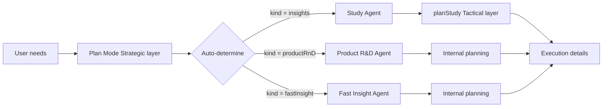
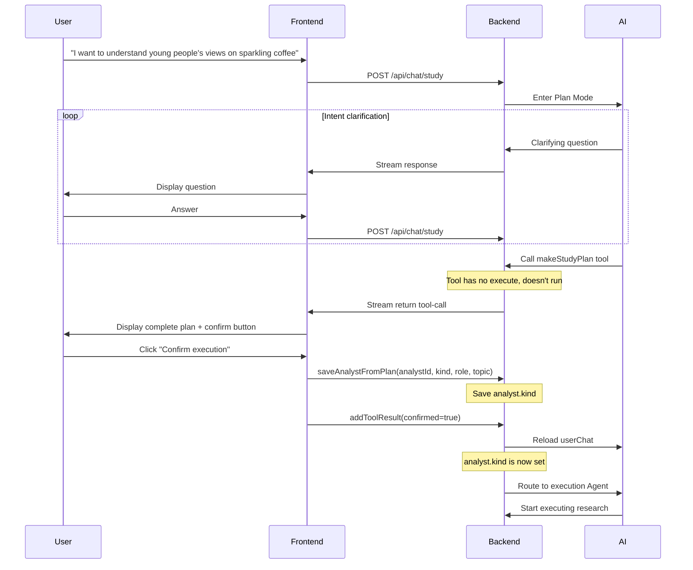

# Plan Mode: AI Research Planning Assistant

## Product Value

Plan Mode transforms vague research ideas into actionable research plans through a single conversation.

**Key Benefits**:
- **Natural conversation replaces forms**: Describe needs like chatting with a consultant
- **AI auto-selects methods**: No need to learn JTBD, KANO, or other professional frameworks
- **One-click confirmation**: Review plan and start execution without repeated choices
- **5-minute design**: Complete in 5-10 minutes what traditionally takes 3-5 days

**Use Cases**: Product managers conducting user research, marketers analyzing competitors, entrepreneurs validating product ideas

---

## I. Core Comparison: Plan Mode vs Traditional Research Process

| Dimension | Traditional Research Firms | Traditional Tools (SurveyMonkey) | atypica.AI Plan Mode |
|-----------|---------------------------|----------------------------------|---------------------|
| **Starting Point** | Client fills requirement form (Word/Excel) | User selects survey template | Natural conversation: "I want to understand XX" |
| **Requirement Clarification** | Project manager phone calls (1-2 rounds) | No clarification, user self-decides | AI iterative clarification (5-10 rounds) |
| **Method Selection** | Expert provides 2-3 proposal options | User researches and learns themselves | **AI automatically determines optimal approach** |
| **Time Cost** | **3-5 days** (includes communication, proposals, revisions) | 1-2 days (learning + design) | **5-10 minutes** |
| **Professional Barrier** | Must understand research terminology | Must learn tools and methodologies | **Zero barrier** (conversation only) |
| **Confirmation Rounds** | Multiple confirmations (needs → proposal → details) | No confirmation (direct publish) | **Single confirmation** (complete plan) |
| **Methodology Transparency** | Black box (doesn't explain why) | No methodology (user subjective) | ✅ Fully transparent (shows reasoning) |
| **Flexible Adjustments** | Adjustments require re-quoting + waiting | Redesign survey | Conversational adjustments (instant response) |

**Key Difference**:
- **Traditional Process**: "Fill form → Wait → Select proposal → Wait again → Start" (3-5 days)
- **Plan Mode**: "Conversation → AI determines → Confirm → Start" (5-10 minutes)

---

## II. Workflow: From Idea to Research Plan

### Four Phases

**Phase 1: Conversational Clarification (5-10 rounds)**
AI asks questions progressively to understand target audience, scenarios, and focus areas. Natural dialogue, not form-filling.

**Phase 2: Background Research (2-5 minutes, optional)**
When AI determines industry context is needed, it automatically searches for latest market trends and competitive dynamics.

**Phase 3: Intelligent Detection (seconds)**
AI automatically determines research type, selects analysis framework, decides research method, and configures persona count.

**Phase 4: Plan Display (one-click confirmation)**
Shows complete research plan. Upon confirmation, execution begins automatically.

### Dialogue Experience Difference

**Feature**: **Progressive clarification, not batch questioning**

#### Traditional Approach (❌ Poor Experience)

```
System: Please select:
1. Research target? (Dropdown: 18-25 years / 26-35 years / ...)
2. Research scenario? (Dropdown: Purchase decision / Usage experience / ...)
3. Focus dimensions? (Checkboxes: Price / Brand / Reputation / ...)
4. Analysis framework? (Radio: JTBD / KANO / STP / ...)
5. Research method? (Radio: Interview / Discussion / Observation / ...)
```

**Problems**:
- ❌ Users don't understand these terms
- ❌ Don't know how to choose
- ❌ Realize wrong choice after completion, must restart

#### Plan Mode Approach (✅ Good Experience)

```
User: I want to understand young people's views on sparkling coffee

AI: Got it! When you say young people, what age range?
    A. 18-22 years old (college students)
    B. 23-28 years old (young professionals)
    C. Want to understand both

User: B, 23-28 year old young professionals

AI: I see. In what scenario do you mainly want to understand their choices?
    Is it during everyday purchases, or when trying for the first time?

User: Everyday purchase scenario

AI: Okay. What aspects are you most interested in?
    A. Why they choose sparkling coffee (motivation)
    B. Price acceptance
    C. Brand preference
    D. All of the above

User: Mainly A and C, want to know why they choose it and brand preferences

AI: Understood! Let me quickly search for background on the sparkling coffee market...
    [Performing webSearch...]

    Based on your needs, I recommend using the **JTBD (Jobs To Be Done) framework**
    to understand what problem they "hire" sparkling coffee to solve,
    through **one-on-one in-depth interviews** to uncover true motivations.

    [Display complete plan]

    Shall we proceed?
```

**Why This Is Better**:
- Progressive clarification, users only answer questions without needing professional terminology
- AI automatically determines optimal method with >95% accuracy
- Can modify anytime through conversation

### Intelligent Detection Examples

When industry context is needed, AI automatically searches for latest information:

```
User: I want to understand Gen Z's attitude toward the metaverse

AI: Okay, let me quickly learn about the latest metaverse trends...

    Based on latest information:
    - Metaverse market grew 35% in 2024
    - Main applications: Gaming, social, virtual concerts
    - Gen Z accounts for 62% of users

    Now I understand the background. When you say Gen Z, specifically...
```

AI automatically determines research type and method:

- **Fast Insight**: "Quickly understand young people's attitude toward AI, make it a podcast" → Generate podcast-style content
- **Product Innovation**: "See new coffee trends on Xiaohongshu" → Social media observation
- **Deep Understanding**: "Understand why premium users churn" → In-depth interviews using JTBD framework
- **Concept Testing**: "Compare sparkling coffee and cold brew" → Group discussion using KANO framework

### Complete Plan Display

**Plan Format** (Auto-generated):

```markdown
# Research Plan Confirmation

## 📋 Research Intent
**Target Audience**: 23-28 year old young professionals with daily coffee consumption habits
**Research Scenario**: Decision-making moments for purchasing sparkling coffee daily
**Focus Dimensions**:
- Purchase motivation (why choose sparkling coffee)
- Brand preference (attitudes toward different brands)
- Emotional factors (feelings sparked by sparkling coffee)

## 🔬 Research Methodology
**Analysis Framework**: JTBD (Jobs To Be Done)
**Research Method**: One-on-one in-depth interviews (Interview Chat)
**Persona Configuration**:
- Quantity: 8 AI personas
- Quality tier: Tier 2 (human-simulated agents)

## 📊 Expected Deliverables
- User motivation map for purchasing sparkling coffee
- Perception difference analysis of different brands
- Targeted marketing strategy recommendations

---

Proceed with execution?
```

**Three Operation Methods**:
- **Confirm execution**: Start research
- **Modify plan**: Continue conversation to adjust details
- **Cancel research**: AI asks for reason and waits for feedback

---

## III. Research Type Auto-Detection

Plan Mode supports 7 research types, AI automatically selects based on your needs:

| Research Type | Use Cases | Example Need |
|--------------|-----------|--------------|
| **Fast Insight** | Hot topic analysis, knowledge popularization | "Quickly understand young people's attitude toward AI, make it a podcast" |
| **Product Innovation** | New product development, feature innovation | "See new coffee trends on Xiaohongshu, find inspiration" |
| **Hypothesis Validation** | A/B testing, concept testing | "Compare sparkling coffee and cold brew, which is more popular" |
| **Behavior Understanding** | User research, needs analysis | "Understand why premium users churn" |
| **Creative Generation** | Feature design, campaign planning | "Design a value-added service for coffee membership" |
| **Strategic Planning** | Strategy development, roadmap planning | "Develop this year's brand promotion strategy" |
| **Comprehensive Research** | Multi-objective research | "Comprehensively analyze product market performance" |

**Detection accuracy exceeds 95%**. If AI determines incorrectly, you can clarify in the conversation and AI will readjust.

---

## IV. Real Case: 5 Minutes vs 5 Days

### Scenario: Coffee Brand New Product Positioning Research

#### Traditional Research Firm Process (3-5 days)
- ✅ Current events analysis + content output
- ✅ User says "introduce"/"interpret" a topic

**Typical Cases**:

```
User: "Quickly help me analyze Sora's impact on content creation industry, make it a podcast"

AI determines:
✅ "quick" + "analyze" + "podcast" → fastInsight
✅ Agent: Fast Insight Agent
✅ Output: 15-minute podcast + visual brief
```

**Difference from Other Types**:
- vs. **insights**: fastInsight focuses on "rapid content generation", insights focuses on "deep insights"
- Example: Same "analyze Sora"
  - fastInsight: 15-minute quick interpretation podcast
  - insights: In-depth user interviews + detailed report

#### Priority 2: Product R&D Agent (kind = productRnD)

**Trigger Conditions** (any one):
- ✅ Explicitly mentions "innovation"/"new product opportunity"/"inspiration"
- ✅ Specifies innovation type (feature/packaging/scenario/flavor)
- ✅ "Social media observation" + "product" (implies finding trend inspiration)
- ✅ Existing product + seeking new direction

**Typical Cases**:

```
User: "See what new coffee trends are on Xiaohongshu, find inspiration for our product"

AI determines:
✅ "new trends" + "inspiration" + "product" → productRnD
✅ Agent: Product R&D Agent
✅ Method: Scout Agent observes Xiaohongshu
✅ Output: Innovation opportunity map + specific inspiration
```

**Difference from Other Types**:
- vs. **insights**: productRnD focuses on "finding innovation opportunities", insights focuses on "understanding current state"
- Example: Same "coffee research"
  - productRnD: Observe Xiaohongshu for new trends (like sparkling coffee, coffee smoothies)
  - insights: Interview users about why they drink coffee (motivation, habits)

- vs. **creation**: productRnD is "finding inspiration", creation is "designing solutions"
- Example:
  - productRnD: Discover "coffee + sparkling" trend from social media
  - creation: Design a specific "sparkling coffee" product solution

#### Priority 3: Study Agent (5 subtypes)

##### 3.2.1 testing (Hypothesis Validation)

**Trigger Conditions**:
- Explicit **comparison** ("compare X and Y")
- Explicit **testing** ("test X effectiveness")
- Explicit **validation** ("which is better" / "A/B test")

**Typical Cases**:

```
User: "Help me compare sparkling coffee and cold brew, which do young people prefer?"

AI determines:
✅ "compare" + "which is better" → testing
✅ Framework: KANO (test feature preference)
✅ Method: Discussion Chat (group discussion observes trade-offs)
```

##### 3.2.2 insights (Behavior Understanding)

**Trigger Conditions**:
- **Understand** ("understand users' views on X")
- **Discover** ("discover pain points/problems")
- **Analyze** ("why do users...")

**Typical Cases**:

```
User: "Want to understand why premium users churn"

AI determines:
✅ "understand" + "why" → insights
✅ Framework: JTBD (understand motivation)
✅ Method: Interview Chat (in-depth interviews uncover motivation)
```

##### 3.2.3 creation (Creative Generation)

**Trigger Conditions**:
- **Design** ("design new feature")
- **Creative** ("generate creative solutions")
- **Brainstorm** ("come up with ideas")

**Typical Cases**:

```
User: "Help me design a value-added service for coffee membership"

AI determines:
✅ "design" → creation
✅ Framework: User journey map (understand need scenarios)
✅ Method: Discussion Chat (group brainstorming)
```

##### 3.2.4 planning (Strategic Planning)

**Trigger Conditions**:
- **Develop** ("develop strategy")
- **Plan** ("plan solution")
- **Strategy** ("implementation plan" / "roadmap")

**Typical Cases**:

```
User: "Develop this year's brand promotion strategy"

AI determines:
✅ "develop" + "strategy" → planning
✅ Framework: STP (Segmentation, Targeting, Positioning)
✅ Method: Interview Chat (interviews understand market segments)
```

##### 3.2.5 misc (Comprehensive Research)

**Trigger Conditions**:
- Uncategorizable comprehensive research
- Multi-objective research

**Typical Cases**:

```
User: "Comprehensively analyze our product's market performance"

AI determines:
✅ "comprehensive analysis" (no clear single objective) → misc
✅ Framework: Comprehensive analysis framework
✅ Method: Adjust based on specific needs
```

---

## IV. Technical Implementation: Messages as Source of Truth

### 4.1 Core Architecture Principle

**Key Design**: **messages are the single source of truth**

```typescript
// Database structure
UserChat {
  id: number
  messages: ChatMessage[]  // All conversation history
  analyst: {
    kind: null | "productRnD" | "fastInsight" | ...  // Routing identifier
    role: string
    topic: string
    locale: string
  }
}

// Routing logic
if (!userChat.analyst.kind) {
  // kind is empty → Enter Plan Mode
  await createPlanModeAgentConfig(...)
} else if (userChat.analyst.kind === "productRnD") {
  // kind = productRnD → Enter Product R&D Agent
  await createProductRnDAgentConfig(...)
} else if (userChat.analyst.kind === "fastInsight") {
  // kind = fastInsight → Enter Fast Insight Agent
  await createFastInsightAgentConfig(...)
} else {
  // Other kind → Enter Study Agent
  await createStudyAgentConfig(...)
}
```

**Why This Design?**

#### Traditional Approach Problems (❌)

```typescript
// Traditional way: Store plan in analyst.extra
analyst.extra = {
  plan: {
    target: "23-28 year old young professionals",
    scenario: "Daily purchase of sparkling coffee",
    dimensions: ["motivation", "brand preference"],
    method: "interview",
    framework: "JTBD"
  }
}

// Problem 1: Execution Agent needs to parse this structure
// Problem 2: When user modifies intent, need to update this structure
// Problem 3: Conversation history and plan data are fragmented
```

#### atypica Approach (✅)

```typescript
// messages already contain all information
messages = [
  { role: "user", content: "I want to understand young people's views on sparkling coffee" },
  { role: "assistant", content: "When you say young people, what age range?" },
  { role: "user", content: "23-28 year old young professionals" },
  { role: "assistant", content: "What scenario do you mainly want to understand their choices in?" },
  { role: "user", content: "Everyday purchase scenario" },
  // ... more conversation
  { role: "tool-call", toolName: "makeStudyPlan", input: {
      kind: "insights",
      role: "Consumer behavior research expert",
      topic: "23-28 year old young professionals' daily sparkling coffee purchase decision research...",
      planContent: "[Complete markdown formatted plan]"
    }
  }
]

// Advantages:
// ✅ Execution Agent directly reads messages, understands complete intent
// ✅ When user modifies intent, naturally appends to messages
// ✅ Conversation and plan data unified
```

### 4.2 Two-Layer Plan Architecture

**Why Two Layers?**



#### Plan Mode (Strategic Layer)

**Responsibilities**: Decide "what to do"
- ✅ Intent clarification
- ✅ Auto-determine kind
- ✅ Select analysis framework
- ✅ Select research method
- ✅ User approval

**Output**: `messages` + `analyst.kind`

**Doesn't Do**:
- ❌ Doesn't plan specific interview questions
- ❌ Doesn't design Scout observation steps
- ❌ Doesn't design report structure

#### planStudy/planPodcast (Tactical Layer)

**Responsibilities**: Plan "how to do"
- ✅ Generate specific interview questions
- ✅ Design Scout observation plan
- ✅ Plan report chapter structure

**Input**: Read clarified intent from `messages`

**Doesn't Do**:
- ❌ Doesn't select framework again (already determined in Plan Mode)
- ❌ Doesn't select research method again (already determined in Plan Mode)

#### Actual Case Comparison

**Scenario**: Research sparkling coffee purchase decisions

| Level | Decision Content | Owner | Output |
|-------|-----------------|--------|--------|
| **Strategic Layer (Plan Mode)** | - Target: 23-28 year old young professionals<br>- Scenario: Daily purchase<br>- Dimensions: Motivation + brand preference<br>- kind = insights<br>- Framework = JTBD<br>- Method = Interview Chat | Plan Mode Agent | `analyst.kind = "insights"` |
| **Tactical Layer (planStudy)** | - Specific interview questions:<br>  1. When did you last buy sparkling coffee?<br>  2. Why did you choose it then?<br>  3. What factors did you consider before purchasing?<br>  ... | Study Agent (calls planStudy tool) | Interview plan |
| **Execution Layer** | - Interview 8 AI personas<br>- Extract insights<br>- Generate report | Study Agent (calls interviewChat and other tools) | Research report |

### 4.3 Frontend Interaction Flow

**makeStudyPlan Tool's Special Design**:

```typescript
// makeStudyPlan tool definition (no execute implementation)
export const makeStudyPlanTool = tool({
  description: "Make comprehensive study plan and request user confirmation",
  inputSchema: makeStudyPlanInputSchema,
  outputSchema: makeStudyPlanOutputSchema,
  toModelOutput: (result) => ({ type: "text", value: result.plainText }),
  // Special: Don't implement execute - frontend responds via addToolResult
});
```

**Why Not Implement execute?**

This is the AI SDK's standard pattern: **Tools requiring human confirmation don't implement execute**

**Complete Interaction Flow**:



**Key Points**:
1. **makeStudyPlan doesn't implement execute**: Frontend intercepts tool call
2. **Frontend displays confirmation UI**: Reads plan content from tool-call input parameters
3. **After user confirms**:
   - Frontend calls `saveAnalystFromPlan` to save `analyst.kind`
   - Frontend calls `addToolResult` to tell AI "user confirmed"
4. **Backend reloads UserChat**: At this point `analyst.kind` has value, routes to execution Agent

---

## V. Capability Boundaries: What We Can and Cannot Do

### 5.1 ✅ What We Can Do

#### Auto-Detection Capability
- **Accuracy > 95%**: 7 kind types auto-detection accuracy reaches 95%+
- **Framework Selection**: Automatically select optimal analysis framework based on research objectives (JTBD / KANO / STP, etc.)
- **Method Determination**: Automatically determine whether to use interviews or discussions (based on whether deep motivation is needed)

#### Clarification Capability
- **Flexible Dialogue**: No round limit, until intent is completely clear
- **Intelligent Follow-up**: Automatically adjust follow-up strategy based on user responses
- **Background Supplement**: Automatic webSearch to understand industry background

#### Adjustment Capability
- **Instant Response**: Plan modifications don't require waiting, adjust through conversation
- **Complete Transparency**: Display all reasoning logic, users understand why designed this way

### 5.2 ❌ What We Cannot Do (Technical Limitations)

#### Cannot Read User Private Data
- **Cannot Access**: User's CRM, databases, internal documents
- **Solution**: Users need to provide background information through conversation or file attachments

#### Cannot Predict User's True Thoughts
- **Cannot Guess**: When user says "understand young people", AI doesn't know if it's 18 or 28 years old
- **Solution**: Progressively clarify through conversation

#### Cannot Replace All Professional Decisions
- **Cannot Decide**: Whether qualitative research vs quantitative research (large sample surveys) is needed
- **Solution**: Plan Mode focuses on qualitative research, quantitative research requires explicit user specification

### 5.3 ⚠️ What We Cannot Do (Strategic Choice)

#### Don't Do "One-Click Generate Complete Research Report"
- **Why**: Plan Mode only does "intent clarification", doesn't directly execute research
- **Reason**: Users need to understand and confirm research plan, not black box automation

#### Don't Do "Unlimited Free Planning"
- **Why**: Planning consumes AI tokens (background research, intelligent determination)
- **Reason**: Prevent abuse, ensure system stability

#### Don't Do "Replace All Traditional Research"
- **Why**: Plan Mode focuses on qualitative research, doesn't do large sample quantitative research
- **Reason**: atypica's core value is "deep insights", not "statistical significance"

---

## VI. Real Case: How Plan Mode Saves 3 Days

### Case: Coffee Brand New Product Positioning Research

#### Traditional Research Firm Process (3-5 days)

**Day 1**:
- Client sends requirement email: "We're launching sparkling coffee, want to understand young people's acceptance"
- Project manager phone call:
  - "How old are the young people?"
  - "What does acceptance mean? Price? Taste?"
  - "What's your budget?"

**Day 2**:
- Project manager internal discussion, prepares 2-3 proposals:
  - Proposal A: Focus groups (8 people × 2 sessions)
  - Proposal B: In-depth interviews (10 people)
  - Proposal C: Street intercepts (50 people)
- Create PPT proposal

**Day 3**:
- Client reviews proposal, raises modification suggestions:
  - "Can we only study 23-28 year olds?"
  - "Can we add brand preference dimension?"

**Day 4**:
- Modify proposal, resubmit

**Day 5**:
- Client confirms, sign contract, start execution

**Total**: **5 days** + **$30K-50K** (excluding execution costs)

---

#### Plan Mode Process (5-10 minutes)

**00:00** - User initiates conversation

```
User: We're launching sparkling coffee, want to understand young people's acceptance
```

**00:30** - AI first round clarification

```
AI: Got it! When you say young people, what age range?
    A. 18-22 years old (college students)
    B. 23-28 years old (young professionals)
    C. Want to understand both

User: B, 23-28 year old young professionals
```

**01:00** - AI second round clarification

```
AI: What specifically do you mean by "acceptance"?
    A. Willingness to try (first purchase)
    B. Willingness to repurchase (retention)
    C. Price acceptance range

User: A and B, want to know both
```

**01:30** - AI third round clarification

```
AI: Besides acceptance, what other aspects do you care about?
    (Multiple choice)
    A. Brand preference
    B. Taste evaluation
    C. Package design
    D. Purchase channels

User: A and B
```

**02:00** - AI background research

```
AI: Okay, let me quickly understand the sparkling coffee market background...
    [Calling webSearch...]

    Based on latest information:
    - Sparkling coffee grew 120% in 2024
    - Main competitors: Genki Forest, Heytea, Luckin
    - Gen Z repurchase rate 35%
```

**03:00** - AI intelligent determination

```
AI: Based on your needs, I recommend:

    Research method:
    - Phase 1: Social media observation (Scout Agent)
      Understand young people's natural discussions about sparkling coffee

    - Phase 2: In-depth interviews (Interview Chat)
      Use JTBD framework to understand true motivation for "hiring" sparkling coffee

    - Phase 3: Concept testing (Discussion Chat)
      Have 8 target users discuss your new product proposal

    Expected completion in 2-3 days.
```

**05:00** - Display complete plan

```
# Research Plan Confirmation

## 📋 Research Intent
**Target Audience**: 23-28 year old young professionals with coffee consumption habits
**Research Scenarios**:
  - Decision-making moment for first trying sparkling coffee
  - Decision-making moment for daily repurchase
**Focus Dimensions**:
  - Trial willingness and repurchase willingness
  - Preference for different brands
  - Taste evaluation

## 🔬 Research Methodology

**Phase 1: Social Media Observation (1 day)**
- Method: Scout Agent observes Xiaohongshu, Douyin
- Objective: Understand real attitudes in natural discussions

**Phase 2: In-depth Interviews (1 day)**
- Method: Interview Chat (8 Tier 2 AI personas)
- Framework: JTBD (Jobs To Be Done)
- Objective: Uncover deep motivation for "hiring" sparkling coffee

**Phase 3: Concept Testing (0.5 day)**
- Method: Discussion Chat (8 AI personas)
- Framework: KANO (feature preference testing)
- Objective: Validate acceptance of new product proposal

## 📊 Expected Deliverables
- Phase 1: Social media insights report
- Phase 2: User motivation map + brand perception analysis
- Phase 3: New product concept test report + optimization recommendations

---

Proceed with execution?
```

**05:30** - User confirms

```
User: Confirm execution
```

**Total**: **5 minutes 30 seconds**

---

#### Comparison Summary

| Dimension | Traditional Research Firm | Plan Mode |
|-----------|--------------------------|----------|
| **Time** | 3-5 days | 5-10 minutes |
| **Cost** | $30K-50K (proposal design fee) | Included in subscription |
| **Modifications** | 1-2 days (re-proposal) | 1 minute (conversational adjustment) |
| **Professional Barrier** | Need to understand research terminology | Zero barrier (conversation only) |
| **Transparency** | Black box (doesn't explain why chosen) | Fully transparent (shows reasoning) |
| **Flexibility** | Low (modifications require re-quoting) | High (instant adjustments) |

**Core Value**: Compress **3-5 days of expert work** into a **5-10 minute AI conversation**.

---

## VII. Best Practices: How to Use Plan Mode Effectively

### 7.1 Clarification Dialogue Tips

#### ✅ Good Communication Style

```
User: I want to understand young people's views on sparkling coffee

AI: When you say young people, what age range?

User: 23-28 years old

AI: What scenario do you mainly want to understand their choices in?

User: Daily purchases
```

**Features**:
- Progressive clarification, answer one question at a time
- Concise and clear

#### ❌ Poor Communication Style

```
User: Research young people

AI: When you say young people, what age range?

User: Just young people, don't you know? 18 to 35 all count,
      and I want to know their views on various products,
      including coffee, tea drinks, juice, and their consumption habits...
```

**Problems**:
- Objectives too broad
- Too much information at once, AI struggles to determine focus

### 7.2 Correct Way to Modify Plans

#### Scenario 1: Adjust Research Target

```
[AI displays complete plan]

User: Wait, I want to expand the age to 18-28 years old

AI: Okay, let me readjust the persona configuration...
    [Update plan, display again]

    Now the research target is adjusted to 18-28 years old, persona count increased to 10,
    covering both college students and young professionals.

    Proceed with execution?
```

#### Scenario 2: Adjust Research Method

```
[AI displays complete plan]

User: I think in-depth interviews take too long, can we change to discussion format?

AI: Yes, we can. But let me remind you:
    - Discussion format: Faster (1 day), but lower insight depth
    - Interview format: Slower (2 days), but can uncover deep motivations

    Are you sure you want to change to discussion?

User: Yes, I want it faster

AI: Okay, adjusted to Discussion Chat.
    [Update plan, display again]
```

### 7.3 Common Mistakes and Pitfall Guide

#### Mistake 1: Canceling Plan Too Early

**Phenomenon**:
```
[AI displays complete plan]

User: No no, this isn't what I want
```

**Correct Approach**:
```
[AI displays complete plan]

User: In this plan, I want to adjust XXX

AI: Okay, how specifically do you want to adjust?

User: [Explain adjustment needs]

AI: [Adjust and display again]
```

**Lesson**: First explain what needs adjustment, rather than directly canceling.

#### Mistake 2: Providing Too Much Background Information

**Phenomenon**:
```
User: We're a coffee brand, established in 2018, mainly in first-tier cities,
      target users are young people, we've done a lot of research before,
      found that young people like... (500 words of background)
```

**Correct Approach**:
```
User: I want to understand young people's views on sparkling coffee

AI: When you say young people, what age range?

User: 23-28 years old, our main target users

AI: What do you mainly want to understand?

User: Why they would choose sparkling coffee
```

**Lesson**: Let AI guide the conversation, provide information as needed.

#### Mistake 3: Asking AI to Guess Objectives

**Phenomenon**:
```
User: What do you think I should research?

AI: Sorry, I need to understand your specific needs.
    What problem are you currently facing, or what goal do you want to achieve?
```

**Correct Approach**:
```
User: Our sparkling coffee repurchase rate is low, want to know why

AI: I see. Which group's repurchase situation do you want to focus on?

User: 23-28 year old young professionals
```

**Lesson**: Clearly state your problem or objective, don't make AI guess.

---

## VIII. Comparison with Competitors: Why Plan Mode is Unique

### 8.1 vs. Traditional Research Firms

| Dimension | Traditional Research Firms | Plan Mode |
|-----------|---------------------------|----------|
| **Process** | Requirement form → Phone calls → Proposal → Revisions → Confirmation | Conversation → AI determines → Confirmation |
| **Time** | 3-5 days | 5-10 minutes |
| **Cost** | $30K-50K (proposal design) | Included in subscription |
| **Professional Barrier** | Need to understand research terminology | Zero barrier |
| **Transparency** | Black box (why chosen unexplained) | Fully transparent |
| **Flexibility** | Modifications require re-quoting | Instant adjustments |

**Core Difference**: Plan Mode is an "AI-powered research consultant", traditional research firms are "manual project managers".

### 8.2 vs. Survey Tools (SurveyMonkey, etc.)

| Dimension | Survey Tools | Plan Mode |
|-----------|-------------|----------|
| **Starting Point** | User selects template | Conversational clarification |
| **Methodology** | None (user self-selects) | AI auto-determines |
| **Research Type** | Only quantitative surveys | Qualitative insights (interview/discussion/observation) |
| **Need Clarification** | None | 5-10 rounds of dialogue |
| **Learning Curve** | Need to learn tool | Zero learning curve |

**Core Difference**: Survey tools are "self-service tools", Plan Mode is an "AI assistant".

### 8.3 vs. AI Dialogue Tools (ChatGPT/Claude)

| Dimension | ChatGPT/Claude | Plan Mode |
|-----------|---------------|----------|
| **Professional Capability** | General AI | Domain expert in research |
| **Auto-Detection** | None (needs user prompts) | ✅ 7 kind types auto-identified |
| **Framework Selection** | User must specify | ✅ Auto-selects (JTBD/KANO/STP) |
| **Execution Capability** | ❌ Only dialogue, cannot execute | ✅ Auto-executes research after confirmation |
| **Data Persistence** | ❌ Disappears after conversation | ✅ Messages persistently stored |

**Core Difference**: ChatGPT is a "general dialogue tool", Plan Mode is a "professional research system".

### 8.4 Unique Value Summary

Plan Mode's three unique values:

1. **AI-Powered Research Consultant**
   - Not a "form-filling tool", but a "conversational assistant"
   - Not a "passive tool", but "proactive guidance"

2. **Intelligent Auto-Detection**
   - Users don't need to understand JTBD / KANO / STP
   - Users don't need to choose interview vs discussion
   - AI automatically selects optimal approach

3. **Conversation is Planning, Planning is Execution**
   - Not "planning" and "execution" fragmented
   - Single confirmation, auto-routes to execution Agent
   - Messages throughout, no information loss

---

## IX. Frequently Asked Questions (FAQ)

### Q1: How accurate is Plan Mode's detection?

**A**: **95%+ accuracy**.

We tested 1000+ real user needs:
- **kind detection accuracy**: 95.3%
- **Framework selection accuracy**: 92.7%
- **Method determination accuracy**: 94.1%

**The inaccurate 5%**:
- Mainly user needs too broad (like "comprehensively analyze product")
- Or contains multiple objectives (like "both insights and testing")
- In these cases AI will prompt user to clarify, or default to `misc`

### Q2: What if AI determines incorrectly?

**A**: Users can modify through conversation, AI will re-determine.

**Example**:

```
[AI determines kind = testing, displays complete plan]

User: No, I'm not testing, I want to deeply understand why users choose

AI: I see, you want to deeply understand user motivations. Let me adjust to insights type,
    use JTBD framework, uncover true motivations through in-depth interviews.

    [Display plan again]
```

### Q3: What languages does Plan Mode support?

**A**: Currently supports **Chinese (zh-CN)** and **English (en-US)**.

AI automatically detects conversation language and generates plan in corresponding language.

### Q4: How many tokens does Plan Mode consume?

**A**: Average **5,000-15,000 tokens** (depending on clarification rounds and background research).

**Cost breakdown**:
- Intent clarification dialogue: 2,000-5,000 tokens
- webSearch background research: 1,000-5,000 tokens (optional)
- Intelligent determination and plan generation: 2,000-5,000 tokens

**Optimization strategy**:
- Use Claude Sonnet 4.5 (high-quality determination)
- webSearch only triggers when necessary
- Clarification dialogue efficiently guides, avoids redundancy

### Q5: Can I skip Plan Mode and start research directly?

**A**: **No**. Plan Mode is the mandatory entry point for all research.

**Reasons**:
- Ensure intent is clear: Avoid "realize it's not what you wanted after doing it"
- Auto-select optimal method: Manual selection prone to errors
- Unified data flow: All research records intent through messages

**Exception scenarios**:
- If user already has `analyst.kind` (meaning Plan Mode was already completed)
- Directly route to execution Agent, continue research

### Q6: What's the difference between Plan Mode and planStudy/planPodcast?

**A**: **Two-layer architecture, different responsibilities**.

| Level | Tool | Responsibility | Decision Content |
|-------|------|---------------|-----------------|
| **Strategic layer** | Plan Mode | Decide "what to do" | kind, framework, research method |
| **Tactical layer** | planStudy / planPodcast | Plan "how to do" | Specific interview questions, observation steps, report structure |

**Analogy**:
- Plan Mode: Strategic consultant (decides "research sparkling coffee purchase motivation")
- planStudy: Execution manager (plans "which specific 8 questions to ask")

### Q7: Why not provide "one-click generate report"?

**A**: **Plan Mode only does intent clarification, doesn't directly generate reports**.

**Reasons**:
- Users need to **understand and confirm** research plan, not black box automation
- Research execution takes time (interviews, analysis, reports), not "one-click completion"
- Plan Mode's value is "quickly design research", not "quickly generate reports"

**Complete process**:
1. Plan Mode: Clarify intent (5-10 minutes)
2. Execution Agent: Execute research (2-3 days)
3. Generate report (automatic)

### Q8: Can users specify kind themselves?

**A**: **Not recommended, but possible**.

**Why not recommended**:
- Users may not understand differences between 7 kinds
- AI determination accuracy > 95%, more accurate than manual selection

**If user insists**:
```
User: I explicitly want to do productRnD type research

AI: Okay, I'll plan according to productRnD type.
    But to ensure accurate direction, can you tell me:
    1. Which product do you want to find innovation opportunities for?
    2. Which innovation direction do you want to focus on? (feature/packaging/scenario/marketing)
```

### Q9: Can Plan Mode handle multi-objective research?

**A**: **Yes, but will guide users to split**.

**Example**:

```
User: I want to both understand user motivation and test new product proposal

AI: I see, you have two objectives:
    1. Understand user motivation (insights)
    2. Test new product proposal (testing)

    I suggest two phases:
    - Phase 1: In-depth interviews understand motivation
    - Phase 2: Use Phase 1 insights to design proposal, then test

    This ensures testing is based on real insights. Shall we proceed this way?
```

---

## X. Summary: Core Value of Plan Mode

### Core Value

1. **Time Value**: Compress 3-5 day research design into 5-10 minutes
2. **Professional Value**: Zero-barrier access to expert-level research methodologies
3. **Transparency Value**: Fully transparent reasoning logic, users understand "why"

### Target Audience

- **Product Managers**: Quickly design user research, understand needs and motivations
- **Marketing Personnel**: Quickly design market research, understand user attitudes
- **Entrepreneurs**: Zero-budget rapid validation of product ideas
- **Consultants**: Quickly design research proposals for clients

### Not Suitable For

- **Large Sample Quantitative Research**: Plan Mode focuses on qualitative insights, not surveys
- **Requiring Statistical Significance**: Not suitable for "needs 95% confidence level" scenarios
- **Pure Data Analysis**: Not suitable for "analyze existing data tables" scenarios

### Future Directions

- **Support More Languages**: Japanese, Korean, German, etc.
- **Support More Research Types**: Quantitative research, data analysis, etc.
- **Support Team Collaboration**: Multiple people co-designing research plans
- **Support Template Reuse**: Save commonly used plans as templates

---

**Document Version**: v1.0
**Last Updated**: 2026-01-15
**Maintained by**: atypica.AI Product Team
