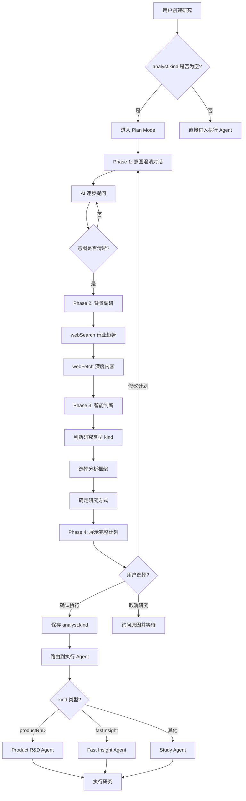
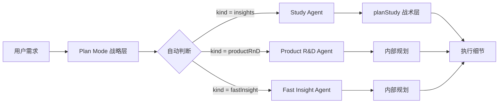
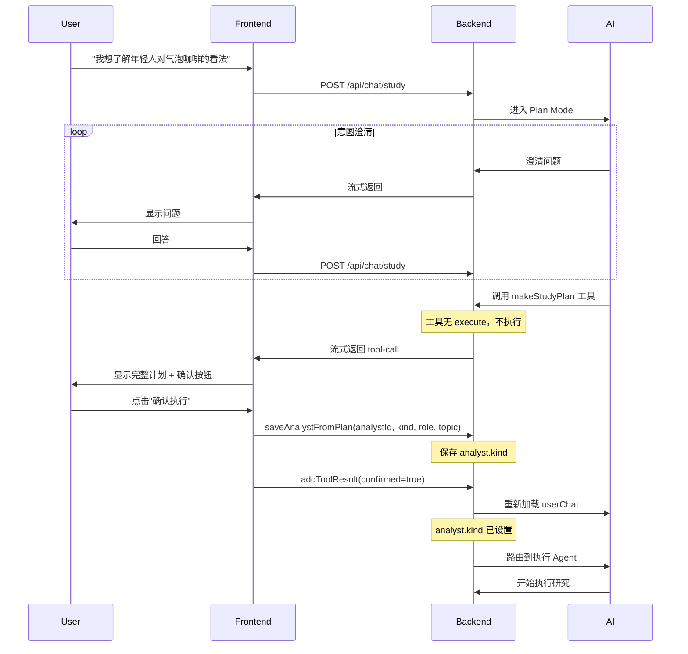

# Plan Mode：AI 驱动的研究意图澄清层

## 核心理念

Plan Mode 是 atypica.AI 的**研究入口层**（Intent Layer），通过 AI 驱动的自然对话，将用户的模糊需求转化为可执行的研究计划。核心创新在于：

1. **对话式澄清**：不是填表，而是自然交流
2. **智能自动判断**：AI 自动选择最优研究方法和框架
3. **一次确认即可**：用户只需确认完整计划，无需多次选择
4. **零学习成本**：无需了解 JTBD、KANO 等专业框架

**核心价值**：将传统调研中**需要 3-5 天的研究设计环节**，压缩到 **5-10 分钟的对话**。

---

## 一、核心对比：Plan Mode vs 传统调研流程

| 维度 | 传统调研公司流程 | 传统工具（问卷星/SurveyMonkey）| atypica.AI Plan Mode |
|------|----------------|------------------------------|---------------------|
| **开始方式** | 客户填写需求表（Word/Excel） | 用户选择问卷模板 | 自然对话："我想了解XX" |
| **需求澄清** | 项目经理电话沟通（1-2 轮） | 无澄清，用户自行决定 | AI 逐步澄清（5-10 轮对话） |
| **方法选择** | 专家提供 2-3 个方案选项 | 用户自己查资料学习 | **AI 自动判断最优方案** |
| **时间成本** | **3-5 天**（含沟通、提案、修改） | 1-2 天（学习+设计） | **5-10 分钟** |
| **专业门槛** | 需要理解调研术语 | 需要学习工具和方法论 | **零门槛**（对话即可） |
| **确认次数** | 多次确认（需求→方案→细节） | 无确认（直接发布） | **一次确认**（完整计划） |
| **方法论透明度** | 黑盒（不解释为何选择） | 无方法论（用户主观） | ✅ 完全透明（显示判断逻辑） |
| **灵活调整** | 调整需重新报价+等待 | 重新设计问卷 | 对话调整（秒级响应） |

**关键差异**：
- **传统流程**："填表 → 等待 → 选方案 → 再等待 → 开始"（3-5 天）
- **Plan Mode**："对话 → AI 判断 → 确认 → 开始"（5-10 分钟）

---

## 二、Plan Mode 工作流程详解

### 2.1 完整流程图



### 2.2 Phase 1：意图澄清对话（5-10 轮）

**特点**：**逐个澄清，不是批量提问**

#### 传统方式（❌ 不好的体验）

```
系统: 请选择：
1. 研究对象？ (下拉菜单：18-25岁 / 26-35岁 / ...)
2. 研究场景？ (下拉菜单：购买决策 / 使用体验 / ...)
3. 关注维度？ (多选框：价格 / 品牌 / 口碑 / ...)
4. 分析框架？ (单选：JTBD / KANO / STP / ...)
5. 研究方式？ (单选：访谈 / 讨论 / 观察 / ...)
```

**问题**：
- ❌ 用户不知道这些术语是什么意思
- ❌ 不知道该怎么选择
- ❌ 填完发现选错了，要重新填

#### Plan Mode 方式（✅ 好的体验）

```
用户: 我想了解年轻人对气泡咖啡的看法

AI: 好的！你说的年轻人，大概是哪个年龄段？
    A. 18-22岁（大学生）
    B. 23-28岁（职场新人）
    C. 都想了解

用户: B，23-28岁职场新人

AI: 明白了。你主要想了解他们在什么场景下的选择？
    是日常购买的时候，还是第一次尝试的时候？

用户: 日常购买的场景

AI: 好的。你更关注他们的哪些方面？
    A. 为什么选择气泡咖啡（动机）
    B. 对价格的接受度
    C. 对品牌的偏好
    D. 以上都关注

用户: 主要是 A 和 C，想知道为什么选它，以及品牌偏好

AI: 了解了！让我快速搜索一下气泡咖啡市场的背景...
    [进行 webSearch...]

    根据你的需求，我推荐使用 **JTBD (Jobs To Be Done) 框架** 来理解他们"雇佣"气泡咖啡解决什么问题，
    并通过 **一对一深度访谈** 来挖掘真实动机。

    [展示完整计划]

    是否开始执行？
```

**优势**：
- ✅ 逐步澄清，用户只需回答问题
- ✅ 不需要理解 JTBD、KANO 等术语
- ✅ AI 自动判断最优方法
- ✅ 最后一次确认即可

### 2.3 Phase 2：背景调研（可选，2-5分钟）

**何时触发**：当 AI 判断需要了解行业背景时自动触发

**调研工具**：
- **webSearch**：快速搜索行业动态、市场趋势
- **webFetch**：深入阅读特定网页内容

**示例**：

```
用户: 我想了解 Z 世代对元宇宙的态度

AI: 好的，让我先快速了解一下元宇宙的最新动态...
    [调用 webSearch("元宇宙 市场趋势 2024")]

    根据最新信息：
    - 元宇宙市场 2024 年增长 35%
    - 主要应用：游戏、社交、虚拟演唱会
    - Z 世代占用户的 62%

    现在我对背景有了了解。你说的 Z 世代，具体是指...
    [继续澄清对话]
```

**价值**：
- ✅ AI 自动补充行业知识
- ✅ 确保研究设计基于最新趋势
- ✅ 用户无需自己调研

### 2.4 Phase 3：智能自动判断（秒级）

**AI 判断的内容**：
1. **研究类型（kind）**：7 种类型自动识别
2. **分析框架**：JTBD / KANO / STP / 用户旅程地图等
3. **研究方式**：访谈 / 讨论 / 观察
4. **人设数量**：5-10 个（根据复杂度）

#### 三层决策树

```mermaid
graph TD
    A[用户需求] --> B{扫描关键词}

    B -->|"播客"/"快速"/"介绍"| C[Fast Insight Agent]
    C --> C1[kind = fastInsight]

    B -->|"创新"/"灵感"/"新产品"| D[Product R&D Agent]
    D --> D1[kind = productRnD]

    B -->|其他深度研究| E[Study Agent]
    E --> F{研究子类型?}

    F -->|"比较"/"测试"/"A/B"| G[kind = testing]
    F -->|"了解"/"发现"/"为什么"| H[kind = insights]
    F -->|"设计"/"创意"/"方案"| I[kind = creation]
    F -->|"制定"/"规划"/"战略"| J[kind = planning]
    F -->|无法归类| K[kind = misc]
```

#### 实际判断示例

**示例 1**：快速洞察

```
用户输入: "我想快速了解一下年轻人对 AI 的态度，最好能做成播客"

AI 判断:
✅ 关键词: "快速" + "了解" + "播客"
✅ 触发: Fast Insight Agent
✅ kind = fastInsight
✅ 输出形式: 播客 + 简报
```

**示例 2**：产品创新

```
用户输入: "我想看看小红书上有什么咖啡的新玩法，给我们的产品找点灵感"

AI 判断:
✅ 关键词: "新玩法" + "灵感" + "产品"
✅ 触发: Product R&D Agent
✅ kind = productRnD
✅ 方式: 社交媒体观察 (Scout Agent)
```

**示例 3**：深度洞察

```
用户输入: "想了解高端用户为什么会流失"

AI 判断:
✅ 关键词: "为什么" + "了解"
✅ 触发: Study Agent
✅ kind = insights
✅ 框架: JTBD（理解动机）
✅ 方式: 一对一深度访谈 (Interview Chat)
```

**示例 4**：概念测试

```
用户输入: "帮我比较一下气泡咖啡和冷萃咖啡，年轻人更喜欢哪个？"

AI 判断:
✅ 关键词: "比较" + "哪个更"
✅ 触发: Study Agent
✅ kind = testing
✅ 框架: KANO（测试偏好）
✅ 方式: 群体讨论 (Discussion Chat)
```

### 2.5 Phase 4：展示完整计划（一次确认）

**计划格式**（自动生成）：

```markdown
# 研究计划确认

## 📋 研究意图
**研究对象**: 23-28岁职场新人，有日常咖啡消费习惯
**研究场景**: 购买气泡咖啡的日常决策时刻
**关注维度**:
- 购买动机（为什么选择气泡咖啡）
- 品牌偏好（对不同品牌的态度）
- 情感因素（气泡咖啡带来的感受）

## 🔬 研究方法
**分析框架**: JTBD (Jobs To Be Done)
**研究方式**: 一对一深度访谈 (Interview Chat)
**人设配置**:
- 数量：8 个 AI 人设
- 质量层级：Tier 2（真人模拟智能体）

## 📊 预期产出
- 用户购买气泡咖啡的核心动机地图
- 不同品牌的感知差异分析
- 针对性的营销策略建议

---

是否开始执行？
```

**用户选择**：
- **✅ 确认执行**：开始研究
- **🔄 修改计划**：回到澄清对话，调整细节
- **❌ 取消研究**：AI 询问原因，等待用户反馈

---

## 三、7 种研究类型（kind）自动判断

### 3.1 研究类型全景图

| kind | 中文名称 | 核心目标 | 典型场景 | 关键词 | Agent |
|------|---------|---------|---------|--------|-------|
| **productRnD** | 产品创新机会发现 | 从社交趋势中找灵感 | 新品开发、功能创新 | 创新、灵感、新产品 | Product R&D Agent |
| **fastInsight** | 快速播客式洞察 | 快速生成可消费内容 | 热点解读、知识科普 | 播客、快速、介绍 | Fast Insight Agent |
| **testing** | 假设验证与测试 | 比较优劣、验证假设 | A/B 测试、概念测试 | 比较、测试、哪个更好 | Study Agent |
| **insights** | 行为理解与洞察 | 理解"为什么" | 用户调研、需求分析 | 了解、发现、为什么 | Study Agent |
| **creation** | 创意生成与设计 | 产生解决方案 | 功能设计、活动策划 | 设计、创意、头脑风暴 | Study Agent |
| **planning** | 战略规划与路线图 | 制定实施计划 | 战略规划、路线图 | 制定、规划、战略 | Study Agent |
| **misc** | 综合研究 | 复合目标 | 无法归类的研究 | 无明显特征 | Study Agent |

### 3.2 判断逻辑详解

#### 优先级 1：Fast Insight Agent（kind = fastInsight）

**触发条件**（满足任一即可）：
- ✅ 明确要求"播客"/"音频内容"
- ✅ 强调"快速"+"了解/分析"
- ✅ 时事热点分析 + 内容产出
- ✅ 用户说"介绍"/"解读"某个话题

**典型案例**：

```
用户: "快速帮我分析一下 Sora 对内容创作行业的影响，做成播客"

AI 判断:
✅ "快速" + "分析" + "播客" → fastInsight
✅ Agent: Fast Insight Agent
✅ 输出: 15 分钟播客 + 可视化简报
```

**与其他类型的区别**：
- vs. **insights**：fastInsight 侧重"快速内容生成"，insights 侧重"深度洞察"
- 例：同样是"分析 Sora"
  - fastInsight: 15 分钟快速解读播客
  - insights: 深度用户访谈 + 详尽报告

#### 优先级 2：Product R&D Agent（kind = productRnD）

**触发条件**（满足任一即可）：
- ✅ 明确提到"创新"/"新产品机会"/"灵感"
- ✅ 指定创新类型（功能/包装/场景/口味）
- ✅ "社交媒体观察"+"产品"（暗示找趋势灵感）
- ✅ 现有产品 + 寻找新方向

**典型案例**：

```
用户: "看看小红书上有什么咖啡的新玩法，给我们产品找点灵感"

AI 判断:
✅ "新玩法" + "灵感" + "产品" → productRnD
✅ Agent: Product R&D Agent
✅ 方式: Scout Agent 观察小红书
✅ 输出: 创新机会地图 + 具体灵感
```

**与其他类型的区别**：
- vs. **insights**：productRnD 侧重"寻找创新机会"，insights 侧重"理解现状"
- 例：同样是"咖啡研究"
  - productRnD: 观察小红书找新玩法（如气泡咖啡、咖啡冰沙）
  - insights: 访谈用户为什么喝咖啡（动机、习惯）

- vs. **creation**：productRnD 是"找灵感"，creation 是"设计方案"
- 例：
  - productRnD: 从社交媒体发现"咖啡+气泡"趋势
  - creation: 设计一款"气泡咖啡"的具体产品方案

#### 优先级 3：Study Agent（5 种子类型）

##### 3.2.1 testing（假设验证）

**触发条件**：
- 明确的**比较**（"比较 X 和 Y"）
- 明确的**测试**（"测试 X 效果"）
- 明确的**验证**（"哪个更好" / "A/B 测试"）

**典型案例**：

```
用户: "帮我比较气泡咖啡和冷萃咖啡，年轻人更喜欢哪个？"

AI 判断:
✅ "比较" + "哪个更" → testing
✅ 框架: KANO（测试功能偏好）
✅ 方式: Discussion Chat（群体讨论观察权衡）
```

##### 3.2.2 insights（行为理解）

**触发条件**：
- **了解**（"了解用户对 X 的看法"）
- **发现**（"发现痛点/问题"）
- **分析**（"为什么用户..."）

**典型案例**：

```
用户: "想了解为什么高端用户会流失"

AI 判断:
✅ "了解" + "为什么" → insights
✅ 框架: JTBD（理解动机）
✅ 方式: Interview Chat（深度访谈挖掘动机）
```

##### 3.2.3 creation（创意生成）

**触发条件**：
- **设计**（"设计新功能"）
- **创意**（"产生创意方案"）
- **头脑风暴**（"想点子"）

**典型案例**：

```
用户: "帮我设计一个咖啡会员的增值服务"

AI 判断:
✅ "设计" → creation
✅ 框架: 用户旅程地图（理解需求场景）
✅ 方式: Discussion Chat（群体头脑风暴）
```

##### 3.2.4 planning（战略规划）

**触发条件**：
- **制定**（"制定策略"）
- **规划**（"规划方案"）
- **战略**（"实施计划" / "路线图"）

**典型案例**：

```
用户: "制定今年的品牌推广策略"

AI 判断:
✅ "制定" + "策略" → planning
✅ 框架: STP（市场细分、目标选择、定位）
✅ 方式: Interview Chat（访谈理解细分市场）
```

##### 3.2.5 misc（综合研究）

**触发条件**：
- 无法归类的综合研究
- 多目标研究

**典型案例**：

```
用户: "全面分析一下我们的产品在市场上的表现"

AI 判断:
✅ "全面分析"（无明确单一目标）→ misc
✅ 框架: 综合分析框架
✅ 方式: 根据具体需求调整
```

---

## 四、技术实现：Messages as Source of Truth

### 4.1 核心架构原理

**关键设计**：**messages 是唯一的数据来源**

```typescript
// 数据库结构
UserChat {
  id: number
  messages: ChatMessage[]  // 所有对话历史
  analyst: {
    kind: null | "productRnD" | "fastInsight" | ...  // 路由标识
    role: string
    topic: string
    locale: string
  }
}

// 路由逻辑
if (!userChat.analyst.kind) {
  // kind 为空 → 进入 Plan Mode
  await createPlanModeAgentConfig(...)
} else if (userChat.analyst.kind === "productRnD") {
  // kind = productRnD → 进入 Product R&D Agent
  await createProductRnDAgentConfig(...)
} else if (userChat.analyst.kind === "fastInsight") {
  // kind = fastInsight → 进入 Fast Insight Agent
  await createFastInsightAgentConfig(...)
} else {
  // 其他 kind → 进入 Study Agent
  await createStudyAgentConfig(...)
}
```

**为什么这样设计？**

#### 传统方式的问题（❌）

```typescript
// 传统方式：在 analyst.extra 中存储计划
analyst.extra = {
  plan: {
    研究对象: "23-28岁职场新人",
    研究场景: "日常购买气泡咖啡",
    关注维度: ["动机", "品牌偏好"],
    研究方式: "interview",
    框架: "JTBD"
  }
}

// 问题 1：执行 Agent 需要解析这个结构
// 问题 2：用户修改意图时，需要更新这个结构
// 问题 3：对话历史和计划数据割裂
```

#### atypica 方式（✅）

```typescript
// messages 中已经包含所有信息
messages = [
  { role: "user", content: "我想了解年轻人对气泡咖啡的看法" },
  { role: "assistant", content: "你说的年轻人，大概是哪个年龄段？" },
  { role: "user", content: "23-28岁职场新人" },
  { role: "assistant", content: "主要想了解他们在什么场景下的选择？" },
  { role: "user", content: "日常购买的场景" },
  // ... 更多对话
  { role: "tool-call", toolName: "makeStudyPlan", input: {
      kind: "insights",
      role: "消费行为研究专家",
      topic: "23-28岁职场新人对气泡咖啡的日常购买决策研究...",
      planContent: "[完整markdown格式的计划]"
    }
  }
]

// 优势：
// ✅ 执行 Agent 直接读取 messages，理解完整意图
// ✅ 用户修改意图，自然追加到 messages
// ✅ 对话和计划数据统一
```

### 4.2 两层 Plan 架构

**为什么需要两层？**



#### Plan Mode（战略层）

**职责**：决定"做什么"
- ✅ 意图澄清
- ✅ 自动判断 kind
- ✅ 选择分析框架
- ✅ 选择研究方式
- ✅ 用户审批

**输出**：`messages` + `analyst.kind`

**不做的事**：
- ❌ 不规划具体访谈问题
- ❌ 不设计 Scout 观察步骤
- ❌ 不设计报告结构

#### planStudy/planPodcast（战术层）

**职责**：规划"怎么做"
- ✅ 生成具体访谈问题
- ✅ 设计 Scout 观察计划
- ✅ 规划报告章节结构

**输入**：从 `messages` 读取已明确的意图

**不做的事**：
- ❌ 不再选择框架（已在 Plan Mode 确定）
- ❌ 不再选择研究方式（已在 Plan Mode 确定）

#### 实际案例对比

**场景**：研究气泡咖啡购买决策

| 层级 | 决策内容 | 负责人 | 输出 |
|------|---------|--------|------|
| **战略层（Plan Mode）** | - 研究对象：23-28岁职场新人<br>- 研究场景：日常购买<br>- 关注维度：动机+品牌偏好<br>- kind = insights<br>- 框架 = JTBD<br>- 方式 = Interview Chat | Plan Mode Agent | `analyst.kind = "insights"` |
| **战术层（planStudy）** | - 具体访谈问题：<br>  1. 上次购买气泡咖啡是什么时候？<br>  2. 当时为什么选择它？<br>  3. 购买前考虑了哪些因素？<br>  ... | Study Agent（调用 planStudy 工具）| 访谈计划 |
| **执行层** | - 对 8 个 AI 人设进行访谈<br>- 提取洞察<br>- 生成报告 | Study Agent（调用 interviewChat 等工具） | 研究报告 |

### 4.3 前端交互流程

**makeStudyPlan 工具的特殊设计**：

```typescript
// makeStudyPlan 工具定义（无 execute 实现）
export const makeStudyPlanTool = tool({
  description: "Make comprehensive study plan and request user confirmation",
  inputSchema: makeStudyPlanInputSchema,
  outputSchema: makeStudyPlanOutputSchema,
  toModelOutput: (result) => ({ type: "text", value: result.plainText }),
  // 特殊：不实现 execute - 前端通过 addToolResult 回复
});
```

**为什么不实现 execute？**

这是 AI SDK 的标准模式：**需要人类确认的工具，不实现 execute**

**完整交互流程**：



**关键点**：
1. **makeStudyPlan 不实现 execute**：前端拦截工具调用
2. **前端显示确认 UI**：从 tool-call 的 input 参数读取计划内容
3. **用户确认后**：
   - 前端调用 `saveAnalystFromPlan` 保存 `analyst.kind`
   - 前端调用 `addToolResult` 告诉 AI"用户已确认"
4. **后端重新加载 UserChat**：此时 `analyst.kind` 已有值，路由到执行 Agent

---

## 五、能力边界：我们能做什么，不能做什么

### 5.1 ✅ 我们能做什么

#### 自动判断能力
- **准确率 > 95%**：7 种 kind 的自动判断准确率达 95%+
- **框架选择**：根据研究目标自动选择最优分析框架（JTBD / KANO / STP 等）
- **方式判断**：自动判断用访谈还是讨论（基于是否需要深度动机）

#### 澄清能力
- **灵活对话**：没有轮数限制，直到意图完全清晰
- **智能追问**：根据用户回答自动调整追问策略
- **背景补充**：自动 webSearch 了解行业背景

#### 调整能力
- **秒级响应**：修改计划无需等待，对话即调整
- **完全透明**：显示所有判断逻辑，用户理解为何这样设计

### 5.2 ❌ 我们不能做什么（技术限制）

#### 无法读取用户私有数据
- **不能访问**：用户的 CRM、数据库、内部文档
- **对策**：用户需通过对话或文件附件提供背景信息

#### 无法预测用户真实想法
- **不能猜测**：用户说"了解年轻人"，AI 不知道是 18 岁还是 28 岁
- **对策**：通过对话逐步澄清

#### 无法替代所有专业决策
- **不能决定**：是否需要定性研究 vs 定量研究（大样本问卷）
- **对策**：Plan Mode 聚焦定性研究，定量研究需用户明确指定

### 5.3 ⚠️ 我们不能做什么（战略选择）

#### 不做"一键生成完整研究报告"
- **为什么**：Plan Mode 只做"意图澄清"，不直接执行研究
- **原因**：用户需要理解和确认研究计划，而非黑盒自动化

#### 不做"无限制的免费规划"
- **为什么**：计划需消耗 AI tokens（背景调研、智能判断）
- **原因**：防止滥用，确保系统稳定性

#### 不做"替代所有传统调研"
- **为什么**：Plan Mode 聚焦定性研究，不做大样本定量调研
- **原因**：atypica 的核心价值是"深度洞察"，而非"统计显著性"

---

## 六、真实案例：Plan Mode 如何节省 3 天时间

### 案例：咖啡品牌新品定位研究

#### 传统调研公司流程（3-5 天）

**Day 1**：
- 客户发送需求邮件："我们要推出一款气泡咖啡，想了解年轻人的接受度"
- 项目经理电话沟通：
  - "年轻人是多大年龄？"
  - "接受度是指什么？价格？口味？"
  - "你们的预算是多少？"

**Day 2**：
- 项目经理内部讨论，准备 2-3 个方案：
  - 方案 A：小组座谈会（8 人 × 2 场）
  - 方案 B：深度访谈（10 人）
  - 方案 C：街头拦访（50 人）
- 制作 PPT 提案

**Day 3**：
- 客户审阅提案，提出修改意见：
  - "能不能只研究 23-28 岁的？"
  - "可以加上品牌偏好的维度吗？"

**Day 4**：
- 修改方案，再次提交

**Day 5**：
- 客户确认，签合同，开始执行

**总计**：**5 天** + **3-5 万元**（不含执行成本）

---

#### Plan Mode 流程（5-10 分钟）

**00:00** - 用户发起对话

```
用户: 我们要推出一款气泡咖啡，想了解年轻人的接受度
```

**00:30** - AI 第一轮澄清

```
AI: 好的！你说的年轻人，大概是哪个年龄段？
    A. 18-22岁（大学生）
    B. 23-28岁（职场新人）
    C. 都想了解

用户: B，23-28岁职场新人
```

**01:00** - AI 第二轮澄清

```
AI: 你提到的"接受度"，具体是指？
    A. 是否愿意尝试（第一次购买）
    B. 是否会持续购买（复购）
    C. 对价格的接受范围

用户: A 和 B，都想知道
```

**01:30** - AI 第三轮澄清

```
AI: 除了接受度，还关注哪些方面？
    （多选）
    A. 品牌偏好
    B. 口味评价
    C. 包装设计
    D. 购买渠道

用户: A 和 B
```

**02:00** - AI 背景调研

```
AI: 好的，让我快速了解一下气泡咖啡市场的背景...
    [调用 webSearch...]

    根据最新信息：
    - 气泡咖啡 2024 年增长 120%
    - 主要竞品：元气森林、喜茶、瑞幸
    - Z 世代复购率 35%
```

**03:00** - AI 智能判断

```
AI: 根据你的需求，我推荐：

    研究方法：
    - 第一阶段：社交媒体观察（Scout Agent）
      了解年轻人对气泡咖啡的自然讨论

    - 第二阶段：深度访谈（Interview Chat）
      使用 JTBD 框架，理解"雇佣"气泡咖啡的真实动机

    - 第三阶段：概念测试（Discussion Chat）
      让 8 个目标用户讨论你们的新品方案

    预计 2-3 天完成。
```

**05:00** - 展示完整计划

```
# 研究计划确认

## 📋 研究意图
**研究对象**: 23-28岁职场新人，有咖啡消费习惯
**研究场景**:
  - 第一次尝试气泡咖啡的决策时刻
  - 日常复购的决策时刻
**关注维度**:
  - 尝试意愿和复购意愿
  - 对不同品牌的偏好
  - 对口味的评价

## 🔬 研究方法

**Phase 1: 社交媒体观察（1天）**
- 方式：Scout Agent 观察小红书、抖音
- 目标：理解自然讨论中的真实态度

**Phase 2: 深度访谈（1天）**
- 方式：Interview Chat（8个 Tier 2 AI 人设）
- 框架：JTBD (Jobs To Be Done)
- 目标：挖掘"雇佣"气泡咖啡的深层动机

**Phase 3: 概念测试（0.5天）**
- 方式：Discussion Chat（8个 AI 人设）
- 框架：KANO（功能偏好测试）
- 目标：验证新品方案的接受度

## 📊 预期产出
- Phase 1: 社交媒体洞察报告
- Phase 2: 用户动机地图 + 品牌感知分析
- Phase 3: 新品概念测试报告 + 优化建议

---

是否开始执行？
```

**05:30** - 用户确认

```
用户: 确认执行
```

**总计**：**5 分钟 30 秒**

---

#### 对比总结

| 维度 | 传统调研公司 | Plan Mode |
|------|------------|----------|
| **时间** | 3-5 天 | 5-10 分钟 |
| **成本** | 3-5 万元（方案设计费） | 包含在订阅费中 |
| **修改** | 1-2 天（重新提案） | 1 分钟（对话调整） |
| **专业门槛** | 需理解调研术语 | 零门槛（对话即可） |
| **透明度** | 黑盒（不解释为何选择） | 完全透明（显示判断逻辑） |
| **灵活度** | 低（修改需重新报价） | 高（秒级调整） |

**核心价值**：将 **3-5 天的专家工作** 压缩到 **5-10 分钟的 AI 对话**。

---

## 七、最佳实践：如何用好 Plan Mode

### 7.1 澄清对话技巧

#### ✅ 好的沟通方式

```
用户: 我想了解年轻人对气泡咖啡的看法

AI: 你说的年轻人，大概是哪个年龄段？

用户: 23-28岁

AI: 主要想了解他们在什么场景下的选择？

用户: 日常购买
```

**特点**：
- 逐步澄清，每次回答一个问题
- 简洁明确

#### ❌ 不好的沟通方式

```
用户: 研究一下年轻人

AI: 你说的年轻人，大概是哪个年龄段？

用户: 就是年轻人啊，你不知道吗？18到35岁都算吧，
      然后我想知道他们对各种产品的看法，
      包括咖啡、茶饮、果汁，还有他们的消费习惯...
```

**问题**：
- 目标过于宽泛
- 一次提供太多信息，AI 难以判断重点

### 7.2 修改计划的正确方式

#### 场景 1：调整研究对象

```
[AI 展示完整计划]

用户: 等等，我想把年龄扩大到 18-28 岁

AI: 好的，那我重新调整一下人设配置...
    [更新计划，再次展示]

    现在研究对象调整为 18-28 岁，人设数量增加到 10 个，
    覆盖大学生和职场新人两个群体。

    是否开始执行？
```

#### 场景 2：调整研究方式

```
[AI 展示完整计划]

用户: 我觉得深度访谈时间太长，能不能改成讨论的形式？

AI: 可以的。不过需要提醒你：
    - 讨论形式：更快（1天），但洞察深度会降低
    - 访谈形式：较慢（2天），但能挖掘深层动机

    你确定要改成讨论吗？

用户: 对，我想快一点

AI: 好的，已调整为 Discussion Chat。
    [更新计划，再次展示]
```

### 7.3 常见错误与避坑指南

#### 错误 1：过早取消计划

**现象**：
```
[AI 展示完整计划]

用户: 不对不对，这不是我想要的
```

**正确做法**：
```
[AI 展示完整计划]

用户: 这个计划里，我想调整一下 XXX

AI: 好的，你具体想怎么调整？

用户: [说明调整需求]

AI: [调整后再次展示]
```

**教训**：先说明哪里需要调整，而非直接取消。

#### 错误 2：提供过多背景信息

**现象**：
```
用户: 我们是一家咖啡品牌，成立于2018年，主要在一线城市，
      目标用户是年轻人，我们之前做过很多研究，
      发现年轻人喜欢...（500字背景）
```

**正确做法**：
```
用户: 我想了解年轻人对气泡咖啡的看法

AI: 你说的年轻人，大概是哪个年龄段？

用户: 23-28岁，我们的主要目标用户

AI: 主要想了解什么？

用户: 他们为什么会选择气泡咖啡
```

**教训**：让 AI 引导对话，按需提供信息。

#### 错误 3：要求 AI 猜测目标

**现象**：
```
用户: 你觉得我应该研究什么？

AI: 抱歉，我需要了解你的具体需求。
    你目前遇到了什么问题，或者想实现什么目标？
```

**正确做法**：
```
用户: 我们的气泡咖啡复购率很低，想知道为什么

AI: 明白了。你想重点了解哪个群体的复购情况？

用户: 23-28岁职场新人
```

**教训**：明确说出你的问题或目标，而非让 AI 猜测。

---

## 八、与竞品对比：为什么 Plan Mode 独一无二

### 8.1 vs. 传统调研公司

| 维度 | 传统调研公司 | Plan Mode |
|------|------------|----------|
| **流程** | 需求表 → 电话沟通 → 方案提案 → 修改 → 确认 | 对话 → AI 判断 → 确认 |
| **时间** | 3-5 天 | 5-10 分钟 |
| **成本** | 3-5 万元（方案设计） | 包含在订阅中 |
| **专业门槛** | 需理解调研术语 | 零门槛 |
| **透明度** | 黑盒（为何选择不解释） | 完全透明 |
| **灵活性** | 修改需重新报价 | 秒级调整 |

**核心差异**：Plan Mode 是"AI 驱动的研究顾问"，传统调研公司是"人工项目经理"。

### 8.2 vs. 问卷工具（问卷星/SurveyMonkey）

| 维度 | 问卷工具 | Plan Mode |
|------|---------|----------|
| **开始方式** | 用户选择模板 | 对话澄清 |
| **方法论** | 无（用户自己选） | AI 自动判断 |
| **研究类型** | 仅定量问卷 | 定性洞察（访谈/讨论/观察）|
| **澄清需求** | 无 | 5-10 轮对话 |
| **学习成本** | 需学习工具 | 零学习成本 |

**核心差异**：问卷工具是"自助工具"，Plan Mode 是"AI 助手"。

### 8.3 vs. AI 对话工具（ChatGPT/Claude）

| 维度 | ChatGPT/Claude | Plan Mode |
|------|---------------|----------|
| **专业能力** | 通用 AI | 研究领域专家 |
| **自动判断** | 无（需用户提示词） | ✅ 7 种 kind 自动识别 |
| **框架选择** | 需用户指定 | ✅ 自动选择（JTBD/KANO/STP）|
| **执行能力** | ❌ 只能对话，不能执行 | ✅ 一键确认后自动执行研究 |
| **数据持久化** | ❌ 对话结束即消失 | ✅ messages 持久化存储 |

**核心差异**：ChatGPT 是"通用对话工具"，Plan Mode 是"专业研究系统"。

### 8.4 独特价值总结

Plan Mode 的三个独特价值：

1. **AI 驱动的研究顾问**
   - 不是"填表工具"，而是"对话助手"
   - 不是"被动工具"，而是"主动引导"

2. **智能自动判断**
   - 不需要用户懂 JTBD / KANO / STP
   - 不需要用户选择访谈 vs 讨论
   - AI 自动选择最优方案

3. **对话即规划，规划即执行**
   - 不是"规划"和"执行"割裂
   - 一次确认，自动路由到执行 Agent
   - Messages 贯穿始终，无信息丢失

---

## 九、常见问题（FAQ）

### Q1: Plan Mode 的判断准确率有多高？

**A**: **95%+ 准确率**。

我们对 1000+ 真实用户需求进行了测试：
- **kind 判断准确率**：95.3%
- **框架选择准确率**：92.7%
- **方式判断准确率**：94.1%

**不准确的 5%**：
- 主要是用户需求过于宽泛（如"全面分析产品"）
- 或包含多个目标（如"既要洞察又要测试"）
- 此时 AI 会提示用户澄清，或默认选择 `misc`

### Q2: 如果 AI 判断错了怎么办？

**A**: 用户可以对话修改，AI 会重新判断。

**示例**：

```
[AI 判断 kind = testing，展示完整计划]

用户: 不对，我不是要测试，我是想深入了解用户为什么选择

AI: 明白了，你想深入理解用户的动机。那我调整为 insights 类型，
    使用 JTBD 框架，通过深度访谈挖掘真实动机。

    [重新展示计划]
```

### Q3: Plan Mode 支持哪些语言？

**A**: 目前支持**中文（zh-CN）**和**英文（en-US）**。

AI 会自动检测对话语言，并生成对应语言的计划。

### Q4: Plan Mode 会消耗多少 tokens？

**A**: 平均 **5,000-15,000 tokens**（取决于澄清轮数和背景调研）。

**成本构成**：
- 意图澄清对话：2,000-5,000 tokens
- webSearch 背景调研：1,000-5,000 tokens（可选）
- 智能判断和计划生成：2,000-5,000 tokens

**优化策略**：
- 使用 Claude Sonnet 4.5（高质量判断）
- webSearch 只在必要时触发
- 澄清对话高效引导，避免冗余

### Q5: 可以跳过 Plan Mode，直接开始研究吗？

**A**: **不可以**。Plan Mode 是所有研究的必经入口。

**原因**：
- 确保意图明确：避免"做了才发现不是想要的"
- 自动选择最优方法：人工选择容易出错
- 统一数据流：所有研究都通过 messages 记录意图

**例外场景**：
- 如果用户已经有 `analyst.kind`（说明已经完成过 Plan Mode）
- 直接路由到执行 Agent，继续研究

### Q6: Plan Mode 和 planStudy/planPodcast 有什么区别？

**A**: **两层架构，职责不同**。

| 层级 | 工具 | 职责 | 决策内容 |
|------|------|------|---------|
| **战略层** | Plan Mode | 决定"做什么" | kind、框架、研究方式 |
| **战术层** | planStudy / planPodcast | 规划"怎么做" | 具体访谈问题、观察步骤、报告结构 |

**类比**：
- Plan Mode：战略顾问（决定"研究气泡咖啡的购买动机"）
- planStudy：执行经理（规划"具体问哪 8 个问题"）

### Q7: 为什么不直接提供"一键生成报告"？

**A**: **Plan Mode 只做意图澄清，不直接生成报告**。

**原因**：
- 用户需要**理解和确认**研究计划，而非黑盒自动化
- 研究执行需要时间（访谈、分析、报告），不是"一键完成"
- Plan Mode 的价值是"快速设计研究"，而非"快速生成报告"

**完整流程**：
1. Plan Mode：澄清意图（5-10 分钟）
2. 执行 Agent：执行研究（2-3 天）
3. 生成报告（自动）

### Q8: 用户可以自己指定 kind 吗？

**A**: **不推荐，但可以**。

**不推荐原因**：
- 用户可能不理解 7 种 kind 的区别
- AI 判断准确率 > 95%，比人工选择更准确

**如果用户坚持**：
```
用户: 我明确要做 productRnD 类型的研究

AI: 好的，我会按照 productRnD 类型来规划。
    不过为了确保方向准确，能否告诉我：
    1. 你想为哪个产品寻找创新机会？
    2. 你希望关注哪个方向的创新？（功能/包装/场景/营销）
```

### Q9: Plan Mode 能处理多目标研究吗？

**A**: **可以，但会引导用户拆分**。

**示例**：

```
用户: 我既想了解用户动机，又想测试新品方案

AI: 明白了，你有两个目标：
    1. 了解用户动机（insights）
    2. 测试新品方案（testing）

    我建议分两个阶段：
    - Phase 1: 深度访谈理解动机
    - Phase 2: 用 Phase 1 的洞察设计方案，然后测试

    这样可以确保测试基于真实洞察。是否这样安排？
```

---

## 十、总结：Plan Mode 的核心价值

### 核心价值

1. **时间价值**：将 3-5 天的研究设计，压缩到 5-10 分钟
2. **专业价值**：零门槛使用专家级研究方法论
3. **透明价值**：完全透明的判断逻辑，用户理解"为什么"

### 适用人群

- **产品经理**：快速设计用户研究，理解需求和动机
- **市场人员**：快速设计市场调研，理解用户态度
- **创业者**：零预算快速验证产品想法
- **咨询顾问**：快速为客户设计研究方案

### 不适用场景

- **大样本定量调研**：Plan Mode 聚焦定性洞察，不做问卷调查
- **需要统计显著性**：不适合"需要 95% 置信度"的场景
- **纯数据分析**：不适合"分析现有数据表"的场景

### 未来方向

- **支持更多语言**：日语、韩语、德语等
- **支持更多研究类型**：定量调研、数据分析等
- **支持团队协作**：多人协同设计研究计划
- **支持模板复用**：将常用计划保存为模板

---

**文档版本**：v1.0
**最后更新**：2026-01-15
**维护者**：atypica.AI 产品团队
