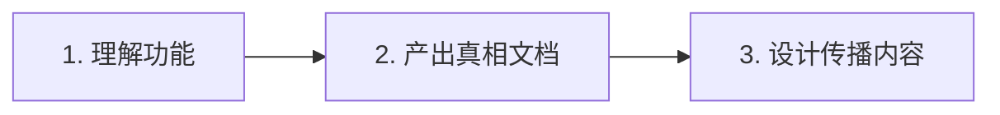

# Product Marketing 内容生产快速指南

> **适合人群**：需要快速上手，按流程产出营销内容
> **阅读时间**：5 分钟
> **更新日期**：2026-01-15

---

## 核心流程（3步）



---

## Step 1：理解功能（从代码到产品）

### 目标
搞清楚"这个功能实际能做什么"（不是想象，是已实现的）

### 快速方法
1. **读代码**：找到功能的核心实现文件
   - Agent 配置：`src/app/(study)/agents/configs/`
   - 工具实现：`src/app/(study)/tools/`
   - 系统提示词：`src/app/(study)/prompt/`

2. **3个关键问题**：
   - 这个功能解决什么问题？（用户痛点）
   - 和其他功能有什么不同？（差异点）
   - 有什么限制？（能做 vs 不能做）

3. **找证据**：
   - 技术参数（代码里的数字、限制）
   - 用户旅程（docs/user-research-journey.md）
   - 架构文档（docs/architecture/）

**产出**：功能理解笔记（自己看懂即可）

---

## Step 2：产出真相文档（客观、细节、不啰嗦）

### 文档类型

#### A. 功能对比文档
**模板**：
```markdown
# [功能A] vs [功能B]：什么时候用哪个？

## 一句话差异
[30字说清楚核心差异]

## 对比表格
| 维度 | 功能A | 功能B |
|------|-------|-------|
| 适用场景 | ... | ... |
| 人数 | ... | ... |
| 输出 | ... | ... |
| 时长 | ... | ... |

## 使用建议
✅ 用功能A：[场景1、场景2、场景3]
✅ 用功能B：[场景1、场景2、场景3]

## 技术实现差异
[简要说明，100字内]
```

#### B. 竞品对比文档
**模板**：
```markdown
# atypica.AI vs [竞品名称]

## 核心差异（对比表格）
| 维度 | atypica | 竞品 |
|------|---------|------|
| 时间 | 30分钟 | ... |
| 成本 | ~50-100元 | ... |
| ... | ... | ... |

## 我们做得更好
1. [优势1]：具体说明 + 数据证据
2. [优势2]：具体说明 + 数据证据

## 对方做得更好（客观承认）
1. [对方优势1]：具体说明
2. [对方优势2]：具体说明

## 使用建议
✅ 用 atypica：[场景列表]
✅ 用竞品：[场景列表]
```

### 质量检查清单
- [ ] 所有数据有来源（代码/文档/用户反馈）
- [ ] 客观承认竞品优势
- [ ] 每个优势都有证据
- [ ] 避免"最好"、"唯一"、"完美"
- [ ] 用对比表格，不是长段落

---

## Step 3：设计传播内容（夺人眼球）

### A. 官网落地页

**结构（3秒抓住注意力）**：
```markdown
[震撼开场]
2025年8月5日，Gartner股价暴跌30%
传统调研模式面临结构性挑战

[核心数据]
30万 AI 人设 + 1万真人深访
85分一致性，超越人类81%基线
30分钟完成传统需要2-4周的研究

[痛点 + 方案]
[根据落地页版本动态调整]

[CTA]
开始你的第一个研究
```

**关键元素库**：
- 行业转折点：Gartner暴跌30%、McKinsey增长2%
- 核心数据：30万人设、85分一致性、80%+重合度
- 时间对比：30分钟 vs 2-4周
- 成本对比：50-100元 vs 5-10万元

### B. KOL/播客演讲稿

**结构（悬念式）**：
```markdown
[开场提问]
"为什么 Gartner 会在一天内暴跌 30%？"

[行业背景]
传统调研模式的三大痛点

[方案引入]
AI 人设模拟提供的新可能

[技术原理]
主观世界建模法 + 置信度验证

[数据支撑]
85分一致性、80%+重合度

[实际演示]
播放访谈实录

[能力边界]
能做什么、不能做什么

[结尾金句]
"让商业决策从'艺术'变成'科学'"
```

---

## 常用模板和工具

### 数据速查表

| 数据项 | 数值 | 用途 |
|--------|------|------|
| 研究完成时间 | 30分钟 | 速度对比 |
| 研究成本 | 50-100元 | 成本对比 |
| AI人设总数 | 30万+1万 | 规模展示 |
| 深访人设一致性 | 85分 | 质量证明 |
| 人类基线 | 81% | 对比基准 |
| 真人重合度 | 80%+ | 准确性证明 |

### 文件组织结构

```
/docs/product/
  /features/              # 功能对比文档
    - interview-vs-discussion.md
    - scout-agent.md
    - plan-mode.md
    ...
  /competitors/           # 竞品对比文档
    - vs-traditional-research.md
    - vs-usertesting.md
    ...
  /landing-pages/         # 落地页内容
    /by-role/             # 按角色
    /by-scenario/         # 按场景
  /scripts/               # 演讲稿
    - kol-full-30min.md
    - kol-short-15min.md
```

---

## 执行清单

### 第一阶段：功能对比文档
- [ ] Interview vs Discussion
- [ ] Plan Mode vs 直接执行
- [ ] Scout Agent 深度解析
- [ ] Fast Insight vs 常规研究
- [ ] Product R&D Agent
- [ ] AI Persona 三层体系
- [ ] Memory System 机制
- [ ] Sage 可进化专家
- [ ] MCP 集成能力
- [ ] 参考研究 + 文件附件

### 第二阶段：竞品对比文档
**P0核心**（必做）：
- [ ] vs 传统调研公司
- [ ] vs UserTesting
- [ ] vs Listen Labs
- [ ] vs Dovetail
- [ ] vs Manus

**P1相关**（重要）：
- [ ] vs AI Agent框架（LangChain/CrewAI/AutoGen）
- [ ] vs NotebookLM
- [ ] vs Claude Projects
- [ ] vs ChatGPT Custom GPTs
- [ ] vs Brandwatch
- [ ] vs Remesh
- [ ] vs Qualtrics

**P2边缘**（简要）：
- [ ] vs Notably/Marvin
- [ ] vs Maze
- [ ] vs Great Question
- [ ] vs 问卷工具
- [ ] vs Perplexity

### 第三阶段：传播内容
**落地页**：
- [ ] 通用版
- [ ] Consultants 版
- [ ] Marketers 版
- [ ] Product Managers 版
- [ ] "快速验证概念"场景版
- [ ] "理解用户真实想法"场景版

**演讲稿**：
- [ ] 完整版（30分钟）
- [ ] 精简版（15分钟）
- [ ] 闪电版（5分钟）

---

## 快速参考

### 核心原则
1. **客观第一**：有证据的才写
2. **细节制胜**：越具体越可信
3. **承认差距**：客观说竞品优势
4. **场景化**：用故事和例子
5. **表格优先**：能表格就不写段落

### 避坑指南
❌ 不要用"最好"、"唯一"、"完美"
❌ 不要回避我们不能做的
❌ 不要只说优势不说场景
❌ 不要长段落堆砌信息
❌ 不要没证据就下结论

### 快速验证
问自己3个问题：
1. 这个信息有证据来源吗？（代码/文档/数据）
2. 竞品对比客观吗？（承认了对方优势吗）
3. 用户能在3秒内抓住重点吗？（表格/小标题）

---

## 下一步

阅读完本指南后：
1. **深入学习**：阅读[详细手册](./how-to-marketing-handbook.md)
2. **实战演练**：跟随[实战教程](./how-to-marketing-tutorial.md)
3. **开始产出**：从最熟悉的功能开始

---

**文档版本**：v1.0
**维护者**：atypica.AI Product Team
**问题反馈**：发现问题或有建议，请及时反馈
