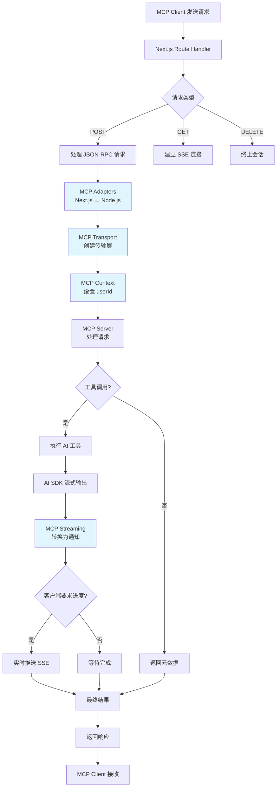
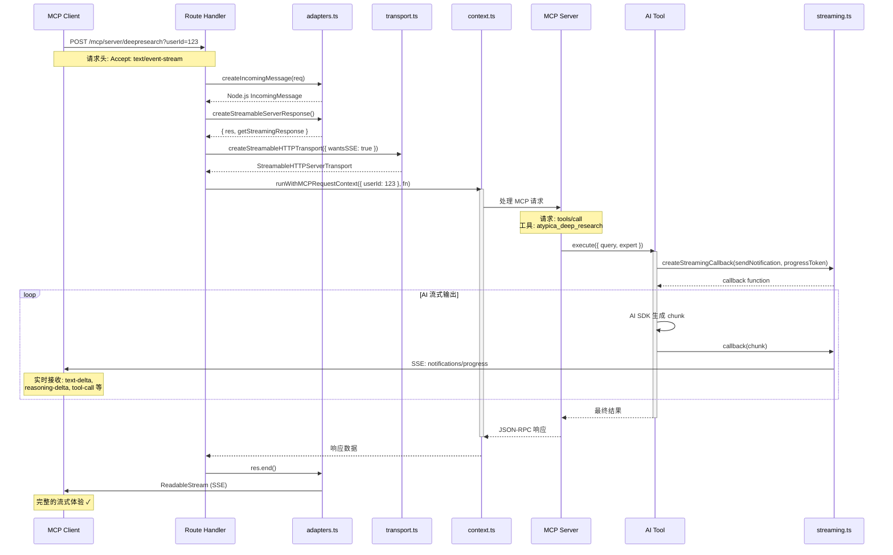
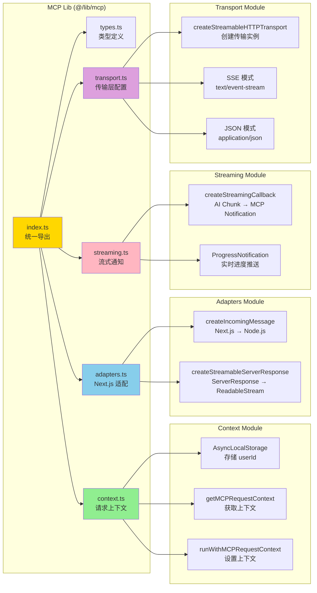
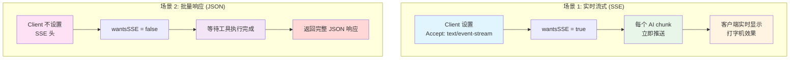
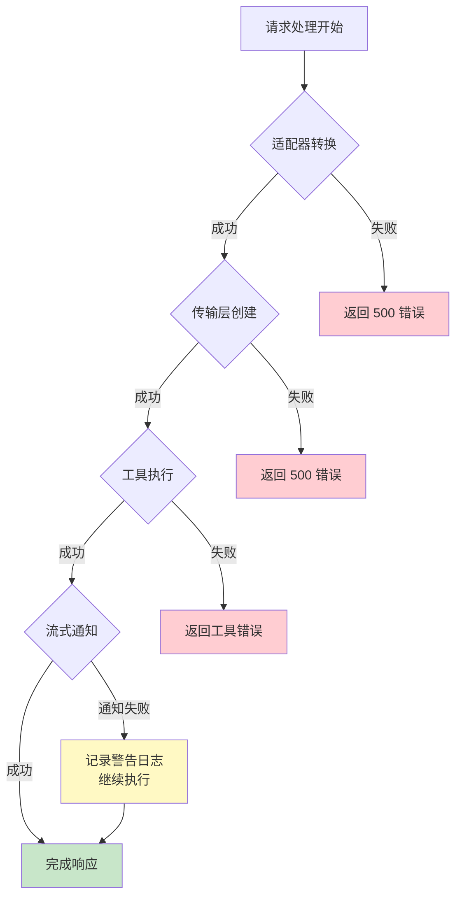
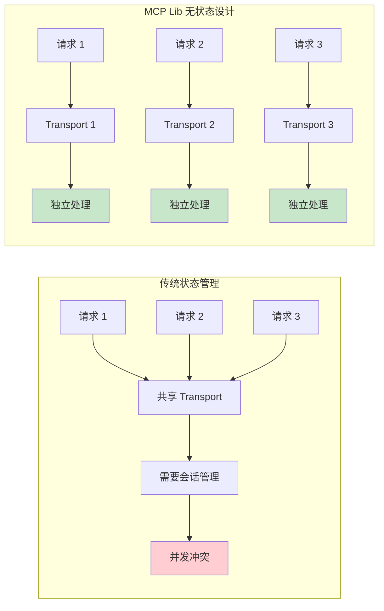
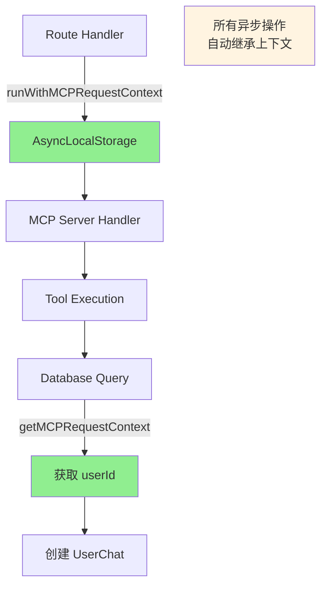

# MCP Library 流程图

## 整体架构流程

```mermaid
graph TB
    A[MCP Client 发送请求] --> B[Next.js Route Handler]
    B --> C{请求类型}

    C -->|POST| D[处理 JSON-RPC 请求]
    C -->|GET| E[建立 SSE 连接]
    C -->|DELETE| F[终止会话]

    D --> G[MCP Adapters<br/>Next.js → Node.js]
    G --> H[MCP Transport<br/>创建传输层]
    H --> I[MCP Context<br/>设置 userId]
    I --> J[MCP Server<br/>处理请求]

    J --> K{工具调用?}
    K -->|是| L[执行 AI 工具]
    K -->|否| M[返回元数据]

    L --> N[AI SDK 流式输出]
    N --> O[MCP Streaming<br/>转换为通知]
    O --> P{客户端要求进度?}

    P -->|是| Q[实时推送 SSE]
    P -->|否| R[等待完成]

    Q --> S[最终结果]
    R --> S
    M --> S

    S --> T[返回响应]
    T --> U[MCP Client 接收]

    style G fill:#e1f5ff
    style H fill:#e1f5ff
    style I fill:#e1f5ff
    style O fill:#e1f5ff
```

## 详细模块交互流程

```mermaid
sequenceDiagram
    participant Client as MCP Client
    participant Route as Route Handler
    participant Adapter as adapters.ts
    participant Transport as transport.ts
    participant Context as context.ts
    participant Server as MCP Server
    participant Tool as AI Tool
    participant Streaming as streaming.ts

    Client->>Route: POST /mcp/server/deepresearch?userId=123
    Note over Client,Route: 请求头: Accept: text/event-stream

    Route->>Adapter: createIncomingMessage(req)
    Adapter-->>Route: Node.js IncomingMessage

    Route->>Adapter: createStreamableServerResponse()
    Adapter-->>Route: { res, getStreamingResponse }

    Route->>Transport: createStreamableHTTPTransport({ wantsSSE: true })
    Transport-->>Route: StreamableHTTPServerTransport

    Route->>Context: runWithMCPRequestContext({ userId: 123 }, fn)
    activate Context

    Context->>Server: 处理 MCP 请求
    Note over Server: 请求: tools/call<br/>工具: atypica_deep_research

    Server->>Tool: execute({ query, expert })
    activate Tool

    Tool->>Streaming: createStreamingCallback(sendNotification, progressToken)
    Streaming-->>Tool: callback function

    loop AI 流式输出
        Tool->>Tool: AI SDK 生成 chunk
        Tool->>Streaming: callback(chunk)
        Streaming->>Client: SSE: notifications/progress
        Note over Client: 实时接收: text-delta,<br/>reasoning-delta, tool-call 等
    end

    Tool-->>Server: 最终结果
    deactivate Tool

    Server-->>Context: JSON-RPC 响应
    deactivate Context

    Context-->>Route: 响应数据
    Route->>Adapter: res.end()
    Adapter->>Client: ReadableStream (SSE)

    Note over Client: 完整的流式体验 ✓
```

## 核心模块功能分解

```mermaid
graph LR
    subgraph "MCP Lib (@/lib/mcp)"
        A[index.ts<br/>统一导出] --> B[types.ts<br/>类型定义]
        A --> C[context.ts<br/>请求上下文]
        A --> D[adapters.ts<br/>Next.js 适配]
        A --> E[streaming.ts<br/>流式通知]
        A --> F[transport.ts<br/>传输层配置]
    end

    subgraph "Context Module"
        C --> C1[AsyncLocalStorage<br/>存储 userId]
        C --> C2[getMCPRequestContext<br/>获取上下文]
        C --> C3[runWithMCPRequestContext<br/>设置上下文]
    end

    subgraph "Adapters Module"
        D --> D1[createIncomingMessage<br/>Next.js → Node.js]
        D --> D2[createStreamableServerResponse<br/>ServerResponse → ReadableStream]
    end

    subgraph "Streaming Module"
        E --> E1[createStreamingCallback<br/>AI Chunk → MCP Notification]
        E --> E2[ProgressNotification<br/>实时进度推送]
    end

    subgraph "Transport Module"
        F --> F1[createStreamableHTTPTransport<br/>创建传输实例]
        F --> F2[SSE 模式<br/>text/event-stream]
        F --> F3[JSON 模式<br/>application/json]
    end

    style A fill:#ffd700
    style C fill:#90ee90
    style D fill:#87ceeb
    style E fill:#ffb6c1
    style F fill:#dda0dd
```

## 数据流转换过程

```mermaid
graph LR
    A[Next.js Request] -->|adapters.ts| B[Node.js IncomingMessage]
    B -->|transport.ts| C[StreamableHTTPTransport]
    C -->|MCP SDK| D[JSON-RPC Request]
    D -->|MCP Server| E[Tool Execute]

    E --> F[AI SDK Stream]
    F -->|streaming.ts| G[ProgressNotification]
    G -->|transport.ts| H[SSE Events]
    H -->|adapters.ts| I[ReadableStream]
    I --> J[Next.js Response]

    style A fill:#e1f5ff
    style B fill:#e1f5ff
    style C fill:#fff4e1
    style D fill:#fff4e1
    style E fill:#e8f5e9
    style F fill:#e8f5e9
    style G fill:#ffe1f5
    style H fill:#ffe1f5
    style I fill:#f3e5f5
    style J fill:#f3e5f5
```

## 使用场景对比

```mermaid
graph TB
    subgraph "场景 1: 实时流式 (SSE)"
        A1[Client 设置<br/>Accept: text/event-stream] --> B1[wantsSSE = true]
        B1 --> C1[每个 AI chunk<br/>立即推送]
        C1 --> D1[客户端实时显示<br/>打字机效果]
    end

    subgraph "场景 2: 批量响应 (JSON)"
        A2[Client 不设置<br/>SSE 头] --> B2[wantsSSE = false]
        B2 --> C2[等待工具执行完成]
        C2 --> D2[返回完整 JSON 响应]
    end

    style A1 fill:#e1f5ff
    style C1 fill:#e8f5e9
    style D1 fill:#fff4e1
    style A2 fill:#ffe1f5
    style C2 fill:#f3e5f5
    style D2 fill:#ffd7d7
```

## 错误处理流程

```mermaid
graph TB
    A[请求处理开始] --> B{适配器转换}
    B -->|成功| C{传输层创建}
    B -->|失败| E1[返回 500 错误]

    C -->|成功| D{工具执行}
    C -->|失败| E2[返回 500 错误]

    D -->|成功| F{流式通知}
    D -->|失败| E3[返回工具错误]

    F -->|通知失败| G[记录警告日志<br/>继续执行]
    F -->|成功| H[完成响应]

    G --> H

    style E1 fill:#ffcdd2
    style E2 fill:#ffcdd2
    style E3 fill:#ffcdd2
    style G fill:#fff9c4
    style H fill:#c8e6c9
```

## 关键设计模式

### 无状态架构

```mermaid
graph LR
    subgraph "传统状态管理"
        A1[请求 1] --> S[共享 Transport]
        A2[请求 2] --> S
        A3[请求 3] --> S
        S --> B[需要会话管理]
        B --> C[并发冲突]
    end

    subgraph "MCP Lib 无状态设计"
        D1[请求 1] --> T1[Transport 1]
        D2[请求 2] --> T2[Transport 2]
        D3[请求 3] --> T3[Transport 3]
        T1 --> E1[独立处理]
        T2 --> E2[独立处理]
        T3 --> E3[独立处理]
    end

    style C fill:#ffcdd2
    style E1 fill:#c8e6c9
    style E2 fill:#c8e6c9
    style E3 fill:#c8e6c9
```

### AsyncLocalStorage 上下文传递

```mermaid
graph TB
    A[Route Handler] -->|runWithMCPRequestContext| B[AsyncLocalStorage]
    B --> C[MCP Server Handler]
    C --> D[Tool Execution]
    D --> E[Database Query]

    E -->|getMCPRequestContext| F[获取 userId]
    F --> G[创建 UserChat]

    Note1[所有异步操作<br/>自动继承上下文]

    style B fill:#90ee90
    style F fill:#90ee90
    style Note1 fill:#fff4e1
```
